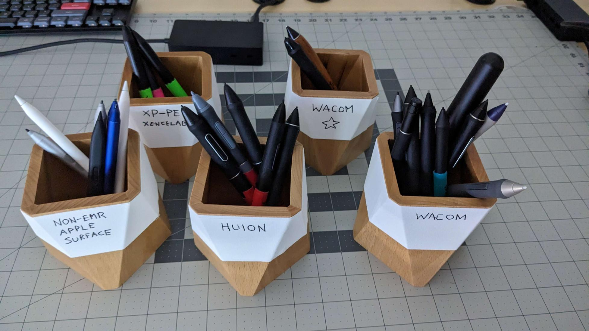

# About TheSevenPens

I love creative tech. I've been using drawing tablets for a long time and wanted share what I learn.&#x20;

* My YouTube channel: [https://www.youtube.com/@thesevenpens](https://www.youtube.com/@thesevenpens) &#x20;
* My notes on drawing tablets: [https://docs.thesevenpens.com/drawtab/](https://docs.thesevenpens.com/drawtab/)&#x20;
* I tweet occasionally: [https://twitter.com/TheSevenPens](https://twitter.com/TheSevenPens)&#x20;
* I moderate Reddit's [/r/drawingtablet](https://www.reddit.com/r/drawingtablet/)&#x20;
* I keep my code on GitHub: [https://github.com/TheSevenPens](https://github.com/TheSevenPens)&#x20;

## Why "TheSevenPens"?

When I started my YouTube channel I had seven pens from my drawing tablets.

Now I have more than seven pens.

<figure><figcaption></figcaption></figure>

## Tablets I own

You can see a complete list of [**the tablets I currently own**](my-tablets.md).

## **My tablet setups**

I have multiple desks with a combination of PCs and laptops for trying out different tablets. More here: [**My tablet setups**](my-tablet-setups.md)&#x20;

## **Key resources**

* My general take on [Drawing tablet brands](../drawing-tablet-brands/) &#x20;
* [Buying guide](../buying-a-drawing-tablet/)&#x20;
* [Drawing tablet recommendations](../recommendations/) &#x20;

## **Relationship to tablet manufacturers**

* I don't have any relationship with tablet manufacturers such as Wacom, Huion, XP-Pen, etc. I'm just an enthusiast.
* I do not receive tablets from manufacturers. Every tablet I have is a personal purchase.
* I do attend public demo events either online or in person if I can.

