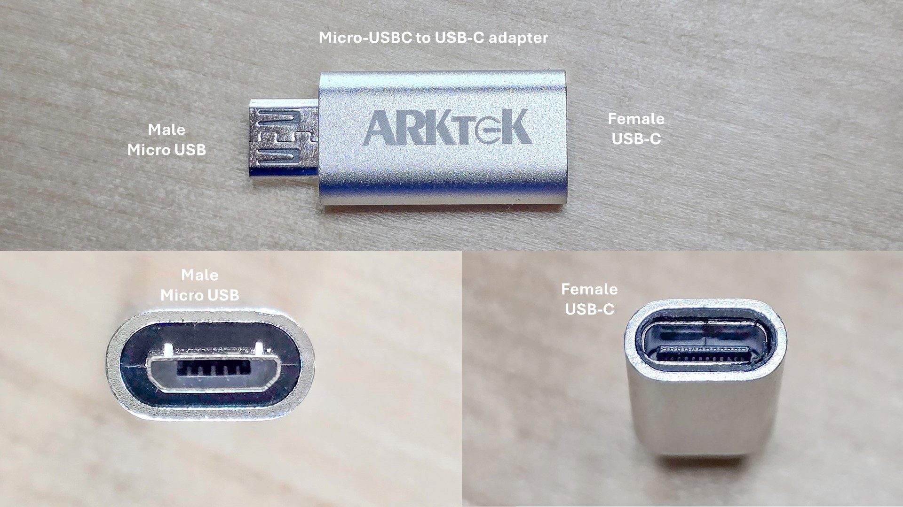
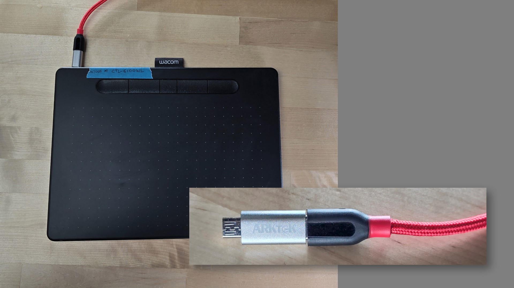

# Cable adapters

## Micro-USB to USB-C

Some older tablets use a Micro-USB port for use with a Micro-USB to USB-A cable.

Instead of such a cable, I use a Micro-USB to USB-A adapter and connect it to to my computer with a more common USB-C to USB-A cable or a USB-C to USB-C able.

This is the specific adapter I use: [https://www.amazon.com/gp/product/B0BDLB86RT/](https://www.amazon.com/gp/product/B0BDLB86RT/)

<figure><figcaption></figcaption></figure>

This adapter is useful for working with

* Wacom Intuos (CTL-4100, CTL-4100WL, CTL-6100, CTL-6100WL)
* One Wacom by Wacom (CTL-472, CTL-672)

<figure><figcaption></figcaption></figure>

## Looking for HDMI adapters?

Check here: [HDMI adapters for pen displays](../guides/pen-displays/using-hdmi-adapters-with-pen-displays/)
