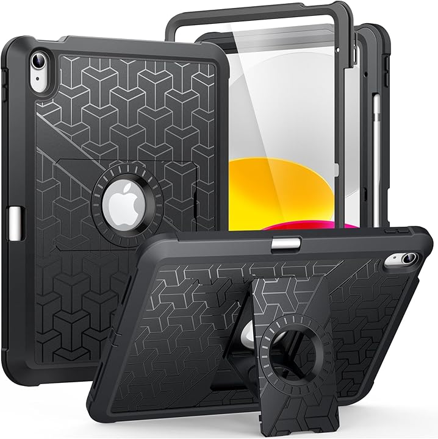
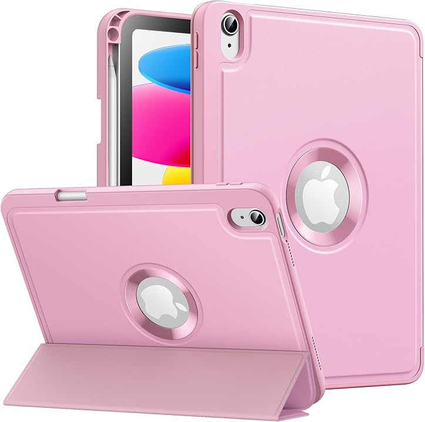
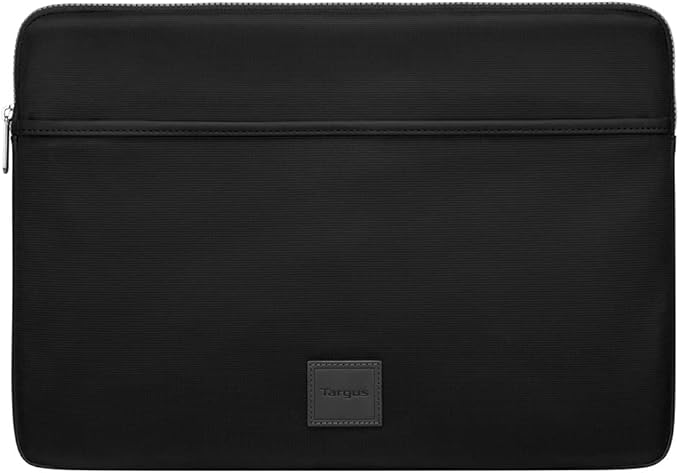

# Protective cases

## **Overview**

Especially if you are traveling you should consider getting a protective case so that your tablet does not get damaged.

* For pen tablets they can get easily scratched.
* For pen displays not only can they get scratched, but you might crack the glass, or a drop my break something inside.
* Even your pens may deserve some amount of protection. As I've mentioned many times if you drop your pen especially with the nib hitting the floor you can really damage your pen irreparably.

Below are some options that I have seen people suggest. <mark style="color:red;">**I don't own any of these cases so I cannot speak from direct personal experience**</mark>. So make sure do you research and get community feedback on what works for them.

## Cases for drawing tablets

### Gator Screen Saver Totes

These are padded transport bags intended for monitors - but will serve the save role for pen displays.&#x20;

Shop here: [Gator Store: Screen Saver Totes](https://gatorco.com/shop-by-category/computer-projector-tablet/computer-projector-bags/screen-saver-totes/)

<figure><figcaption></figcaption></figure>

### **Moko cases**

These cases are focused around iPads and similar tablets. They may be useful for small to medium pen tablets. Shop here: [**Moko store on Amazon**](https://www.amazon.com/stores/MoKo/page/2017E8BA-91D3-4C19-B94A-CC40C7866F49?ref\_=ast\_bln)

<figure><figcaption></figcaption></figure>

<figure><figcaption></figcaption></figure>

### Targus Laptop Sleeves

These are meant for laptops but can also work for drawing tablets. These come in several sizes.

<figure><figcaption>
Targus - 15.6 Inch Urban Laptop Sleeve
</figcaption></figure>

Targus 16" Laptop Sleeve - ([https://www.target.com/p/targus-16-34-pulse-slipcase-laptop-sleeve-black-purple/-/A-86228148](https://www.target.com/p/targus-16-34-pulse-slipcase-laptop-sleeve-black-purple/-/A-86228148))

## Notes on iPad cases

**Possible magnetic interference** - Something to look out for.  Some cases have magnets that can interfere with the Apple Pencil. See [**this reddit post**](https://www.reddit.com/r/ipad/comments/1d93ew0/some\_magnetic\_cases\_may\_interfere\_with\_the\_apple/).

## Cases for pens

* Eyeglass cases
* Cases meant for pens or pencils
* Examples of small cases for pens:&#x20;
  * [https://www.amazon.com/dp/B01FWE0DQY/ref=sspa\_dk\_detail\_2?pd\_rd\_i=B01FWE0DQY](https://www.amazon.com/dp/B01FWE0DQY/ref=sspa\_dk\_detail\_2?pd\_rd\_i=B01FWE0DQY)

