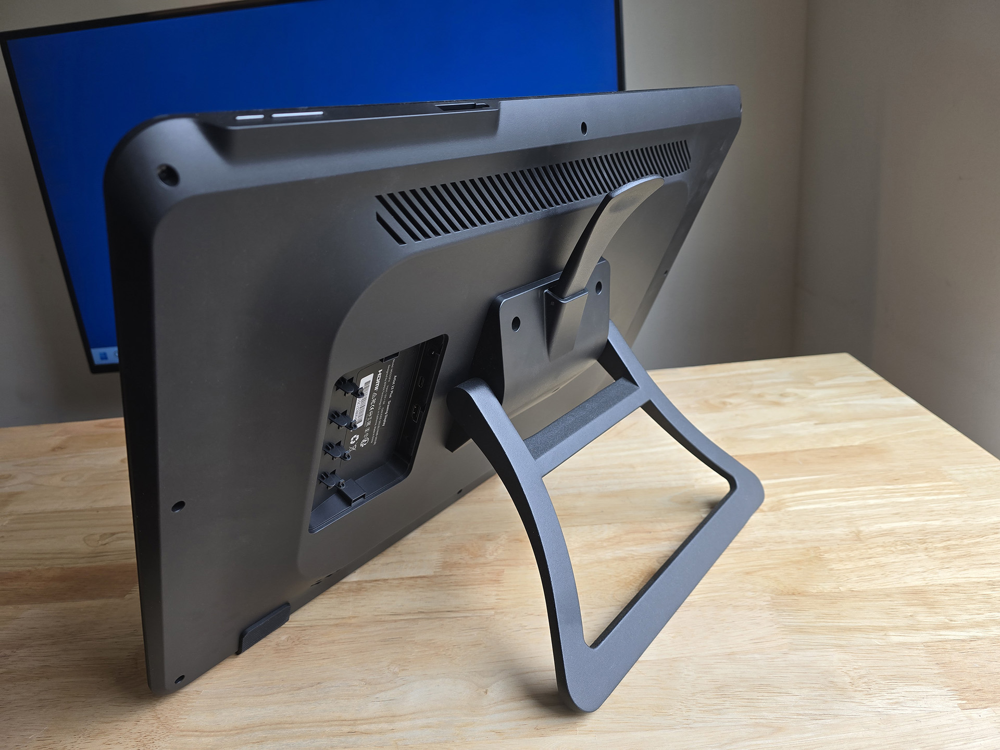

# Stands

## Overview

If you are looking for iPad stands go here: [**iPad stands**](https://www.amazon.com/HUION-Adjustable-Drawing-Displays-Suitable/dp/B09C5YJFGS)

There are several options for stands below.

## VESA-attached stands&#x20;

VESA is a standard to mount displays to various things using screws. More here: [**VESA**](../../technology/vesa.md)

Here's a typical VESA-attached stand. This one came pre-attached to the XP-Pen Artist 22 Plus. It is my favorite VESA-attached stand because the wide lever is easy to reach and operate. &#x20;

<figure><figcaption>
XP-Pen Artist 22 Plus with stand 
</figcaption></figure>

Here is another stand from Huion. This was works fine, though I find its level a little more diffucult to find and use.

<figure><figcaption>
HUION ST100A Adjustable Drawing Tablet Stand
</figcaption></figure>

These stands attach to the back of tablet via screws. Because they are VESA compatible, they work with any drawing tablet that is VESA mountable.

Some people have had success with the Ergotron Neo-Flex Stand. See this reddit thread: [https://www.reddit.com/r/wacom/comments/1b527hs/finally\_found\_a\_stand\_for\_my\_cintiq\_pro\_27/](https://www.reddit.com/r/wacom/comments/1b527hs/finally\_found\_a\_stand\_for\_my\_cintiq\_pro\_27/)&#x20;

It's important to match the stand with the height of the pen display. A stand designed for a smaller pen display will have its angle adjustment lever in a position so that it is convenient to reach by putting your hand over the top of the display. However when used with a large display that lever may be much more difficult to reach.

## Stands I use

* I use the Huion ST100A stand with my Huion Kamvas Pro 90
* I use the VIVO Pneumatic Arm Monitor Desk Stand (STAND-V100R) with y Cintiq Pro 22. [<mark style="background-color:green;">**my notes on this stand**</mark>](7p-notes-vivo-pneumatic-arm-monitor-desk-stand-stand-v100r.md)

## Unattached folding stands

here are the key features:

* They are height/angle adjustable
  * Some can vary the angle continually and you can lock them into a specific preferred angle
  * Some only support 1 or two angles&#x20;
* They have a "lip" at the bottom to help secure the tablet
* The tablet is not attached to the stand
* They have rubberized surfaces on top to prevent the tablet from sliding off too easy
* They have rubberized surfaces on the bottom to prevent the stand from moving around on the desk&#x20;

These stands are simple and inexpensive, but beware that since the tablet is not secured to the stand, it can be easy to knock the tablet of the stand.

### Parblo unattached stand

<figure><figcaption>
Parblo PR 100 Drawing Tablet Stand
</figcaption></figure>

### XP-Pen unattached stands

* AC 41 stand - designed for 16" pen displays
* AC 42 stand - designed for 13" pen displays

More here: [https://www.xp-pen.com/product/ac41-ac42-portable-tablet-stand.html](https://www.xp-pen.com/product/ac41-ac42-portable-tablet-stand.html)

## The XOOT Stand

[XOOT stand](xoot-stand.md)

