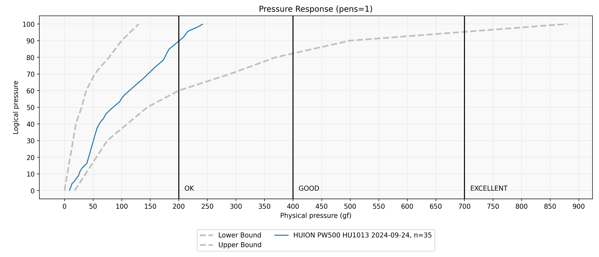

# 7P notes: TourBox

## Summary

I've been using a TourBox regularly since July of 2021. It's become required piece of equipment as I work on digital art. I have multiple drawing workstations each one has an individual TourBox device attached to it.

## Adjustment time

I originally purchased the TourBox NEO in November of 2020. I used it for about a month and then quit. It was very difficult for me to remember to use the device. I would often end up falling back to using my normal keyboard shortcuts. After a few weeks, I put it back in its box and left it there untouched for about 4 months.

After a particularly frustrating drawing session where I had to use keyboard shortcuts heavily, I committed to retraining myself on the TourBox device. I brought it out of storage, and made a concerted effort to make it part of my workflow.

* I forced myself to not touch the keyboard
* I read the user manual
* I learned out to customize it
* I tweaked the shortcuts in my drawing application to make it easier use the TourBox for some tasks.

After about six months my brain was fully trained to use the TourBox instead of relying on keyboard shortcuts. It was well worth that investment of time, because it made me much more productive.

## What I like about the TourBox

**Productivity**

It has made me more productive simply be letting me not have to disrupt my flow by looking at the keyboard or remembering an obscure shortcut.

**The TourBox Console app**

The accompanying TourBox Console application is very user friendly. It is very easy to configure the device in general and to create configurations for specific applications.&#x20;

A great feature of the application is it has an auto switching feature which you can enable or disable. This is very important because this means switch between windows, the appropriate configuration for that application will be used by the TourBox. You don't have to manually switch it settings.

The software is also updated quite frequently.

**Connectivity**

The TourBox NEO supports only a wired USB connection.&#x20;

The TourBox ULTRA supports both wired and Bluetooth connection. One negative of the ultra for me is that it uses normal non-rechargeable batteries. So that's kind of irritating to have to replace them every now and then.

**Importing / Exporting configurations**

I have 2 machines - each with its own TourBox. One nice feature of the TourBox Console app is that it lets export the configuration for a specific app and then import it on another machine.&#x20;

## What could be better

I wish the dials and wheels had a little more resistance to movement. I have this scroll wheel set to control my brush size. And sometimes I accidentally brush against it and change my brush size and I don't notice that until later. I don't use the large spinning dial at all. I had it set to rotate the canvas. However then I was accidentally rotating my canvas far too often. So now I do not use the dial it all.

**Profile syncing**

It would be nice if I could have the TourBox software automatically sync all my TourBox devices to have the same configuration without me having to go through the export/import process.

**Limitations with Microsoft store apps**

With Windows there's also an interesting limitation. It has to deal with apps like concepts which are not normal windows applications but are ones designed for the Microsoft Store. Apparently these applications are built differently. And the TourBox device cannot set a profile for those applications. An example of such an application is the concepts app. I really enjoy sketching with this application. But the TourBox cannot bind to it. So I cannot have an application specific configuration for it. I do not know if this limitation is because of the TourBox software or how windows works or a combination of both those factors.

## How I configure my TourBox

Partial setup for Clip Studio Paint

<figure><figcaption></figcaption></figure>

