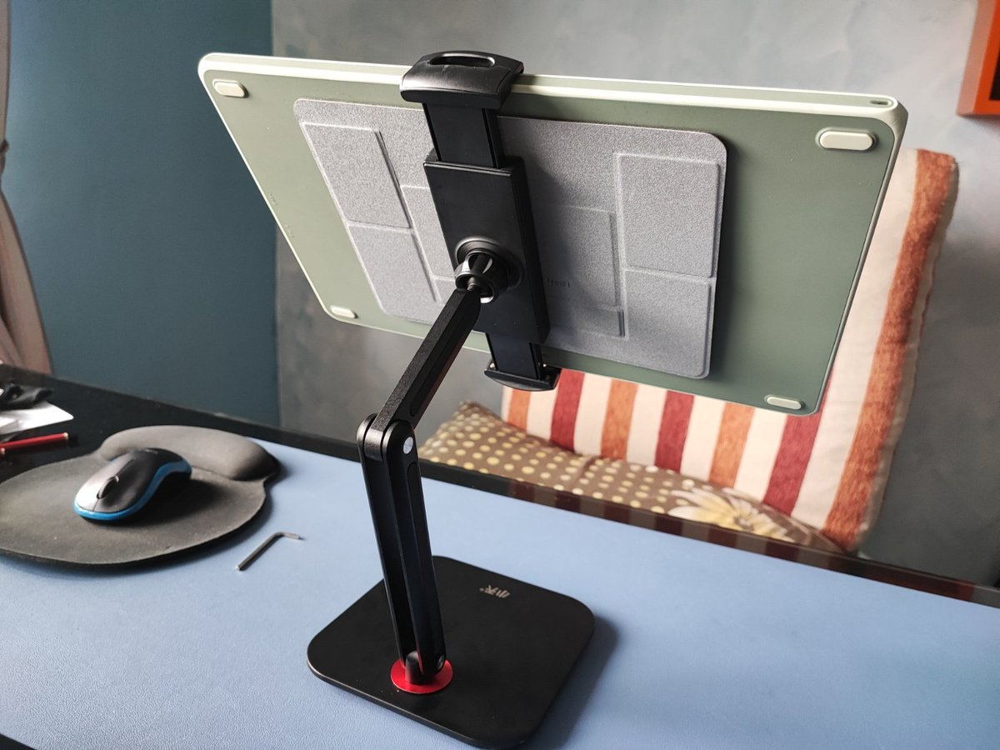

# Monitor arms

## Overview

Using a monitor arm with your pen display comes down to whether your pen display is VESA mountable.

* **If your pen display is VESA mountable**, you can use a VESA compatible monitor arm.
* **If your pen display is not VESA mountable,** there are some options

## Pen displays without VESA support

Smaller pen displays are about the size of a laptop, so you can try an arm designed to hold a laptop.

Here is an example: [https://twitter.com/eyekoodraws/status/1596064399109726209](https://twitter.com/eyekoodraws/status/1596064399109726209) \

Here's some creative DIY solutions:

* [https://www.reddit.com/r/huion/comments/ryrt3x/diy\_arm\_mount\_kamvas\_16\_2021/](https://www.reddit.com/r/huion/comments/ryrt3x/diy\_arm\_mount\_kamvas\_16\_2021/)  &#x20;
* [https://www.reddit.com/r/huion/comments/159hnvy/finally\_found\_a\_use\_for\_this\_stand/](https://www.reddit.com/r/huion/comments/159hnvy/finally\_found\_a\_use\_for\_this\_stand/)&#x20;

## **Wacom Flex arm**

Wacom has designed an arm for their Cintiq line called the Wacom Flex arm that is specifically designed for their product. Not that this arm only works with specific Cintiq models.

* [MobileTechReview: Wacom Ergo Flex Arm for Cintiq Pro 24 & 32 Review](https://www.youtube.com/watch?v=iuqRv5wN2p8) Dec 17, 2018
* [Brad Colbow - Wacom Flex Arm Review](https://www.youtube.com/watch?v=4zIKQqBeF9o) Dec 10, 2018

## **Wacom VESA mount**

If you already have a monitor arm you can use the Wacom VESA Mount for Cintiq 24 & 32 with it to mount those specific models.

## Huion ST500 Desktop Arm&#x20;

Huion has a monitor arm which appears to be a rebranded version of a generic monitor arm.

[r/Huion - Huion ST500 Desktop Arm Review](https://www.reddit.com/r/huion/comments/1d5bin3/huion\_st500\_desktop\_arm\_review/) 2024/05/31&#x20;

## North Bayou

This brand comes up a lot when people mention what arms they use, but I don't have any personal experience with them.

* North Bayou F100A
* North Bayou F80
  * [https://www.reddit.com/r/wacom/comments/16jmczd/just\_wanted\_to\_share\_i\_found\_the\_perfect\_setup/](https://www.reddit.com/r/wacom/comments/16jmczd/just\_wanted\_to\_share\_i\_found\_the\_perfect\_setup/)

## Ergotron

I use this brand a lot. Further down&#x20;

* Ergotron HX&#x20;
* Ergotron LX

For my larger pen displays, 24" and larger, I use the **Ergotron HX**. This is a very welld designed and rugged arm. I use it with:

* &#x20;Wacom Cintiq Pro 27
* Huion Kamvas 24 Pro 4K
* many 32" monitors

The Ergotron HX has less wobble than the **Ergotron LX**, but still has some wobble.

For 22" and below I use the Ergotron LX. It's certainlyu not as rugged as the Ergotron HX, but it has been reliable and has a good range of motion.

[Ergotron - Install Ergotron LX Monitor Arm](https://www.youtube.com/watch?v=8w\_3pzQcjfg) 2021/10/01

[Ergotron - HX Monitor Arm Adjustments](https://www.youtube.com/watch?v=giOfhNkGGdY) 2020/03/04&#x20;

[Ergotron - Install Ergotron HX Monitor Arm with Heavy-Duty Tilt Pivot or HD Pivot](https://www.youtube.com/watch?v=3GZYP7DwwCA) 2021/05/24&#x20;

## Wobble

All monitor arms have some amount of wobble. Some have more and some have less. But NONE of them feel "rock solid"

One thing that will help reduce the wobble is if the bottom of the pen display rests on something like your desk.

If you want to have ZERO wobble you need to use a stand with your pen display.

## Resources

* There's a write up on using tablets that includes a section on a North Bayou arm here: [https://www.asianjoyco.com/resources-tutorials/digital-sculpting-tools](https://www.asianjoyco.com/resources-tutorials/digital-sculpting-tools)&#x20;
* [David Zhang - $25 vs. $300 Monitor Arm - What Stands Do I Recommend?](https://www.youtube.com/watch?v=\_\_K4V8pFhf4) 2019/10/25&#x20;
* [/r/huion - Is there a way to attach the Huion Kamvas 16 2021 to a monitor arm?](https://www.reddit.com/r/huion/comments/oygb83/is\_there\_a\_way\_to\_attach\_the\_huion\_kamvas\_16\_2021/) 2021/08/05&#x20;

