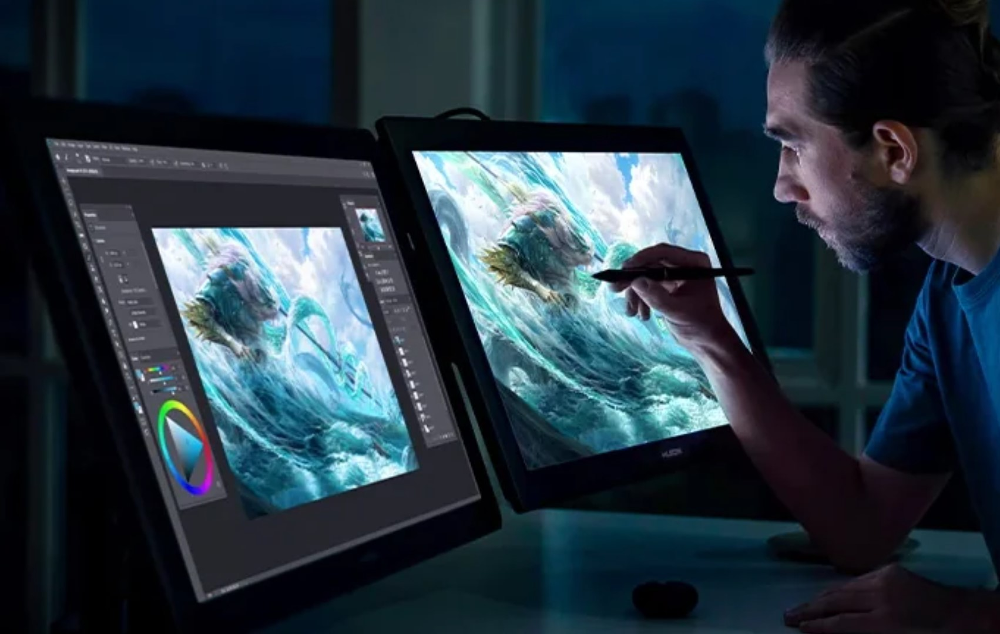

# Showing canvas on another display

## Introduction

Sometimes you may want to see the same canvas on two displays.

<figure><figcaption></figcaption></figure>

This is useful in a couple of cases:

* Work on the canvas on display A, but see a full-screen version of the canvas on display B.
* Work on the full-screen version on display A, but show the canvas on display B so that you can access the rest of the application's UI.

Some applications support this generic capability of putting the canvas on two displays simultaneously, but not all do.

Here are the ones I have confirmed support it: Clip Studio Paint, Krita, and Photoshop.

## Clip Studio Paint

Let's say you already have a document window open called **.**

**Click Window > Canvas > New Window.A new window showing the canvas for will appear.Drag that window to another display.Any changes you make in one canvas will be reflected in the other.Krita instructionsLet's say you already have a document window open called .Click Window > New WindowThis creates a second new Krita application window that will have no documents in it.Go to the original Krita application window and click Window > New View > .Now you will see the document \<title> on both application windows.Then you can draw on that document in either application window.Any changes to the document in one window will be reflected in the other.Photoshop instructionsIf you already have a document window open called :Use Window > Arrange > New Window for \<title>.Now you will have two windows for the same document.Drag either window to a second display and maximize the window.Then you can use either window to edit the document.**
