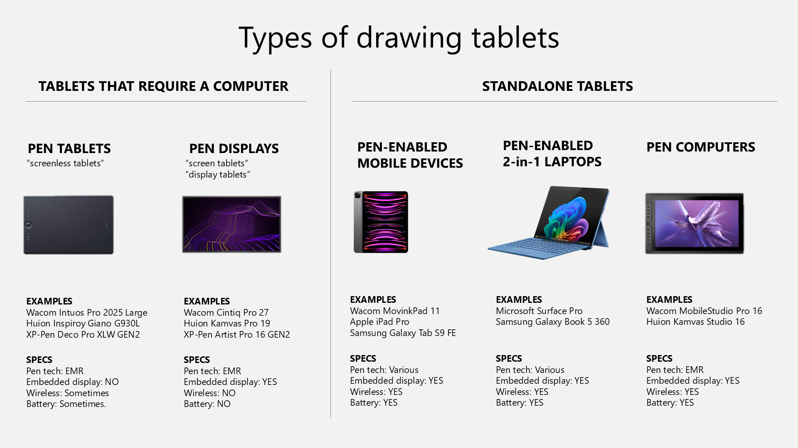

# Types of drawing tablets

<figure><figcaption></figcaption></figure>

## Non-standalone drawing tablets

* Pen tablets (also called "screenless tablets") do not have a screen. You use them with a computer or laptop. More here: [Introduction to pen tablets](intro-pen-tablets.md)
* Pen displays (also called "screen tablets") have a screen. You use them with a computer or laptop. More here: [Introduction to pen displays](intro-pen-displays.md)
* To choose between them, see [Pen tablets vs pen displays](../../buying/pen-tablets-vs-pen-displays.md).

## Standalone drawing tablets

* **Pen-enabled mobile devices** are devices like iPads and Samsung Galaxy Tab S models that support a pen. They are not strictly drawing tablets, but they use similar technology and can work as standalone drawing tablets. More here: [Introduction to pen-enabled mobile devices](intro-mobile-devices.md)
* **Pen computers** are drawing tablets that are essentially laptops. I do not recommend them. More here:
  * [Introduction to pen computers](intro-pen-computers.md)
  * [The case against pen computers](../../buying/pen-computers-bad.md)
* **Pen-enabled 2-in-1 laptops** are devices like the Microsoft Surface Pro or Samsung Galaxy Book 5 360 that can be used with a pen. More here: [Introduction to pen-enabled 2-in-1 laptops](intro-2-in-1-laptops.md)
