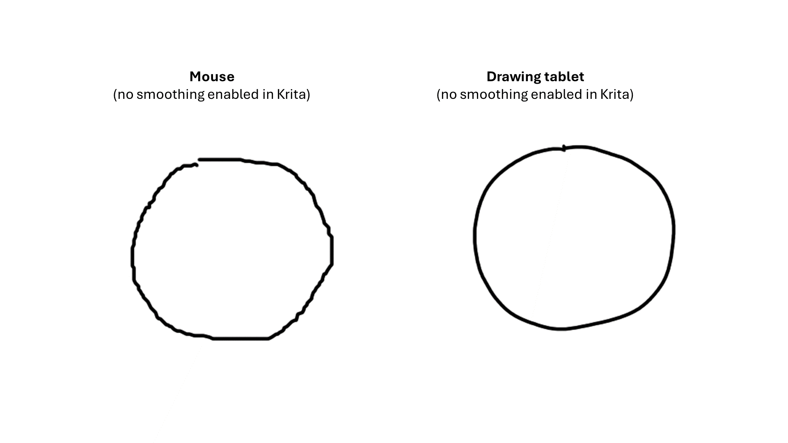

# Drawing tablets vs mice

## Overview

You have almost certainly used a mouse with a computer. This document explains how a drawing tablet and pen differ.

## Positioning strategy

Mice and drawing tablets use very different positioning strategies. Mice use **relative positioning**. Drawing tablets use **absolute positioning**. Learn more here: [Absolute versus relative positioning](../core/active-area/absolute-versus-relative-positioning.md). Drawing tablets can simulate relative positioning with [Mouse mode](../core/active-area/mouse-mode.md), but I do not recommend it.

## **Stroke smoothness in drawing apps**

In drawing applications, strokes drawn with a mouse usually have a rougher stair-step effect and are generally less smooth.

<figure><figcaption></figcaption></figure>

There are many techniques and features that help you draw smooth strokes. Some work for both mouse and tablet, and some are specific to drawing tablets. More here: [Drawing smooth strokes](../guides/drawing/drawing-smooth-strokes.md).

Position smoothing, also called stabilization, is one of these techniques. However, some apps allow position smoothing with drawing tablets but not with mice.

Here is what Krita currently does:

* Basic smoothing: applies ONLY to drawing tablets
* Weighted smoothing: applies BOTH to drawing tablets and mice

Here is what Clip Studio Paint does:

* Stabilization: applies ONLY to drawing tablets

## **Clicking and moving the pointer**

With a mouse, you move the pointer and clicks only happen when you take a very conscious effort to click a mouse button.

A drawing tablet feels very different. To move the pointer without clicking, you hover the pen over the tablet, up to about 10 mm away. If you touch the pen to the tablet, it counts as a click.

So, with a drawing tablet, you have to get used to hovering and pressing down only when you want to click.

## **Keep the pointer on a single pixel (without clicking)**

With a mouse, it is usually easy to place the pointer on a single pixel and keep it there. Once the pointer is where you want it, it is easy to hold the mouse in place. You can even let go, and the pointer will stay there.

Drawing tablets feel very different in this regard. First, you cannot touch the tablet with the pen. You have to hover over that spot. It is easy to hover in a general location a couple of pixels wide, but it is much harder to keep the pen over a specific pixel because your hand will move slightly. Also, most drawing tablet pens are sensitive to tilt, so tilting the pen may move the pointer.

## **Keep the pointer on a single pixel (while clicking)**

Mice are really good at this. Once the pointer is where you want it, you can click the buttons without changing the pointer location.

This is much harder with a pen. First, there is the general difficulty of keeping the pointer on a specific pixel. Then, if you press the buttons on the pen, this will almost always change the position of the pen and thus the pointer.

## Application considerations

If you are drawing strokes or painting in an app like Clip Studio Paint or Krita, a drawing tablet will feel much more natural.

If you are laying out shapes and creating vector art in applications like Illustrator, a mouse might actually be better because it is easier to keep on a specific pixel. For example, I normally use a mouse in Illustrator.

## Ergonomics > Wrist Pain

Using a mouse can place strain on your wrist. Drawing tablets are generally less stressful on your wrist. However, they can also place strain.

## Power

Mice get their power either from a cable or from batteries.

Modern drawing tablets all support wired connection through USB. Some tablets also support wireless connection through Bluetooth.

The pens for a modern drawing tablet neither use a cable nor have batteries. Instead, they get power simply by being near the drawing tablet.

## Pro tip: Match aspect ratios when using a pen tablet

Make sure you match aspect ratios when using a pen tablet so drawing feels natural and your strokes are not distorted. More here: [Matching aspect ratios with Force Proportions](../guides/customizing/force-proportions.md)
