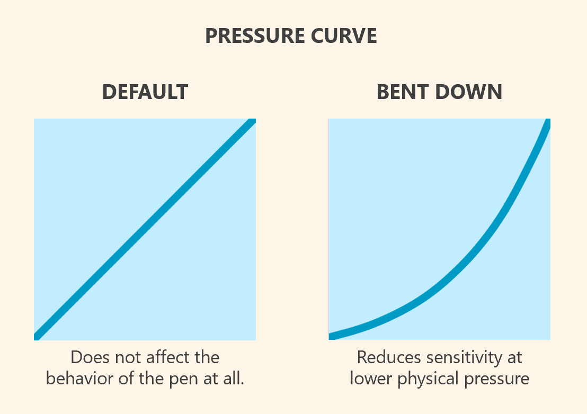

# Getting started with a drawing tablet

## Overview

If you just acquired a drawing tablet and want to start using it, this guide will lead you through the basics.


* If you are new to drawing tablets, first read [Beginner's guide to drawing tablets](beginners-guide.md)
* If you don't have a drawing tablet: [Drawing tablet buying guide](../buying/)


## Find out the tablet's model number

* Make sure you know the model number of the tablet. This will help you in many ways later. More here: [Finding the model number of your drawing tablet](../guides/general/finding-tablet-model-number.md).

## Identify how to contact support

* The vast majority of time everything "just works" but you may need help or a question answered by customer support. So, Make sure you know how to [Contacting support](support.md) for your tablet manufacturer

## Read the user manual

* Most questions you have will be answered already in the user manual.
* You will spare yourself a lot of frustration if you read it first.
* You don't need to even open the box. You can download the manual from the manufacturer website.
* The most important thing to understand in the user manual is how the tablet physically connects to your computer. This is especially important if you have a pen display (screen tablet).

## Don't drop the pen

* If drop the pen to the floor, usually it will be unharmed.
* When you are not using it make sure its stored in such a way it doesn't fall off your desk.
* HOWEVER, sometimes a pen seems to hit just right and the fall can damage the pen.

## Keep the box safe

* You may need to return or transport the tablet, the original box is the best way of doing thus.

## Verify the box contains what it should

The box will usually list everything that is supposed to be inside it. If you can't see it there look for it in the user manual, or the manufacturer website.

Then verify that box contains everything that is expected.

99.9999% if of the time it will have everything is supposed to have. But every now and then you might encounter a box that is missing a cable.

## Prepare for replacing your pen

The pen has somewhat delicate parts inside and is the most likely thing you will break. If you lose or damage your pen, there are some things you need to know:

* First drawing tablets are generally only compatible with the pen they came with or a small number of pens. So note down the model number of the pen. You will need this to get a replacement. More here: [Pen compatibility](../guides/pens/pen-compatibility.md)
* Pens are surprisingly expensive to replace.
  * Some pens cost half the cost of the tablet
  * Some pens (especially Wacom Pro pens) are more expensive than the tablets of other brands.

## Install the tablet driver

* You need the tablet driver installed for the tablet to work correctly.
* You can go to the manufacturer site and download the driver and install now before your tablet even arrives.
* If the tablet driver is installed, when you connect the tablet with USB cable the driver will just detect the tablet and the pen will work as soon as it comes close to the tablet (about 10mm)
* The drivers install an app you can use to configure the driver. The apps have different names depending on your tablet brand
* Why you need to install tablet drivers: [https://www.youtube.com/watch?v=qUsZUcH6SWk](https://www.youtube.com/watch?v=qUsZUcH6SWk)
* More here: [Drivers](../guides/drivers/)

## Connect the tablet

* Pen tablet - There will be a simple USB cord. These days the cords are all USB-C cords.
  * Some pen tablets ALSO support wireless connection. For now ignore wireless. It just adds more complication. Get it working with a cable first. Once everything is working, then try wireless.
* Pen display - There are several options. See [Connecting a pen display](../guides/connecting/connecting-pen-display/)

## Finding the Driver UI

At some point you'll need to find the driver again after you have installed it. You MUST be familiar with how to do this. Here are the instructions: [Finding the driver settings UI](../guides/drivers/finding-the-driver-settings-ui.md).

## The NO SIGNAL problem with pen displays

If you encounter a "NO SIGNAL" message, follow these troubleshooting steps: [TSG: Pen display shows NO SIGNAL message](../troubleshoot/tsg-no-signal.md)

## How the pen & tablet work with the computer

* Once the tablet driver is installed and the tablet is connected it will detect the pen. It will treat the pen just like a mouse. (except a mouse uses relative positioning and the pen uses absolute positioning. more here: [Absolute versus relative positioning](../core/active-area/absolute-versus-relative-positioning.md))
* If the pen is in range (about 10mm) of the tablet or touching the tablet , then moving the pen will move the mouse pointer.
  * If the pen is not touching the tablet, it will be like your are not pressing down any mouse buttons
  * if the pen is touching the tablet, it will be like you are holding down the left mouse button
* In drawing apps which are pen aware can take advantage of other features like pressure and tilt.
* If you are using a drawing program, You don't need to hold down any button for it to draw, just put touch the pen to the tablet.

## Learn what the active area is (aka "Working Area")

* The active area on the tablet is the region of the tablet that is sensitive to the pen.
  * Wacom calls this the "Active Area" in their docs. In their driver, it is called "Mapping"
  * Huion calls this the "Working Area"
  * I will always call it the "active area" because that is the oldest term for it.
* Go into the driver and and find the active area and get familiar with what it looks like. It's one of the most common things you'll need to adjust.
* More here: [Active area](../core/active-area/)

## Pen tablets: map the Active Area to a single display

* This step is needed for pen tablets (the ones without a screen)
* The active area is mapped to one of your displays or multiple displays.
* By default, they are often mapped to multiple displays.
* My recommendation is:
  * Map the active area to a single display.
  * If you want use multiple displays with your pen tablet, use the tablet driver's **display toggle** feature. It lets you switch your active area mapping between displays by pressing a button on the pen or the tablet. See: [Display toggle](../core/active-area/display-toggle.md)

## Pen tablets: Enable Force Proportions

* <mark style="color:red;">**This step is very important for pen tablets**</mark> (the ones without a screen). You don't have to do this for pen displays.
* If you don't do this there will be a distortion as you draw - in other words tracing out a perfect circle on the tablet will draw an oval on the screen.
* Explanation and instructions here: [Matching aspect ratios with Force Proportions](../guides/customizing/force-proportions.md).

## Pen displays: map the Active Area to your pen display if needed

* With a pen display, the active area should be mapped to its own display.
* However, sometimes tablet drivers get confused. They might initially map the active area to some other display that your have. When this happens, you will move the pen on your tablet but you'll see the pointer move on a different display. This is easy to solve: [TSG: Pointer on wrong display](../troubleshoot/tsg-pointer-on-wrong-display.md)

## Adjust the pressure curve to give you more control

Drawing tablet pens are "over-sensitive" at low physical pressure. Near the initial activation force the pressure can swing wildly. If you are using pressure to control for example the width of your strokes, then the width can vary more than you expect. This is especially obvious as you are doing linework and you brushes start getting larger (>50px).

This over-sensitivity is common to pens, and not unusual. Some people may not even notice. But if you do, you can use pressure curves to reduce the over sensitivity.

<figure><figcaption></figcaption></figure>

## Mapping buttons dials and sliders

If you tablet has additional inputs such as buttons, dials, etc. You can control what they do. Even assign them to do different things per application.

Here are some popular assignments: [Popular bindings for auxiliary inputs](../core/expresskeys/popular-bindings.md)

## Windows

Perform this configuration: [Disable the press-and-hold ring in Windows](../guides/platforms/windows/disable-press-hold-ring.md)

## Apps

* **Krita -** I highly recommend you Install [Krita](../catalog/apps/krita.md). It is a FREE and good drawing app. Eve if you are not going to draw anything, it is useful for testing and troubleshooting.
* **Kleki -** [Kleki](../catalog/apps/kleki.md) is a FREE web-based app that is very simple. It's ideal I think for something for kids to start with before they try something complicated like Krita.
* **Clip Studio Paint -** I draw a lot of illustrations so I pay for a subscription to [Clip Studio Paint](../catalog/apps/clip-studio-paint.md).
* **Photopea** ([https://www.photopea.com/](https://www.photopea.com/)) is a web-based Photoshop-like app. It is very good and also has a free tier.
* [Procreate](../catalog/apps/procreate.md) - this is THE drawing app to get if you are drawing on an iPad.
* [Infinite Painter](../catalog/apps/infinite-painter.md) - this is the equivalent of Procreate, but for Android devices.
* **Other applications -** Look here to find a large number of applications to explore: [Apps](../apps/)
