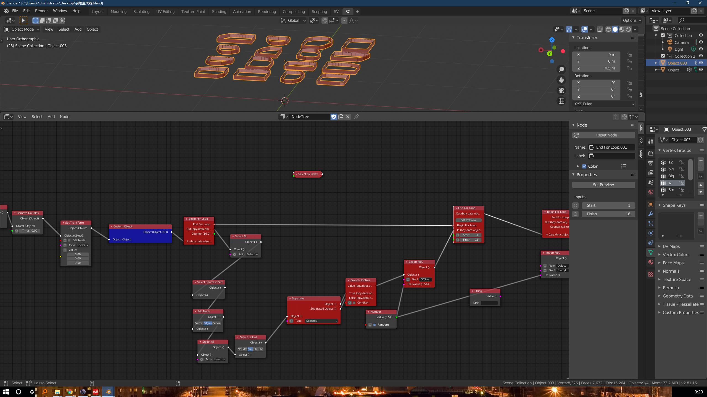

# Using drawing tablets in 3D workflows


For the overall buying guide: [Drawing tablet buying guide](../../buying-drawtabs/)


## Overview

I don't do 3D work myself, so this document is based on feedback I've been given by others and what I have observed in online forums. Please share any [Discord server](../../resources/community/discord.md).

It seems that the 3D workflow tends has some special needs, ans for that reason we need to look at this use case specifically.

There are three considerations for 3D workflows

* Whether to get a pen display or pen tablet (the most common answer is pen display)
* What display resolution to get for the pen display
* What size for the pen display

## Pen display vs pen tablet

Based on on my observation, most people doing 3D work use a pen display (screen tablet) instead of a pen tablet (screenless tablet).

However, what will work for you takes some consideration. See: [Pen tablets vs pen displays](../../buying-drawtabs/pen-tablets-vs-pen-displays.md)

## Display resolution of pen display

* 4K+ is RECOMMENDED
* 2.5K to 3K is OKAY
* 2K, 1080p, and lower - NOT RECOMMENDED

## Display size of pen display

* 19" to 32" recommended
  * I have personally noted a lot of 3D artists looking for a 24" display.
* 16" is OKAY
* 14 and lower - NOT RECOMMENDED

For general guidance on picking size: [Choosing the right size for a drawing tablet](../../buying-drawtabs/choosing-size.md)

## Prioritizing resolution and size

It seems that the 3D workflow typically involves having many UI elements on screen at once - for example when using node editors. Higher resolutions will make it easier to read the smaller text in these scenarios.

For example here is an example of what might need to be on screen

<figure><figcaption></figcaption></figure>

<figure><figcaption></figcaption></figure>

For this reason, some suggest prioritizing resolution first before size.

## Notes

Thanks to tablet enthusiast KoyoD for providing the guidance that this document is based on.
