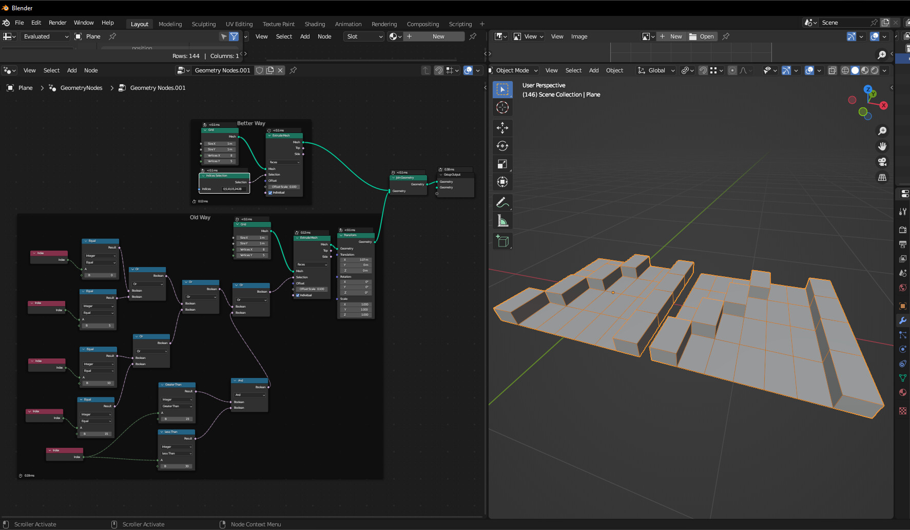

# Using drawing tablets in 3D workflows


For the overall buying guide: [Drawing tablet buying guide](../../buying/)


## Overview

I do not do 3D work myself, so this document is based on feedback from others and what I have observed in online forums. Please share feedback in the [Discord server](../../resources/community/discord.md).

3D workflows tend to have some special needs, so this use case deserves separate guidance.

There are three main considerations for 3D workflows:

* Whether to get a pen display or pen tablet (the most common answer is pen display)
* What display resolution to get for the pen display
* What size for the pen display

## Pen display vs pen tablet

Based on my observation, most people doing 3D work use a pen display instead of a pen tablet.

However, what works for you depends on your workflow. See: [Pen tablets vs pen displays](../../buying/pen-tablets-vs-pen-displays.md)

## Display resolution of pen display

* 4K+ is RECOMMENDED
* 2.5K to 3K is OKAY
* 2K, 1080p, and lower - NOT RECOMMENDED

## Display size of pen display

* 19" to 32" recommended
  * I have personally noted a lot of 3D artists looking for a 24" display.
* 16" is OKAY
* 14 and lower - NOT RECOMMENDED

For general guidance on size: [Choosing the right size for a drawing tablet](../../buying/choosing-size.md)

## Prioritizing resolution and size

3D workflows typically involve many UI elements on screen at once, such as node editors. Higher resolutions make smaller text easier to read in these cases.

For example, this is the kind of UI that may need to be visible at once.

<figure><figcaption></figcaption></figure>

<figure><figcaption></figcaption></figure>

For this reason, some suggest prioritizing resolution first before size.

## Notes

Thanks to tablet enthusiast KoyoD for providing the guidance that this document is based on.
