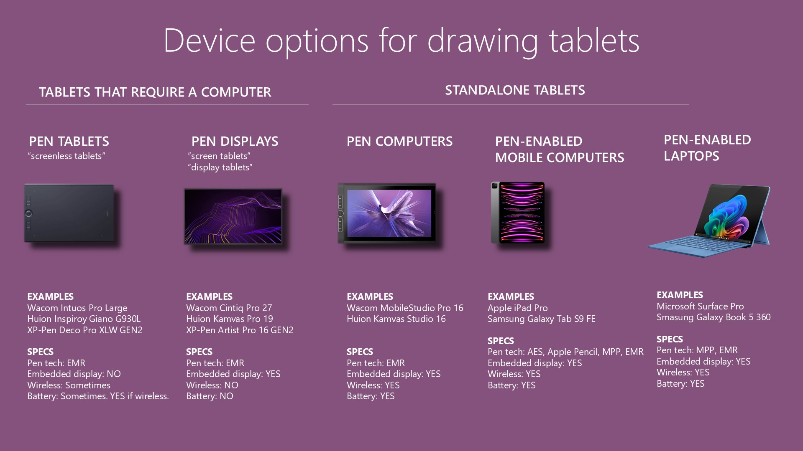

# Types of drawing tablets

## Overview

* Non-standalone devices
  * Pen tablets (also called "screenless tablets") - Don't have a screen and you have to use them with a computer or laptop&#x20;
  * Pen displays (also called "screen tablets") -  Have a screen and you have to use them with a computer or laptop&#x20;
* Standalone devices
  * **Pen computers** - Drawing tablets that are essentially laptops. I do not recommend getting these. more here: [**The case against pen computers**](../buying-a-drawing-tablet/the-case-against-pen-computers.md)&#x20;
  * **Pen-enabled mobile devices** - These are devices like iPads and Samsung Galaxy Tab S devices that support being used with a pen. They aren't strictly-speaking drawing tablets, but they use the same/similar tech and can work as a standalone drawing tablet.
  * **Pen-enabled 2-in-1 laptops** - These are devices like the Microsoft Surface Pro or Samsung Galaxy Book 5 360 that can be used with a  pen.&#x20;

<figure><figcaption></figcaption></figure>



## Pen tablets

Pen tablets are the simplest and least expensive kind of drawing tablet. They are often called: "screenless tablets" or "non-screen tablets".

* They DO NOT have an embedded display
* They REQUIRE A COMPUTER to be used.
* They REQUIRE A MONITOR attached the the computer or that the computer is a laptop.

The key skill required to use a pen tablet is that you must adjust to your hand drawing on one surface (the tablet) while you are looking at another surface (your monitor). Most people can adjust to this immediately or within a few days, but some people find this weird and for them one of the other device options may be a better choice.

Pen tablets cost between $50 to $500.&#x20;



## Pen displays

Pen displays are drawing tablets that have an embedded display panel. They are also called: "screen tablets", "display tablets".

Key attributes:

* They DO have an embedded display
* They REQUIRE A COMPUTER to be used.

A pen display may look like a laptop or an iPad which are standalone devices. However unlike those devices:

* A pen display will **always** have to have at least one cord coming from it that is connected to a computer.&#x20;
* A pen display does not contain a battery. It must always get power through a cable attached to a power supply or from the computer directly.

Pen displays cost between $300 to $3500.&#x20;



## Pen tablets

Pen tablets are the simplest and least expensive kind of drawing tablet. They are often called: "screenless tablets" or "non-screen tablets".

* They DO NOT have an embedded display
* They REQUIRE A COMPUTER to be used.
* They REQUIRE A MONITOR attached the the computer or that the computer is a laptop.

The key skill required to use a pen tablet is that you must adjust to your hand drawing on one surface (the tablet) while you are looking at another surface (your monitor). Most people can adjust to this immediately or within a few days, but some people find this weird and for them one of the other device options may be a better choice.

Pen tablets cost between $50 to $500.&#x20;

## Pen displays

Pen displays are drawing tablets that have an embedded display panel. They are also called: "screen tablets", "display tablets".

Key attributes:

* They DO have an embedded display
* They REQUIRE A COMPUTER to be used.

A pen display may look like a laptop or an iPad which are standalone devices. However unlike those devices:

* A pen display will **always** have to have at least one cord coming from it that is connected to a computer.&#x20;
* A pen display does not contain a battery. It must always get power through a cable attached to a power supply or from the computer directly.

Pen displays cost between $300 to $3500.&#x20;

## Standalone tablets

### Pen-enabled mobile computers&#x20;

These are NOT drawing tablets, but because they are very very similar to pen computers in that they are standalone and you can use a pen to draw with them - we can talk about them as an viable alternative to a pen computer.

But the key difference is a pen computer is intended for drawing, whereas a mobile computer with pen support is meant for general purpose use, but also you can use a pen do draw.

Sometimes the drawing experience with a mobile computers can really rival that of a pen computer. Sometimes they even use the same pen technology. But other times, they use a different technology and the drawing experience is not as good or may be missing features. So you have to carefully choose which devices you pick here.

In this category I think the Apple iPad provides the most compelling experience, followed closely by a Samsung Galaxy Tab S9.

More here: [**Using an iPad as a drawing tablet**](../drawing-tablets-links/apple/apple-ipad-1.md) &#x20;

## Pen computers

**Pen computers** are essentially laptops with an embedded pen tablet. You don't need them to be connected up to a separate computer to work. Because pen computers have a CPU, they are running an operating system and all current pen computers use Microsoft Windows. Some people love using pen computers but [**I don't recommend pen computers**](../buying-a-drawing-tablet/the-case-against-pen-computers.md). Instead, I recommend you choose a mobile computer with pen support.

Pen computers cost between $1000 to $3500.
