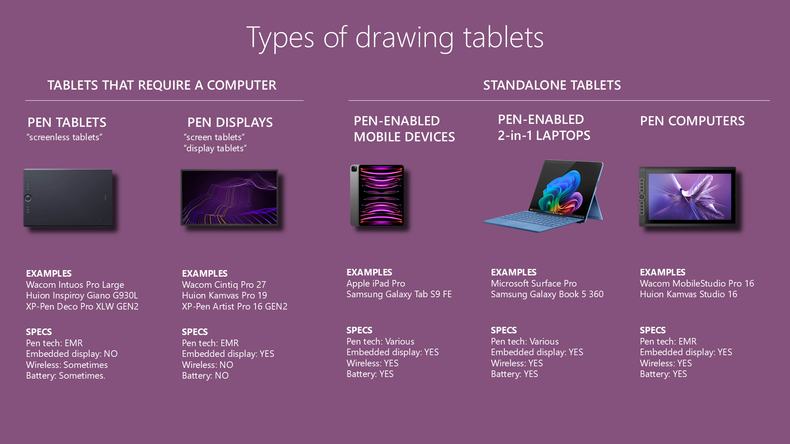

# Types of drawing tablets

<figure><figcaption></figcaption></figure>

## Non-standalone drawing tablets

* Pen tablets (also called "screenless tablets") - Don't have a screen and you have to use them with a computer or laptop. More here: [Introduction to pen tablets](introduction-to-pen-tablets.md)
* Pen displays (also called "screen tablets") -  Have a screen and you have to use them with a computer or laptop. More here: [Introduction to pen displays](introduction-to-pen-displays.md)
* How to choose between these two? See [Pen tablets vs pen displays](../../buying-drawtabs/pen-tablets-vs-pen-displays.md)

## Standalone drawing tablets

* **Pen-enabled mobile devices** - These are devices like iPads and Samsung Galaxy Tab S devices that support being used with a pen. They aren't strictly-speaking drawing tablets, but they use the same/similar tech and can work as a standalone drawing tablet. More here: [Introduction to pen-enabled mobile devices](introduction-to-pen-enabled-mobile-devices.md)&#x20;
* **Pen computers** - Drawing tablets that are essentially laptops. I do not recommend getting these. more here:&#x20;
  * [Introduction to pen computers](introduction-to-pen-computers.md)
  * [The case against pen computers](../../buying-drawtabs/the-case-against-pen-computers.md)&#x20;
* **Pen-enabled 2-in-1 laptops** - These are devices like the Microsoft Surface Pro or Samsung Galaxy Book 5 360 that can be used with a pen. More here: [Introduction to pen-enabled 2-in-1 laptops](introduction-to-pen-enabled-2-in-1-laptops.md)&#x20;

