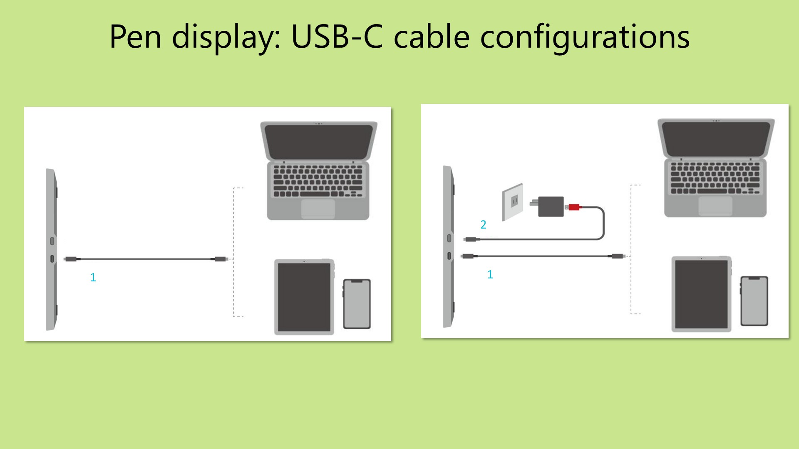
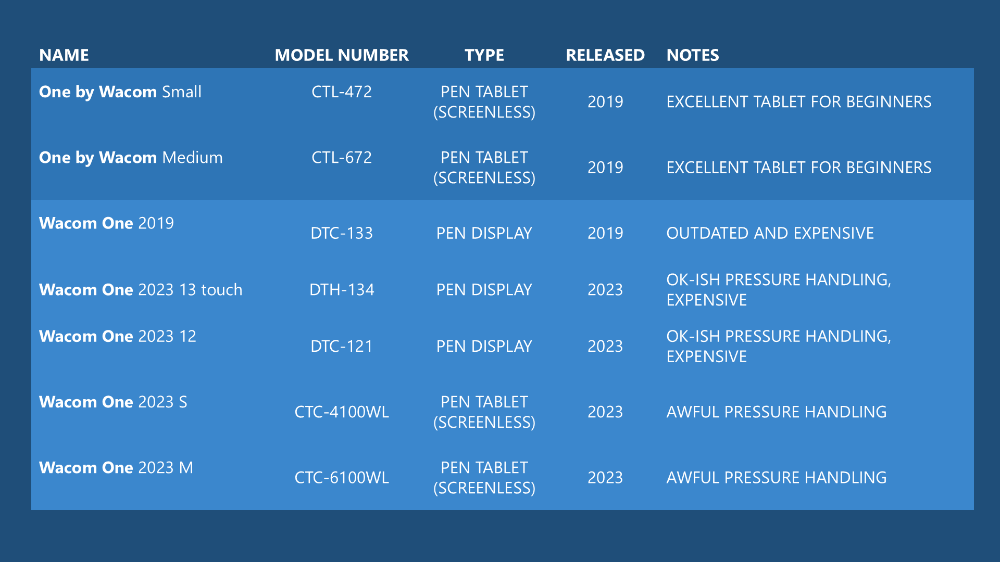

# Buying tips

## Video



## Read the user manual

The user manual contains so much information that can help you understand if the tablet will work for you. It'll answer most of the questions you'll have about connecting the tablet and the basics of how it works. It will also give you a chance to familiarize yourself with potential problems you might encounter and how to handle them.

If you read the user manual before you make a purchase you'll save yourself a lot of time and frustration.

The key thing you want to understand from a user manual is:

* How to install the driver
* how the tablet will connect to your computer. This is especially important to understand if you are planning on purchasing a pen display.

## Pen tablets vs pen displays

Because it is so common that people struggle with the decision between getting a pen tablet and pen display. You should go into the purchase decision knowing that each kind of tablet has its advantages.

Many people think that pen displays are simply inherently better. This certainly is not true. I strongly suggest you carefully consider the strengths and weaknesses of both.&#x20;

Here you can find the comparison between pen tablets and pen displays that should help you make your decision: [**pen tablets vs pen displays**](buying-tips.md#pen-tablets-vs-pen-displays).

## Tablet brands

There are many tablet brands. I usually stick to talking about and recommending tablets from Wacom, Huion, XP-Pen, and Xencelabs. That's because I have owned many of those tablets and I believe there's a large enough community of users of those tablets that if you need help you're likely to find it from them.

You can read much more about these brands here: [**Drawing tablet brands**](../drawing-tablet-brands/drawing-tablet-brands-vs-digitizers.md).

## Community size

Based on my experience with tech products when a user of a product has a question or needs help more than 50% of the time they get their answer or help not from customer support but rather from other users in the online community.

In other words the community around a drawing tablet brand has a great impact on your satisfaction with that tablet.

That's why I tend to recommend the brands that I do because they have so many users that I can see online.

Since Reddit is a popular online location for discussions around drawing tablets here are some numbers that help you see how big these communities are.

<figure><figcaption></figcaption></figure>

## Understand how the tablet will connect to your computer

For pen tablets this is pretty easy. All pen tablets can connect with a USB C cable. And some pen tablets can also support wireless connectivity.

In the user manual you'll find diagrams like this for a pen tablet.

<figure><figcaption></figcaption></figure>

For a pen display wiring them up is much more complicated. There are more cables and ports involved. And more requirements on those cables and ports.

The user manual will show diagrams like these below indicating how pen displays may connect to a computer.

<figure><figcaption></figcaption></figure>

<figure><figcaption></figcaption></figure>

With pen displays you should also be very clear about which cables come in the box. Sometimes it user manual may show you how to wire up the connections. But sometimes some cables are not included. So it's best to understand that before you make a purchase.

In addition to just understanding how the cables are connected for pen display you also have to make sure your computer has all the ports that are needed and that they meet the requirements.

To help you understand this I recommend you watch this video on connecting a pen display.



## Test the ports on your computer

Once you know how a once you know how the connection should work even before you order the tablet you should confirm if the ports on your computer will work as intended.

A pen tablet will lead you to a simple USB port. So you can verify it works by testing that port with a mouse or some other similar input device.

For a pen tablet you should verify any ports used to transmit a display signal work.

In particular because using a pen display essentially counts as adding another monitor to your computer. You should make sure that your computer can support as many simultaneous displays connected as are needed to account for both your monitor and the pen display.

## Use model numbers not names

So many tablets are on the market right now and many of them have confusingly similar names.

For example Wacom has one series of tablets called Wacom 1 and another series of tablets called one by Wacom. They have very different levels of quality, they are different types of tablets, and they have different ages. If you rely on name alone you're likely to buy the wrong tablet.

<figure><figcaption></figcaption></figure>

Another example are names like these from XP pen which are confusingly similar.

<figure><figcaption></figcaption></figure>

Ultimately the way you can avoid purchasing the wrong tablet is by making sure you know the model number.

## Do not stress out about the numbers of pressure levels.

These days it's very fashionable for drawing tablets to advertise that they have 8000 levels of pressure or 16,000 levels of pressure. In my analysis the vast majority of users only need about 2000 levels of pressure and could get by with far less.

<figure><figcaption></figcaption></figure>

This video below might be a little bit technical but does explain why I arrive at this 2000 number.



In any case even if you disagree with my conclusion the key thing is that all tablets on the market today almost every tablet on the market today has more than 8000 levels of pressure and only a handful have 4000. So any tablet you buy will have enough.

## **Be prepared to handle common problems**

* Ensure you know how to contact customer support.&#x20;
* Ensure you know the warranty and how (if needed) you can can return the tablet to the manufacturer or to the retailer (example: Amazon) you bought it from&#x20;
* Here's a list of [Common problems with drawing tablets](../troubleshooting/common-problems-with-drawing-tablets.md). Although for a majority of you everything \`will "just work" some small number of you will start off with issues on day one.
* I have a list of troubleshooting docs here: [Troubleshooting](../troubleshooting/)&#x20;
* The most complex problem for pen displays is usually the "NO SIGNAL" problem. If it happens, this guide will help: [Troubleshoot the NO SIGNAL problem](../troubleshooting/troubleshoot-no-signal.md)  &#x20;

## Check the reviews&#x20;

<mark style="color:red;">**Never purchase a tablet without looking at the reviews first.**</mark>

Some reviewers to explore:

* **Teoh on Tech** ([https://www.youtube.com/@teohontech7141](https://www.youtube.com/@teohontech7141)) Teoh has the most in-depth reviews of tablets.
* **Create Now Sleep Later** ([https://www.youtube.com/c/Createnowsleeplater)](https://www.youtube.com/c/Createnowsleeplater)
* **Brad Colbow** ([https://www.youtube.com/c/thebradcolbow)](https://www.youtube.com/c/thebradcolbow)
* **Aaron Rutten** ([https://www.youtube.com/c/aaronrutten)](https://www.youtube.com/c/aaronrutten)
* **Adam Duff** ([https://www.youtube.com/@AdamDuffArt) ](https://www.youtube.com/@AdamDuffArt)

## Verify the model number, not just the model name

Tablet names are confusingly similar. So much so, that I've seen people order the wrong tablet just because the names were close.

* NEVER order by using the name of the tablet alone.
* ALWAYS verify you have ordered correct model number.

See this page for all the reasons why you should not rely on the model name: [Model names vs model numbers](../guides/general/model-names-vs-model-numbers.md)&#x20;

## Make sure your working environment is usable

* Check for potential sources of Electromagnetic Interference. More here: [**Electromagnetic interference**](../guides/general/electromagnetic-interference.md)&#x20;
* Ensure you have enough space on your desk for the tablet and  where your keyboard will be placed

