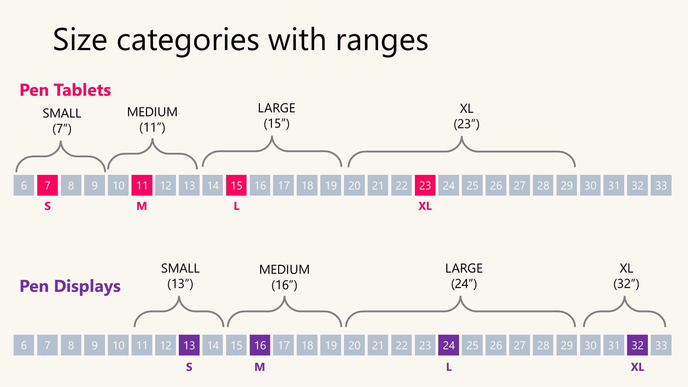

# Choosing the right size for a drawing tablet

## Overview

**Size = Active Area Size.** The size of a tablet is NOT measured by the physical size of the device. Instead, we measure the diagonal of the ACTIVE AREA — the region on the tablet's surface that responds to the EMR pen. Learn more: [**Active area**](../core-features/active-area/) & [**Active area size**](../core-features/active-area/active-area-size.md)

## Companion Video



## My size categories

I've given convenient labels ("small", "medium", "large") to drawing tablets to make it easier to talk about their sizes. These categories are based on the standard sizes Wacom uses. The sizes are approximate — for each category a typical value and a range are provided.

<table><thead><tr><th width="188">Size category</th><th width="170.33333333333331">Pen tablet</th><th width="249.66666666666669">Pen display</th></tr></thead><tbody><tr><td>SMALL</td><td>Typical: 7" Range: 6" to 9"</td><td>Typical: 13" Range: 11" to 14"</td></tr><tr><td>MEDIUM</td><td>Typical: 11" Range: 10" to 13"</td><td>Typical: 16" Range: 15" to 19"</td></tr><tr><td>LARGE</td><td>Typical: 15" Range: 14" to 19"</td><td>Typical: 24" Range: 20" to 29"</td></tr><tr><td>EXTRA LARGE</td><td>Typical: 23" Range: 20" to29"</td><td>Typical: 32" Range: 30" to 33"</td></tr></tbody></table>

<figure><figcaption></figcaption></figure>

## Manufacturer size categories

Manufacturers sometimes include size categories in their tablet names. Don't rely on these — always calculate the actual diagonal measurement when comparing sizes.

Here are some good examples of why:

* The XP-Pen Deco L is much closer in size to a Wacom Intuos Pro Medium than to the Intuos Pro Large.
* The Inspiroy 2L falls somewhere between medium and large.

<table><thead><tr><th>Tablet and manufacturer</th><th>My size category</th><th width="141">Active area</th><th>Diagonal</th></tr></thead><tbody><tr><td>Wacom Intuos Pro <strong>Medium</strong> (PTH-660)</td><td>MEDIUM</td><td>8.7"x5.8"</td><td>10.5"</td></tr><tr><td>XP-Pen Deco <strong>L</strong></td><td>MEDIUM</td><td>10"x6"</td><td>11.5"</td></tr><tr><td>Inspiroy 2 <strong>L</strong></td><td>MEDIUM (high end of medium)</td><td>10.5"x6.56"</td><td>12.38"</td></tr><tr><td>
Wacom Intuos Pro <strong>Large</strong>

(PTH-860)
</td><td>LARGE</td><td>12.1"x8.4"</td><td>14.7"</td></tr></tbody></table>

## Considerations

Here's what you should consider when choosing a size:

* What is your natural drawing style? Some people draw mostly from the wrist; others use larger motions driven from the elbow and shoulder.
* Do you have enough space on your desk?
* Do you intend to be mobile and use the tablet in different locations?

## Size recommendations

|                                                                                                                                                          | Pen tablet                                                                                       | Pen display                                                                                       |
| -------------------------------------------------------------------------------------------------------------------------------------------------------- | ------------------------------------------------------------------------------------------------ | ------------------------------------------------------------------------------------------------- |
| **Starter tablet**                                                                                                                                       | 
<strong>MEDIUM (11")</strong>

<strong>SMALL (7")</strong> if budget is a constraint
 | 
<strong>MEDIUM (16")</strong>

<strong>SMALL (13")</strong> if budget is a constraint
 |
| **Drawing, Sketching, Painting**                                                                                                                         | 
<strong>MEDIUM (11")</strong>

<strong>LARGE (15")</strong> if you know you need it
  | 
<strong>MEDIUM (16")</strong>

<strong>LARGE (24")</strong> if you know you need it
   |
| **Photo Editing**                                                                                                                                        | **SMALL (7")** is enough                                                                         | **SMALL** **(13")** or **MEDIUM**                                                                 |
| 
<strong>Note taking</strong> (more here:<a href="../basics/scenarios/taking-notes.md"> Taking notes with drawing tablets</a>)
                  | 
<strong>MEDIUM (11")</strong> (I don't recommend pen tablets for note taking)
          | **SMALL (13")** (I don't recommend pen displays for note taking)                                  |
| 
<strong>Mouse replacement</strong> (More here: <a href="../basics/scenarios/replacing-mouse.md">Using a drawing tablet instead of a mouse</a>)
 | **SMALL (7")**                                                                                   | N/A                                                                                               |
| **For children**                                                                                                                                         | **SMALL (7")**                                                                                   | **SMALL (13")**                                                                                   |
| **What I prefer and use**                                                                                                                                | **LARGE (15")**                                                                                  | 22" - on the low end of LARGE                                                                     |

## **Pen tablet sizes**

* **Small (7")** pen tablets work well for scenarios where creating detailed strokes is less important. For example, if you just need a tablet as a mouse replacement, a small one will do fine. Photo editing is another task that works well on a small tablet, since it doesn't typically involve drawing strokes. Most people who draw would find a small tablet feels cramped.
* **Medium (11")** pen tablets offer the best combination of size, cost, and ergonomics for most people and are my standard recommendation. Medium is the minimum size I recommend for drawing, sketching, painting, or any creative task that requires stroke work.
* **Large (15")** pen tablets are currently the largest size available. They are popular with some artists, but are large enough that you'll need to adapt to using them. More here: [**Using large pen tablets**](../guides/general/using-large-pen-tablets.md).
* **Extra large (23")** pen tablets are no longer produced. They are ideal for some users but require quite a bit of adjustment. More here: [**Using Extra-large pen tablets**](../guides/general/using-extra-large-pen-tablets.md).

## Pen tablet size vs monitor size

If you use a pen tablet (which has no screen), you use it alongside a monitor. The relationship between the two sizes affects how it feels to draw. A detailed explanation is here: [**Matching pen tablet size to monitor size**](../guides/general/matching-pen-tablet-size-to-monitor-size.md).

## Pen display sizes

* **SMALL (13")** pen displays may be good choices for children.
* For drawing, the minimum size I'd recommend is **MEDIUM (16")**, though many people work very effectively with SMALL pen displays.
* **LARGE (24")** are great but take up a lot of desk space — make sure you have enough room.
* I think the best balance is around 20" to 22". These offer enough drawing space without being too cumbersome, taking up too much desk space, or being difficult to move.

## Impact of pen display size

* **Anti-glare sparkle** - For a given anti-glare treatment, the higher the pixels-per-inch, the more anti-glare sparkle you'll notice. For example, with the same anti-glare treatment, a 4K 24" display will show less sparkle than a 4K 16" display.

## Test the tablet before you buy

Check if there is a way to try a tablet before buying. For example:

* At retail locations
* A friend might have the same model

## Simulate the tablet before you buy

If you can't try the actual tablet, consider simulating it with a piece of cardboard: [Simulating tablet size with cardboard](simulating-tablet-size.md).

## **In relation to paper size**

Some people find it helpful to think of a tablet's size relative to standard paper sizes. The table below shows paper sizes with their diagonal measurements and how they match my standard tablet size categories.

| Standard tablet size     | Nearest ISO paper | Nearest US paper  |
| ------------------------ | ----------------- | ----------------- |
| Pen Tablet Small (7")    | ISO A6 (7.1")     | n/a               |
| Pen Tablet Medium (11")  | ISO A5 (10.1")    | US Letter (13.9") |
| Pen Tablet Large (16")   | ISO A4 (14.3")    | US Legal (16.4")  |
| Pen Display Small (13")  | ISO A4 (14.3")    | US Letter (13.9") |
| Pen Display Medium (16") | ISO A4 (14.3")    | US Legal (16.4")  |
| Pen Display Large (24")  | ISO A3 (20.2")    | n/a               |

## **Videos**

* [Tim McBurnie - Which Size Wacom Is Right For You?](https://youtu.be/hyfj_Ek77qM) Nov 28, 2022
* [Aaron Rutten - What Size Drawing Tablet Should I Get?](https://youtu.be/qd4OEaqV-rI) Mar 18, 2022
* [The Seven Pens - What size drawing tablet should you get?](https://youtu.be/lGAhzRcMS3s) Mar 8, 2022
* [The SevenPens - Is a LARGE pen tablet right for you?](https://youtu.be/YCmVugc3w_g) Jun 27, 2022
* [The Seven Pens - Is an EXTRA LARGE Pen tablet right for you?](https://youtu.be/Tv_qX1Z9-wI) Jul 25, 2022
