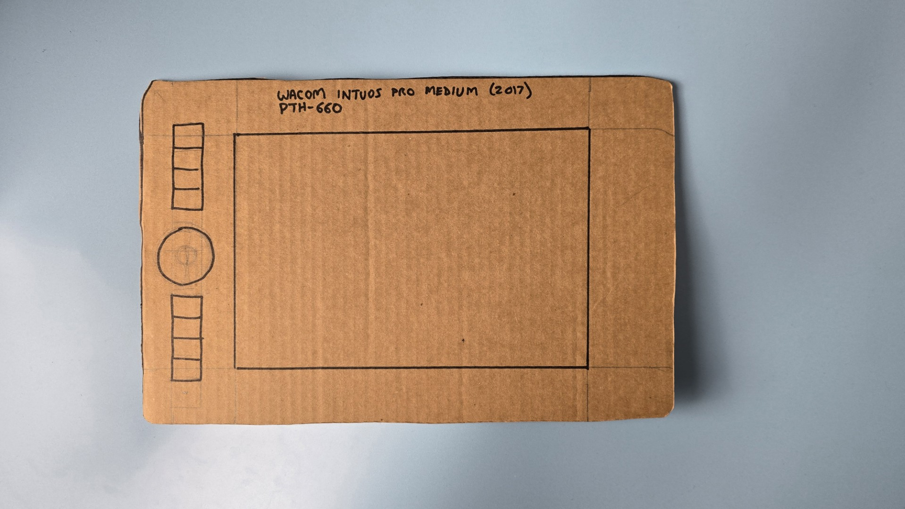

# Simulating tablet size

## Steps

* Find the dimensions of the device and the active area then&#x20;
  * The dimensions will be published online
* Cut out a piece of cardboard to the size of the tablet dimensions
* Draw a rectangle to represent the active area
* Then try drawing on it

## Example

<figure><figcaption></figcaption></figure>

## Things to test

* In the active area, do you find enough space to draw
* How will you place it relative to your keyboard
* Does it fit your desk
* Especially for pen displays, keep it about half an arms length away. How much does this prevent you from reacing other items on the desk

