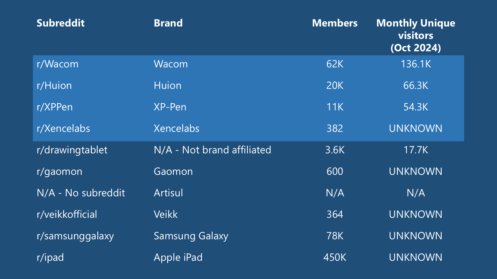
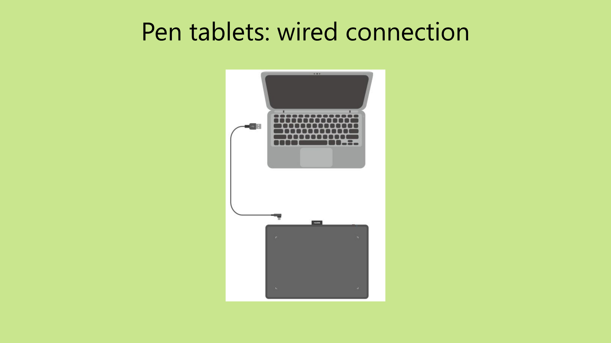
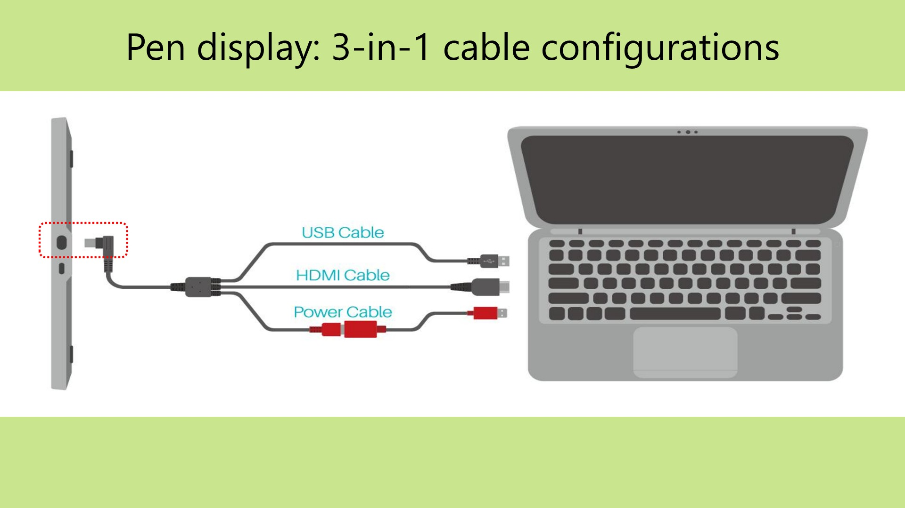
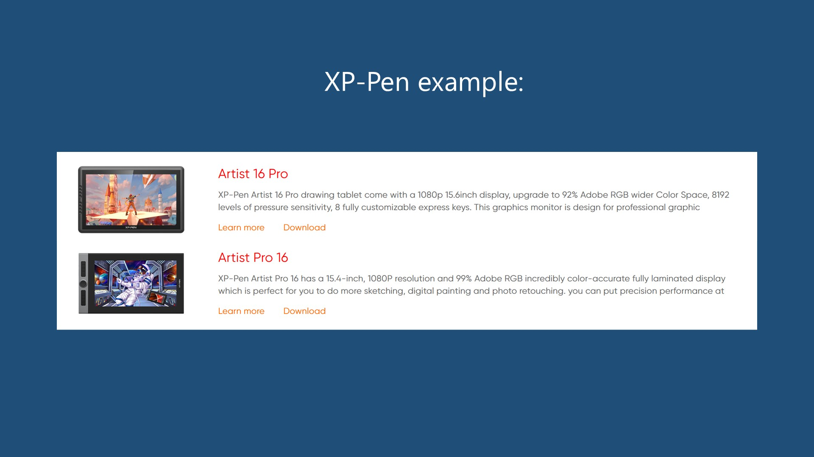

---
layout:
  width: default
  title:
    visible: true
  description:
    visible: true
  tableOfContents:
    visible: true
  outline:
    visible: true
  pagination:
    visible: true
  metadata:
    visible: true
  tags:
    visible: true
  actions:
    visible: true
---

# Buying tips

## Video



## Read the user manual

The user manual contains a lot of information that can help you understand whether a tablet will work for you. It answers most questions about connecting the tablet and the basics of how it works. It also gives you a chance to familiarize yourself with potential problems you might encounter and how to handle them.

Reading the user manual before you make a purchase will save you a lot of time and frustration.

The key things to look for in the user manual are:

* How to install the driver
* How the tablet connects to your computer. This is especially important if you are planning to purchase a pen display.

## Pen tablets vs pen displays

The decision between a pen tablet and a pen display is something many people struggle with. Going into the purchase knowing the strengths of each kind of tablet will help you choose wisely.

Many people assume pen displays are simply better. This is not true. I strongly suggest you carefully consider the strengths and weaknesses of both.

You can find the comparison here: [Pen tablets vs pen displays](pen-tablets-vs-pen-displays.md).

## Tablet brands

There are many tablet brands. I usually stick to talking about and recommending tablets from Wacom, Huion, XP-Pen, and Xencelabs. That's because I have owned many of those tablets and there is a large enough community of users that if you need help, you're likely to find it.

You can read more about these brands here: [Drawing tablet brands vs digitizers](../brands/drawtab-brands-vs-digitizers.md).

## Community size

In my experience with tech products, when a user has a question or needs help, more than 50% of the time they get their answer not from customer support but from other users in the online community.

In other words, the community around a drawing tablet brand has a big impact on your satisfaction with that tablet.

That's why I tend to recommend the brands I do — they have a large number of users who are active online.

Since Reddit is a popular place for drawing tablet discussions, here are some numbers that show how big these communities are.

<figure><figcaption></figcaption></figure>

## Understand how the tablet will connect to your computer

For pen tablets, this is straightforward. All pen tablets connect with a USB cable, and some also support wireless connectivity.

In the user manual, you'll find diagrams like this for a pen tablet.

<figure><figcaption></figcaption></figure>

For pen displays, wiring is much more complicated. There are more cables and ports involved, with more requirements on those cables and ports.

The user manual will show diagrams like these indicating how pen displays may connect to a computer.

<figure><figcaption></figcaption></figure>

<figure><figcaption></figcaption></figure>

With pen displays you should also be clear about which cables come in the box. Sometimes the user manual shows how to wire up the connections but some of those cables are not actually included. It's best to confirm this before you make a purchase.

In addition to understanding how the cables connect, you also need to make sure your computer has all the required ports and that they meet the necessary specifications.

To help you understand this, I recommend watching this video on connecting a pen display.



## Test the ports on your computer

Once you know how the connection should work, confirm that the ports on your computer will work as intended — even before you order the tablet.

For a pen tablet, you can verify a USB port works by testing it with a mouse or similar input device.

For a pen display, you should verify that any ports used to transmit a display signal work correctly.

In particular, connecting a pen display is essentially the same as adding another monitor to your computer. Make sure your computer can support as many simultaneous displays as you need, accounting for both your existing monitor and the pen display.

## Use model numbers, not names

Many tablets are on the market right now, and many have confusingly similar names.

For example, Wacom has one series called "Wacom One" and another called "One by Wacom." They differ significantly in quality, type, and age. If you rely on the name alone, you're likely to buy the wrong tablet.

<figure><figcaption></figcaption></figure>

Another example: these XP-Pen names are confusingly similar.

<figure><figcaption></figcaption></figure>

The way to avoid purchasing the wrong tablet is to always verify the model number.

## Do not stress about the number of pressure levels

These days it's fashionable for drawing tablets to advertise 8,000 or 16,000 levels of pressure. In my analysis, the vast majority of users only need about 2,000 levels and could get by with far less. Almost every tablet on the market today has more than 8,000 levels, and only a handful have as few as 4,000. Any tablet you buy will have enough.

More here: [How many pressure levels do you really need?](how-many-pressure-levels.md)

## **Be prepared to handle common problems**

* Make sure you know how to contact customer support.
* Make sure you know the warranty terms and how (if needed) you can return the tablet to the manufacturer or to the retailer (e.g., Amazon) you bought it from.
* Here's a list of [Common problems](../troubleshoot/common-drawtab-problems.md). Although most users will have no issues, a small number will run into problems on day one.
* I have a list of troubleshooting docs here: [Troubleshooting](../troubleshoot/)
* The most complex problem for pen displays is usually the "NO SIGNAL" problem. If it happens, this guide will help: [TSG: Pen display shows NO SIGNAL message](../troubleshoot/tsg-no-signal.md)

## Check the reviews

<mark style="color:red;">**Never purchase a tablet without looking at the reviews first.**</mark>

Some reviewers to explore:

* **Teoh on Tech** [https://www.youtube.com/@teohontech7141](https://www.youtube.com/@teohontech7141) Teoh has the most in-depth reviews of tablets.
* **Create Now Sleep Later** [https://www.youtube.com/c/Createnowsleeplater](https://www.youtube.com/c/Createnowsleeplater)
* **Brad Colbow** [https://www.youtube.com/c/thebradcolbow](https://www.youtube.com/c/thebradcolbow)
* **Aaron Rutten** [https://www.youtube.com/c/aaronrutten](https://www.youtube.com/c/aaronrutten)
* **Adam Duff** [https://www.youtube.com/@AdamDuffArt](https://www.youtube.com/@AdamDuffArt)

## Verify the model number, not just the model name

Tablet names are confusingly similar — I've seen people order the wrong tablet just because the names were close.

* NEVER order using the name of the tablet alone.
* ALWAYS verify you have ordered the correct model number.

See this page for all the reasons why you should not rely on the model name: [Model names vs model numbers](../guides/general/model-names-vs-model-numbers.md)

## Make sure your working environment is suitable

* Check for potential sources of electromagnetic interference. More here: [Electromagnetic Interference](../guides/general/electromagnetic-interference.md)
* Make sure you have enough space on your desk for the tablet and your keyboard.
