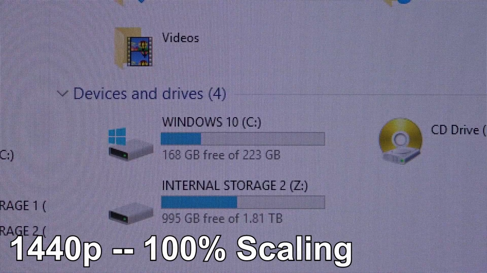

# Choosing the resolution for a pen display

## Overview

Choosing the right resolution that will work for you on a Pen display is very important. Higher resolutions aren't automatically better, and lower resolutions aren't automatically bad. What will work well for you will depend on your preferences, your prior experiences, and the size of the Pen display.

## Summary

Based on my experience, here are a few things I'd like to point out. As a Pen display gets bigger, it does become more useful to have a higher resolution. As Pen displays get smaller, having high resolution doesn't help as much and, in fact, may cause problems. Keep in mind, some users feel that specific resolutions such as 2560 by 1440 require some extra work to use well with Mac OS.

## Pen displays are different from monitors for resolution

How are **Pen displays** different from monitors in terms of resolution? You probably have some existing preferences for the resolution of a monitor you're using with your computer, and that is a good starting point. But the resolution that will work well for you for a **Pen display** is different from what you would typically pick for a monitor.

The big difference is due to one factor: Pen displays, in order for you to draw on them, must by definition be within arm's length. Typically, they're even closer than arm's length—they are about half the distance of your arm away—and this is much closer than a typical monitor.

Here's an example from my own background: I like really large monitors that are very far away from me, and they tend to be almost four feet away. When I draw, a Pen display is between 8 to 12 inches away, which is much closer. For a monitor that's three to four feet away, I prefer to have a 4K resolution; otherwise, I see a lot of pixelation. But for a Pen display that's close to me, I don't necessarily need 4K resolution. It will depend strongly on the size of the Pen display.

## Pixel density

Depending on the size and resolution you're considering, the combination will give you a different pixel density. In practical terms, the real issue here is your tolerance for seeing noticeable pixelation on a display. Some people want super tiny pixels and hate seeing very obvious pixels, while others are more tolerant of seeing them. It's hard to make a single recommendation, but you can be informed by your experiences with devices you are already using and considering the pixel density you enjoy with those.

Here are some known pixel densities for iPads

| **Model Lineup** |  **Diagonal Sizes**                                                   | **Native Resolution**                           | **Pixel Density**                       |
| ---------------- | --------------------------------------------------------------------- | ----------------------------------------------- | --------------------------------------- |
| iPad Pro         | 
11" (Ultra Retina XDR)

 

13" (Ultra Retina XDR)
 | 
2420 × 1668

 

2752 × 2064
 | 
264 ppi

 

264 ppi
 |
| iPad Air         | 
11" (Liquid Retina)

 

13" (Liquid Retina)
       | 
2360 × 1640

 

2732 × 2048
 | 
264 ppi

 

264 ppi
 |
| iPad (Standard)  | 10.9" / 11" (Liquid Retina)                                           | 2360 × 1640                                     | 264 ppi                                 |
| iPad mini        | 8.3" (Liquid Retina)                                                  | 2266 × 1488                                     | 326 ppi                                 |

| **Model Lineup**                | **Diagonal Size** | **Native Resolution** | **Pixel Density** |
| ------------------------------- | ----------------- | --------------------- | ----------------- |
| Galaxy Tab S10 Ultra / S9 Ultra | 14.6"             | 2960 × 1848           | 239 ppi           |
| Galaxy Tab S10+ / S9+           | 12.4"             | 2800 × 1752           | 266 ppi           |
| Galaxy Tab S9 _(Base Flagship)_ | 11.0"             | 2560 × 1600           | 274 ppi           |
| Galaxy Tab S9 FE+               | 12.4"             | 2560 × 1600           | 243 ppi           |
| Galaxy Tab S9 FE                | 10.9"             | 2304 × 1440           | 249 ppi           |

What we see with these devices is that generally, if you've been using them, you're used to a pixel density of around 250 PPI, and in some cases, 300 plus. Now, let's take a look at how PPI works for different Pen display sizes.

<table><thead><tr><th width="126.20001220703125">Diagonal Size</th><th>Full HD (1920x1080)</th><th width="207">2.5K (2560x1440)</th><th>4K (3840x2160)</th></tr></thead><tbody><tr><td>13"</td><td>~169ppi</td><td>~226ppi</td><td>~339ppi</td></tr><tr><td>16"</td><td>~138ppi</td><td>~184ppi</td><td>~275ppi</td></tr><tr><td>19"</td><td>~115ppi</td><td>~155ppi</td><td>~231ppi</td></tr><tr><td>22"</td><td>~100ppi</td><td>~133ppi</td><td>~220ppi</td></tr><tr><td>24"</td><td>~92ppi</td><td>~122ppi</td><td>~184ppi</td></tr><tr><td>27"</td><td>~82ppi</td><td>~109ppi</td><td>~163ppi</td></tr></tbody></table>

What you will see pretty clearly with Pen displays is that very high PPIs really require 4K. For 2K, if you're dealing with a 13-inch Pen display,

You don't strictly need your **Pen display** to have the same pixel density as a phone or iPad, but it may help you decide what might work well for you.

## What the data says

These are the results of a small survey I conducted in August 2026.

One of the questions posed in the survey was for users to identify the ideal resolution across different sizes of **Pen tablets**. Here are the initial results for 29respondents.

<figure><figcaption></figcaption></figure>

**13"** - Most are happy with a 2K resolution and some prefer 2.5K resolution. There's little preference for 4K. My take: 2K works well enough at this size. I can understand why some people prefer 2.5K. 4K at this size is unnecessary and can be difficult to work with.

**16" -** We see a strong preference for 2.5K compared to 2K. We see some interest in 4K. My take: I agree that 2.5K is great at this size. Though I have no difficulty working at 2K. 4K is still excessive at this size.

**22"** - People strongly shift to 4K with some still preferring 2.5K. My take" Many people will benefit from 4K resolution here. I am totally fine working with 2.5K at this size.&#x20;

**≥ 24"** - We see a strong preference for 4K. My take: I would definitely agree that the vast majority of people should look for 4K at these sizes. At resolutions less than 4K, people will start noticing a lot below 4K.

## MacOS

macOS handles resolution differently than Windows. In particular, it renders text differently, and this can make text look a little fuzzy at certain resolutions. Fortunately, there are ways to mitigate the problem. See: [Fuzzy text on displays with macOS](../guides/platforms/macos/display-resolution.md)

## **Picking between 2.5K vs 4K resolution**

People often ask about choosing between these two resolutions. Overall, I think 2.5K is the best value for your money.

Especially at the 13" and 16" sizes, a 2.5K display delivers a massive increase over 2K. At these sizes, higher resolutions provide only incremental benefits.

This video illustrates some differences: [Nicolas11x12 English - 1440p vs 4K (2160p) Monitor -- What To Look Out For!](https://www.youtube.com/watch?v=0C2DnfPTcmE) 2018-04-05

<figure><figcaption>
From: <a href="https://www.youtube.com/watch?v=0C2DnfPTcmE">Nicolas11x12 English - 1440p vs 4K (2160p) Monitor -- What To Look Out For!</a> 
</figcaption></figure>

<figure><figcaption>
From: <a href="https://www.youtube.com/watch?v=0C2DnfPTcmE">Nicolas11x12 English - 1440p vs 4K (2160p) Monitor -- What To Look Out For!</a> 
</figcaption></figure>
