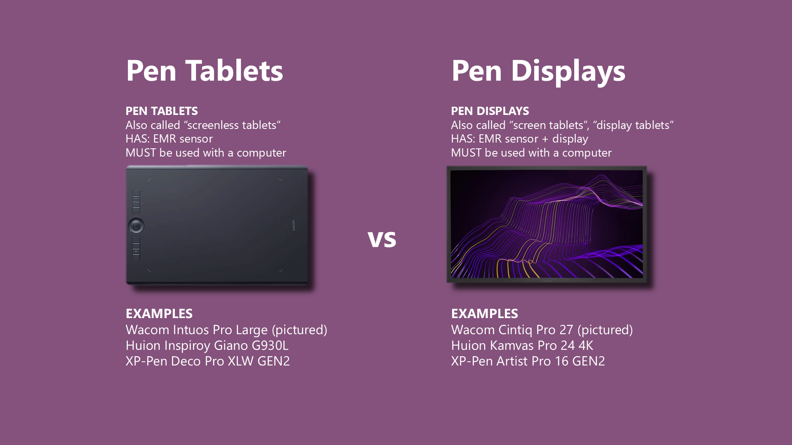

# Pen tablets vs pen displays

## Overview

This guide helps you choose between a pen tablet and a pen display.

* **Pen tablets** lack a screen and require a computer
* **Pen displays** include a screen and require a computer

<figure><figcaption></figcaption></figure>

## Approach

Choosing between a pen tablet and a pen display takes careful thought. No single answer suits everyone. This guide compares pen tablets and pen displays across key dimensions. It highlights where each type offers an advantage.

This guide summarizes several in-depth topics. For more detail, consult the [Drawing tablet buying guide](./).

## Dispelling common myths

### MYTH: Pen displays are inherently better pen tablets

<mark style="color:red;">**FALSE. REALITY: Neither is inherently better. Your needs determine the right choice.**</mark>

Pen displays look impressive and cost much more than pen tablets. That difference might suggest superiority- but simply is not true. Pen tablets offer distinct merits over pen displays. Do not view a pen tablet as a cheaper mor primitive compromise. For many people, a pen tablet is the right choice.

### MYTH: Professional artists only use pen displays

<mark style="color:red;">**REALITY: Professional artists use pen displays and pen tablets**</mark>

Another common myth claims that professionals only use pen displays. This is false. Many professional artists choose pen tablets and create high-quality work.

### MYTH: Pen displays let you create better art

<mark style="color:red;">**REALITY: Pen displays and pen tablets can produce equally good art**</mark>

Some people worry that their desired art quality requires a pen display. Do not let that concern stop you. Artists have produced amazing work with pen tablets for decades. Pen displays offer benefits, but art quality does not distinguish the two types.

### MYTH: Once you use a pen display you will never enjoy using a pen tablet

<mark style="color:red;">**REALITY: Many people try a pen display and RETURN to a pen tablet**</mark>

* [Ariann Art - 7 Reasons Why I Switched Back from a Display Tablet to a Pen Tablet](https://www.youtube.com/watch?v=rnW5O221e70) 2020-10-07
* [Art by Sil — video on ditching a screen tablet](https://www.youtube.com/watch?v=Ti4u-Y6uuCM) 2025-03-25

## Advice for first-time tablet users

If you have never had any kind of drawing tablet before -  explore a pen tablet first. Learn its workflow. If you cannot adjust after a few weeks, return it and choose a pen display.

If you have drawing using a pen on device like an iPad or Samsung Galaxy Tab S device, you alrady have some experience similar to using a drawing tablet. I still think you should explore pen tablets, but if you want a similar experience to what you are already used to then it makes sense to think about a pen display/

## Computer requirements

<mark style="background-color:purple;">WINNER: TIE</mark>

Pen tablets and pen displays need a computer. Neither works independently like an Apple iPad.

## Posture

<mark style="background-color:purple;">WINNER: Pen tablets</mark>

With a pen tablet, you draw with better posture. Your back stays upright, and you look straight ahead at your monitor. With a pen display, you almost always lean forward and look down, which can strain your lower back and neck. This pattern drives many pen-display returns. Learn more: [Body posture when using drawing tablets](../guides/ergonomics/posture.md)

## Cost

<mark style="background-color:purple;">WINNER: Pen tablets</mark>

Pen tablets cost much less than pen displays. Even premium pen tablets cost less than most pen displays.

* Pen tablets cost between $50 and $250. Premium models cost $500 and often sell for $400.
* Pen displays start near $300 and can reach $1,300. Wacom professional pen displays occupy their own category and cost $2,500 to $3,500.

## Reliability

<mark style="background-color:purple;">WINNER: Pen tablets</mark>

Pen tablets clearly win on reliability. Their simpler design uses far fewer components, so fewer parts can fail. Their components also tolerate more wear.

## Cabling

<mark style="background-color:purple;">WINNER: Pen tablets</mark>

Pen tablets work through one USB cable, and some connect wirelessly. Pen displays need more complex connections. Your computer and pen display determine the cabling options. Configuration can prove difficult. Learn more: [Connecting a pen display](../guides/connecting/connecting-pen-display/)

## Pointer lag

<mark style="background-color:purple;">WINNER: Pen tablets</mark>

All tablets introduce some pointer lag. In my observation, pen tablets introduce less lag than pen displays.

Even with equal lag, a pen display makes the delay more noticeable. You see the pen tip and cursor together on one screen. Their close proximity makes the lag apparent. Learn more: [Pointer lag](../core/pointer-lag.md)

## Wireless connectivity

<mark style="background-color:purple;">WINNER: Pen tablets</mark>

Many pen tablets support wireless connectivity, typically through Bluetooth.

No pen display supports wireless connectivity. You need at least one cable between your pen display and computer. Larger pen displays, at 16 inches or above, almost certainly need two cables: one for your computer and one for power.

## Taking notes

<mark style="background-color:purple;">WINNER: Pen displays</mark>

In general, I do not recommend either type for note-taking. Standalone tablets serve note-taking much better. Compared with a pen tablet, a pen display better supports notes because you see your writing. The experience feels more natural and intuitive, like writing on paper. Learn more: [Taking notes with drawing tablets](../basics/scenarios/taking-notes.md).

## Surviving a fall

<mark style="background-color:purple;">WINNER: Pen tablets</mark>

If you knock a pen tablet off your desk, almost certainly nothing bad happens. Pen tablets generally contain no moving parts beyond buttons. Dropping a pen display, however, almost certainly causes severe damage. The glass could shatter, or the display panel could suffer serious internal damage. Users cannot repair this damage, and repairs often cost a great deal — when repairs remain possible.

In most cases I have seen, repairing a damaged pen display costs about as much as a new one.

## Power requirements

<mark style="background-color:purple;">WINNER: Pen tablets</mark>

Pen tablets require very little power. When connected to a laptop, they barely drain its battery. Pen displays require significantly more power and drain laptop batteries faster. Learn more: [Powering a drawing tablet](../core/power/powering-drawtabs.md).

## Hand covering what you are drawing

<mark style="background-color:purple;">WINNER: Pen tablets</mark>

A pen display mimics drawing on paper in many ways, usually to your advantage. It also shares some paper limitations. In particular, your hand and arm sit between you and your drawing. You need to draw from another angle or rotate the canvas.

With a pen tablet, your drawing hand never blocks the screen.

## Physical size and weight

<mark style="background-color:purple;">WINNER: Pen tablets</mark>

Pen tablets are considerably thinner and lighter.

## Drawing experience

<mark style="background-color:purple;">WINNER: Pen displays</mark>

* Pen displays feel more natural because you look where you draw. With a pen tablet, your eyes and hand work in separate places.
* Most people press **Undo** less frequently with a pen display, because strokes more often land as intended.
* With a pen tablet, you **must** match the active area to your display's aspect ratio. This prevents distortion. Use the tablet driver's "Force proportions" setting. Pen displays arrive with the correct proportions. Learn more: [Matching aspect ratios with Force Proportions](../guides/customizing/force-proportions.md).

Learn more: [The drawing experience](../basics/drawing-experience.md)

## Portability

<mark style="background-color:purple;">WINNER: Pen tablets</mark>

Their size, weight, and single-cable or wireless operation make pen tablets much easier to carry.

Pen displays need more protection during travel because they suffer damage more easily. See [Tablet cases](../catalog/accessories/tablet-cases.md).

## Diagonal wobble

Diagonal wobble describes a slight pen-position tracking inaccuracy. Drawing tablets show it to varying degrees.

My testing shows no clear pattern across pen tablets and pen displays. Wobble appears linked to the tablet model, not the type.

View the diagonal-wobble samples here: [Diagonal wobble data](../process/diagonal-wobble-data.md).

## Pen pressure handling

Pen design, not tablet design, determines pressure handling, including IAF and maximum pressure.

A few exceptions exist. One or two tablets handle pressure poorly regardless of the pen, but such cases remain exceedingly rare.

## Surface texture

When you drag your pen across a tablet, the surface needs enough texture to prevent a slippery, hard-to-control feel.

Generally, pen tablets offer noticeably more texture than pen displays. Some older pen tablets feel relatively smooth beside modern models.

Pen displays include surface texture, but less than pen tablets.

## You can use both kinds of tablets

No rule requires you to use only one tablet type. Many people own both types and switch according to the task. See: [Connecting multiple drawing tablets at the same time](../guides/general/connecting-multiple-drawtabs.md)

## VESA mounting

* Pen displays often include VESA mounting holes.
  * Pen displays measuring 16 inches or less usually lack VESA mounting holes.
  * Tablets larger than 16 inches almost always include VESA mounting holes.
* Pen tablets do **not** support VESA mounting.
* For more information, see [VESA](../tech/vesa.md).
