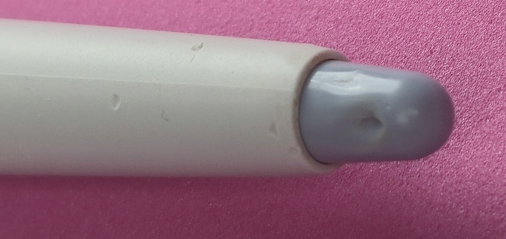

# Buying used drawing tablets

## Overview

We would all like to have brand-new equipment. However, used tablets can be a good way to save money.

## My experience with used drawing tablets

I have bought and worked with MANY used drawing tablets - 26 used tablets as of April 2024. You can see the full list here: [Tablet inventory](../about/inventory.md)

* **pen tablets** - Pen tablets are generally very reliable devices and are fine to buy used. I own many used pen tablets, some over 25 years old, that still work.
* **pen displays** - I have purchased four used pen displays.
* **standalone** - I have no experience with used standalone tablets.

## Tablet age

Because used tablets might be older models, you should be prepared for issues that may arise due to their age. More here: [Using older drawing tablets](../guides/general/older-drawtabs.md)

## Older drivers

In particular, you may need to use older drivers. This comes with its own set of complications. More here: [Using older tablet drivers](../guides/drivers/older-tablet-drivers.md)

## Which brands to buy used

Wacom products have always been the most reliable and highest quality. Even going back many years, their models hold up well. Because Wacom professional pen tablets are the highest quality, they make great choices to buy used. More here: [Brands](../brands/)

## Used Wacom Intuos professional tablets

There are some factors you MUST take into account when buying them used. I've summarized those issues in the video below. Make sure to check the video description for errata.

Even though this video is about used pen tablets, it may be useful even if you are looking to purchase a used pen display.

Likewise, even though this video is about professional tablets, the topics raised also apply to consumer-level tablets.



## Be clear about what you are getting in the box

Find out what the manufacturer normally includes in the box for the tablet. You can find this on the manufacturer's website, by contacting customer support, or by watching a review or unboxing video on YouTube.

Then compare what the manufacturer includes with what the seller has available. The most important things to verify are the pen and any cables you need.

## Be prepared to clean the tablet

Some used tablets arrive in pristine condition - either through disuse or because the seller thoroughly cleaned the tablet beforehand.

Sometimes, though, the tablets are filthy. For example, they may:

* Have food crumbs, dust, or skin cells in crevices
* Have stickers attached
* Have adhesive residue on the surface from removed stickers

It may be worth asking the seller how clean the tablet is.

## Notes on Wacom drivers

* As of Wacom Driver 6.4.0, released in October 2022, Wacom has dropped support for Intuos 5 tablets and older Intuos tablets - except for the Wacom Intuos 4 XL, which is still supported. ([https://cdn.wacom.com/u/productsupport/drivers/win/professional/releasenotes/Windows\_6.4.0.html](https://cdn.wacom.com/u/productsupport/drivers/win/professional/releasenotes/Windows_6.4.0.html))

## Alternative to Wacom drivers for older tablets

* If you have an older tablet and need a driver, check out [OpenTabletDriver](../guides/drivers/opentabletdriver/)
* For creative work in Windows, see [Install OpenTabletDriver on Windows](../guides/drivers/opentabletdriver/otd-windows-install.md)

## Testing a tablet before you buy

If you have the opportunity to examine the tablet before deciding to buy it, here are some things to check: [Inspecting a drawing tablet](inspecting-drawtab.md).

## Buying online

You can find many tablets on eBay. I've had a good experience with the 25+ tablets I've bought there.

* All but one worked out of the box.
* When reading the item description, I made sure:
  * The surface didn't have any visible signs of wear
  * The tablet came with a pen
  * The tablet came with the cables it needed - this is very important if the tablet uses proprietary cables
* Listings on sites like eBay let the seller provide photos. Sometimes the initial photo is the official product photo pulled from the manufacturer's website.
  * Remember - the seller may have used the image for the wrong tablet.
  * Some people advise being very cautious when you see an official product photo in a listing, as it may not match the actual product being sold.
  * Always verify with photos of the actual tablet.

## Verifying the model you are buying

You must be extra careful to verify that you are purchasing the correct tablet. Always verify the MODEL NUMBER, not just the name. The importance of using the model number is explained here: [Model names vs model numbers](../guides/general/model-names-vs-model-numbers.md). If the seller is unsure of the model number, see this article: [Finding the model number of your drawing tablet](../guides/general/finding-tablet-model-number.md)

Don't rely on the model number in the listing title - always check photos of the actual product from the seller.

## Official tablet brand stores on eBay

Some manufacturers sell new, used, or refurbished tablets on eBay:

* Wacom: [https://www.ebay.com/str/wacom](https://www.ebay.com/str/wacom)
* Huion: [https://www.ebay.com/str/huiontablet](https://www.ebay.com/str/huiontablet)
* XP-Pen:
  * [https://www.ebay.com/str/xpdrawingus](https://www.ebay.com/str/xpdrawingus)
  * [https://www.ebay.com/str/xppentechnology](https://www.ebay.com/str/xppentechnology)

## Surface texture

A used tablet's surface might be nearly pristine, or it might show significant wear.

* Ideally, get one that is not heavily worn.
* Small scratches are OK if they can't be felt through the pen.
* Larger scratches will interfere with your drawing. You may be able to mitigate this with surface protection. More here: [Surface protection](../misc/surface-protectors-obsolete.md)

More here:

* [Surface wear on pen tablets](../guides/maintain/surface-wear-pen-tablets.md)
* [Surface wear on pen displays](../guides/maintain/surface-wear-pen-displays.md)

## Pens

Keep in mind that you may find a great deal on a tablet that doesn't come with a pen. Verify whether a pen is included before you purchase.

If you need to buy a pen, or if you break your pen, be aware that:

* You need to find the exact model number of the pen that is compatible with your tablet. A random pen from the same brand may not be compatible.
* Replacement pens can be very expensive even if they are a decade old. For example, older Wacom Pro Pens can cost $100 or more.
* Replacement pens can be incredibly hard to find on the used market.
* On the used market, sellers rarely sell the pen by itself. You may even have to purchase another tablet just to get a compatible pen. I've personally had to do this.

More here: [Replacing a pen](../guides/maintain/replacing-pen.md)

## Bite marks on pens

Some people hold their pens in their mouths and lightly chew on them. You can sometimes find teeth marks on the pens.

Below is a used Intuos 1 pen (GP-300E) I bought on eBay with what I believe are bite marks near the eraser.

<figure><figcaption></figcaption></figure>

This is a reminder to thoroughly clean any used equipment you purchase.

## Nibs

Depending on the tablet and how you draw, the pen nib wears down over time.

* Verify whether your purchase includes spare nibs.
* Compatible nibs may be difficult to find.
* Compatible nibs may also be expensive.

## Reddit threads

* [**r/wacom - Intuos 4 or intuos 5**](https://www.reddit.com/r/wacom/comments/17cp4h9/intuos_4_or_intuos_5/) 2023-10-20
