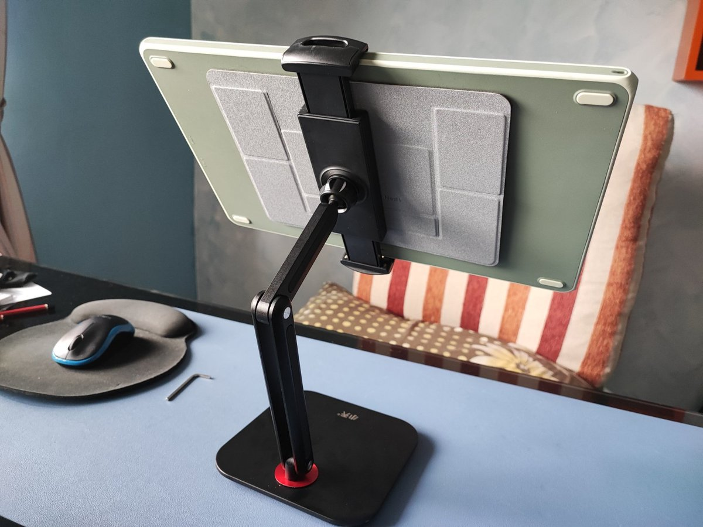
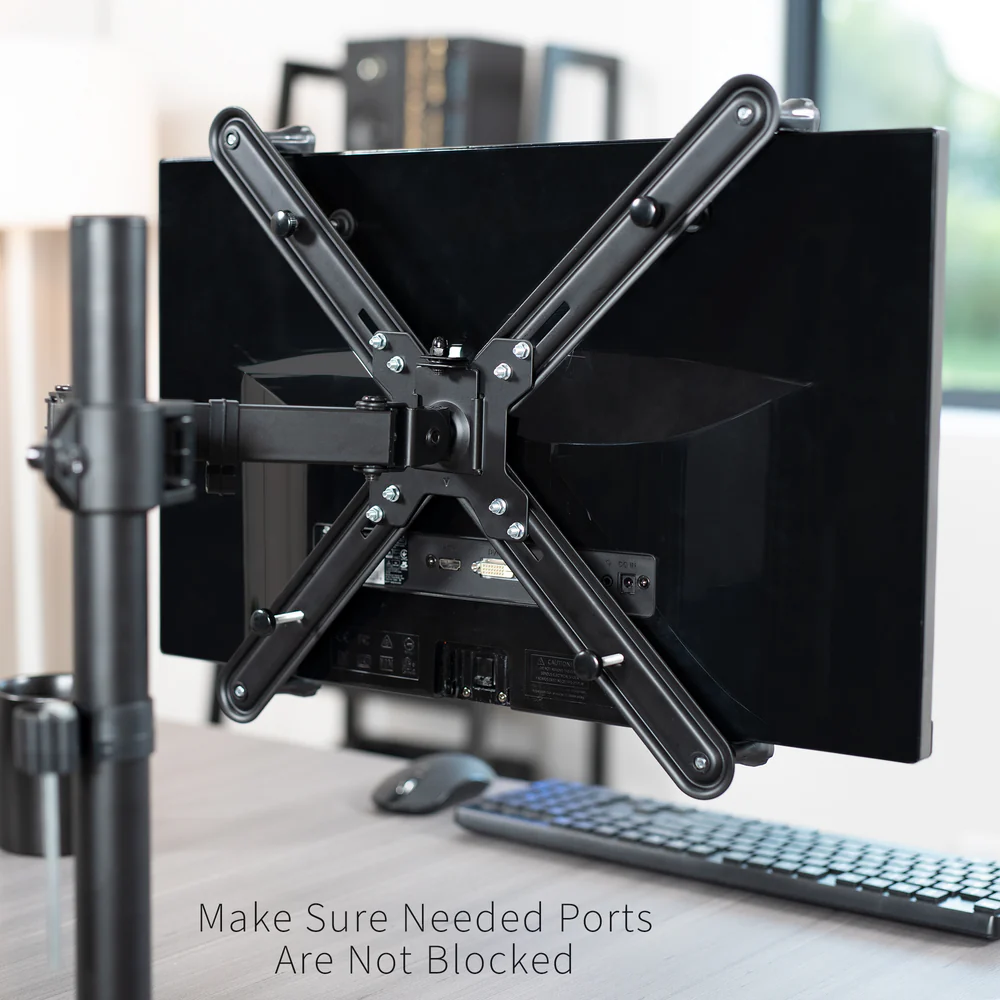
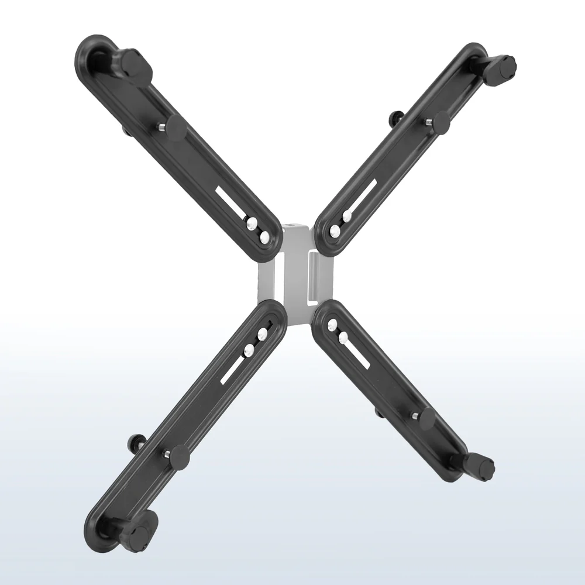

# Monitor arms

## Overview

Using a monitor arm with your pen display comes down to whether your pen display is VESA mountable.

* **If your pen display is VESA mountable**, you can use a VESA compatible monitor arm.
* **If your pen display is not VESA mountable,** there are still some options.


Instead of an arm, you might also explore [Stands](../stands/) for your tablets.


## Arm wobble

All monitor arms have some amount of wobble. Some have more and some have less. But none of them feel "rock solid."

One thing that will help reduce the wobble is if the bottom of the pen display rests on something like your desk.

If you want to have ZERO wobble you need to use a stand with your pen display.

## **Wacom Flex arm**

Wacom has designed an arm for the Cintiq line called the Wacom Flex Arm. It is specifically designed for these products. Note that this arm only works with specific Cintiq models.

* [MobileTechReview: Wacom Ergo Flex Arm for Cintiq Pro 24 & 32 Review](https://www.youtube.com/watch?v=iuqRv5wN2p8) Dec 17, 2018
* [Brad Colbow - Wacom Flex Arm Review](https://www.youtube.com/watch?v=4zIKQqBeF9o) Dec 10, 2018

## **Wacom VESA mount**

If you already have a monitor arm you can use the Wacom VESA Mount for Cintiq 24 & 32 with it to mount those specific models.

## Huion ST500 Desktop Arm

Huion has a monitor arm which appears to be a rebranded version of a generic monitor arm.

[r/Huion - Huion ST500 Desktop Arm Review](https://www.reddit.com/r/huion/comments/1d5bin3/huion_st500_desktop_arm_review/) 2024-05-31

## North Bayou

This brand comes up a lot when people mention what arms they use, but I don't have any personal experience with them.

* North Bayou F100A
* North Bayou F80
  * [https://www.reddit.com/r/wacom/comments/16jmczd/just\_wanted\_to\_share\_i\_found\_the\_perfect\_setup/](https://www.reddit.com/r/wacom/comments/16jmczd/just_wanted_to_share_i_found_the_perfect_setup/)

## Ergotron

I use this brand a lot. [Ergotron monitor arms](ergotron-monitor-arms.md)

* [Ergotron - Install Ergotron LX Monitor Arm](https://www.youtube.com/watch?v=8w_3pzQcjfg) 2021-10-01
* [Ergotron - HX Monitor Arm Adjustments](https://www.youtube.com/watch?v=giOfhNkGGdY) 2020-03-04
* [Ergotron - Install Ergotron HX Monitor Arm with Heavy-Duty Tilt Pivot or HD Pivot](https://www.youtube.com/watch?v=3GZYP7DwwCA) 2021-05-24

## VIVO VESA monitor and touch screen desk stand

I've used this for a while with a 22" pen display and I really like it. [VIVO Pneumatic Arm Monitor Desk Stand (STAND-V100R)](../stands/vivo-v100r.md)

<figure><figcaption></figcaption></figure>

## XP-Pen ACS15 Ergo Stand

See this video



## Handling pen displays without VESA support

### Adjustable brackets

For smaller pen displays that are about the size of a laptop, you can try an arm designed to hold a laptop.

Here is an example: [https://twitter.com/eyekoodraws/status/1596064399109726209](https://twitter.com/eyekoodraws/status/1596064399109726209)\

If your pen display is larger, there are some larger brackets available as well.

One example is VIVO VESA Adapter Bracket Kit (STAND-VAD1)

<figure><figcaption></figcaption></figure>

<figure><figcaption></figcaption></figure>

Some things to watch out for with these brackets before you buy them:

* Will they block access to any ports on your tablet?
* Will the brackets go beyond the bezel and cover the glass of the tablet?
* How securely will they hold your tablet?
* How much weight can they support?
* How much wobble will they have if you try to draw on the tablet?

### Other examples

* [r/drawingtablet - Kamvas Pro 16 Setup](https://www.reddit.com/r/drawingtablet/comments/1mrshrw/kamvas_pro_16_setup/) 8/16/2025
  * North Bayou pole desk mount arm
  * VIVO universal VESA adapter
  * industrial strength velcro strips
* [r/huion - DIY arm mount | Kamvas 16 (2021)](https://www.reddit.com/r/huion/comments/ryrt3x/diy_arm_mount_kamvas_16_2021/) 1/7/2022
* [r/huion - Finally Found A Use For This Stand :)](https://www.reddit.com/r/huion/comments/159hnvy/finally_found_a_use_for_this_stand/) 7/25/2023

## Resources

* There's a write up on using tablets that includes a section on a North Bayou arm here: [https://www.asianjoyco.com/resources-tutorials/digital-sculpting-tools](https://www.asianjoyco.com/resources-tutorials/digital-sculpting-tools)
* [David Zhang - $25 vs. $300 Monitor Arm - What Stands Do I Recommend?](https://www.youtube.com/watch?v=__K4V8pFhf4) 2019-10-25
* [/r/huion - Is there a way to attach the Huion Kamvas 16 2021 to a monitor arm?](https://www.reddit.com/r/huion/comments/oygb83/is_there_a_way_to_attach_the_huion_kamvas_16_2021/) 2021-08-05
