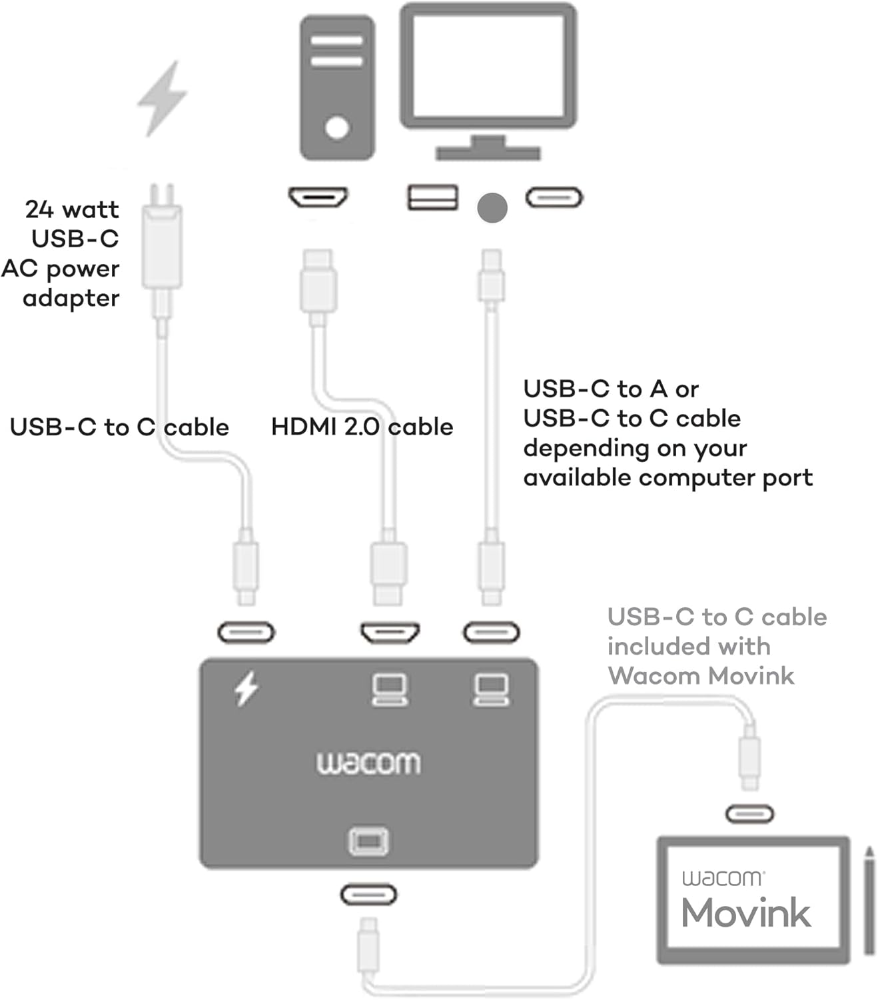

# Wacom Converter (ACK45219Z) notes

## Overview

The Wacom converter takes HDMI video output from your computer, a USB data connection from your computer, and a USB power cable, then combines them into a single USB-C port that you can use with the Wacom Movink 13.

The Wacom converter was intended for the Movink, but can work with non-Wacom pen displays.

## Compared to a 3-in-1 cable

The Wacom converter is essentially an $80 3-in-1 cable without the cable. To use it fully, you need to provide four separate cables.

## You have to buy the cables separately

I cannot emphasize this enough. The Wacom converter is just "a box" with ports. It has no cables at all. It is your responsibility to acquire compatible cables.

## Connection

<figure><figcaption></figcaption></figure>

## Testing results

* Wacom Movink 13 - worked perfectly
* Huion Kamvas 13 GEN3 - worked perfectly
* Huion Kamvas 16 GEN3 - worked perfectly
* Huion Kamvas Pro 19 - <mark style="color:red;">**DID NOT WORK**</mark>
  * Problem #1 - Could not power the tablet through the converter
  * Problem #2 - I always got a "NO SIGNAL" message on the tablet.
    * The problems here COULD have been due to me not using the specific USB-C cable that came with the KP19.
      * I ALSO tested this with a Samsung Galaxy Book 5 Pro 360 with the same results.
* Xencelabs Pen Display 16 - worked perfectly

## Testing setup

* M4 Mac Mini
* Cabling
  * Mac Mini -> Wacom converter with a random USB 2.0 cable
  * Mac Mini -> Wacom converter with a random HDMI cable
  * Wacom converter -> tablet with a Huion full-featured USB-C cable
