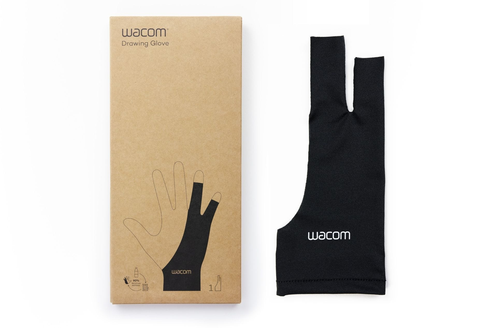

# Drawing gloves

## Overview

You may notice that some tablet users wear drawing gloves. Sometimes these gloves even come in the tablet box. Unlike a normal glove, a drawing glove usually covers only the last two fingers and leaves the other fingers uncovered.

## Why people use drawing gloves

* The gloves keep the tablet surface free from sweat and oil from your hand. This is very useful for screen tablets
* Sometimes people don't like the feeling of their hand on the tablet surface.
* For tablets that are touch sensitive you can wear a glove to help improve palm rejection so your hand does not accidentally interrupt your strokes.&#x20;
* For screen tablets, there might be a bit of heat from the screen - the glove may keep you hand from feeling that s much.

## Do you have to use a drawing glove?

No. I don't think most peopel sue them but many do - especially when using screen tablets. At the very least it is worth a try.

## Cleaning the gloves

Some people wash them with regular laundry. Others hand-wash them with a mild detergent.

* [r/huion - How should I wash my artist glove](https://www.reddit.com/r/huion/comments/13x8v69/how_should_i_wash_my_artist_glove/)? 2023-05-31
* [r/Arttips - Can you machine wash an art glove?](https://www.reddit.com/r/Arttips/comments/ol14k1/can_you_machine_wash_an_art_glove/) 2021-07-15

## Examples

### Wacom drawing glove (ACK4472501Z)

<figure><figcaption></figcaption></figure>

### Huion drawing glove

<figure><figcaption></figcaption></figure>

### XP-Pen AC08 S/M/L Artist Drawing Glove

This one is available in three sizes to better fit your needs.

<figure><figcaption></figcaption></figure>

## Resources

* [Huion - Why Do We Need the Drawing Gloves?](https://store.huion.com/posts/why-do-we-need-the-drawing-gloves)
