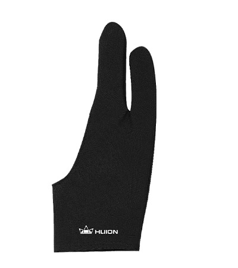
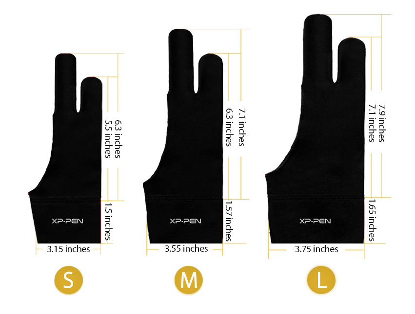

# Drawing gloves

## Overview

You may notice that some tablet users wear drawing gloves. Sometimes these gloves even come inside the tablet box. Unlike a normal glove, usually a drawing glove only covers the last two fingers and leaves your other two fingers uncovered.

## Benefits

The gloves keep the screen free from sweat and oil from your hand.

Primarily they are worn by people using pen displays (tablets that have a screen) though they work just as well with pen tablets.

They can also be useful in helping with palm rejection with tablets that support touch.

## Cleaning the gloves

Some people just wash them as laundry. Others hand wash with a mild detergent

* [r/huion - How should I wash my artist glove](https://www.reddit.com/r/huion/comments/13x8v69/how_should_i_wash_my_artist_glove/)? 2023-05-31
* [r/Arttips - Can you machine wash an art glove?](https://www.reddit.com/r/Arttips/comments/ol14k1/can_you_machine_wash_an_art_glove/) 2021-07-15

## Examples

### Wacom drawing glove (ACK4472501Z)

<figure><figcaption></figcaption></figure>

### Huion drawing glove

<figure><figcaption></figcaption></figure>

### XP-Pen AC08 S/M/L Artist Drawing Glove

This one is available in three sizes to better fit your needs.

<figure><figcaption></figcaption></figure>

## Resources

* [Huion - Why Do We Need the Drawing Gloves?](https://store.huion.com/posts/why-do-we-need-the-drawing-gloves)

 
