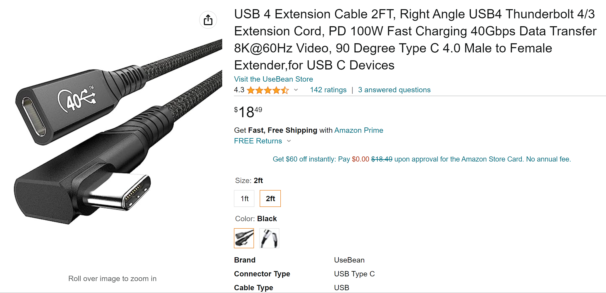

# Extension cables

### Overview

Sometimes your cables just are not long enough. In those cases, you can use extension cables.

Key requirements for an extension cable:

* For pen tablets
  * It needs to support data and a small amount of power. Any USB 2.0 extension cable should work.
* For pen displays
  * It must support data
  * It must support DP alt mode
  * It must support the resolution and refresh rate you need
  * It must support sending enough power to your pen display
  * <mark style="color:red;">**SAFETY CRITICAL**</mark> It must support **at least** as much power as the tablet's original cable. If it is not rated to handle that much power, it can become a safety or fire risk.

To better understand the requirements for connecting a pen display, see [Connecting a pen display](../../guides/connecting/connecting-pen-display/).

## The extension cable I use for pen displays

I use a 2-foot UseBean USB-C extension cable. It has worked well for me. I have run up to `4K@60Hz` through this extension cable.

I used it in these ways:

* With a Huion Kamvas 22 Plus: I connect it to the USB-C end of a Huion 3-in-1 cable.
* With a Wacom Cintiq Pro 16 (DTH-167): I connect it to the USB-C cable that came with the Cintiq.

[https://www.amazon.com/dp/B0BB13ZNPQ](https://www.amazon.com/dp/B0BB13ZNPQ)

### 

## Be aware of how deeply the port is housed in the pen display

The specific USB-C extender above has a plug that fits into some pen displays, but other pen displays have more deeply recessed USB-C ports. This cable will not fit those ports.

For example, this extender does NOT go deep enough to fit into a Huion Kamvas 13.

### Links

* Teoh on Tech: Using Extension Cables with Pen Displays or Graphics Tablets [https://www.youtube.com/watch?v=y7kvIGbnjzo](https://www.youtube.com/watch?v=y7kvIGbnjzo)
* [https://www.reddit.com/r/huion/comments/11wvplt/extending\_the\_3\_in\_1\_cable/](https://www.reddit.com/r/huion/comments/11wvplt/extending_the_3_in_1_cable/)
