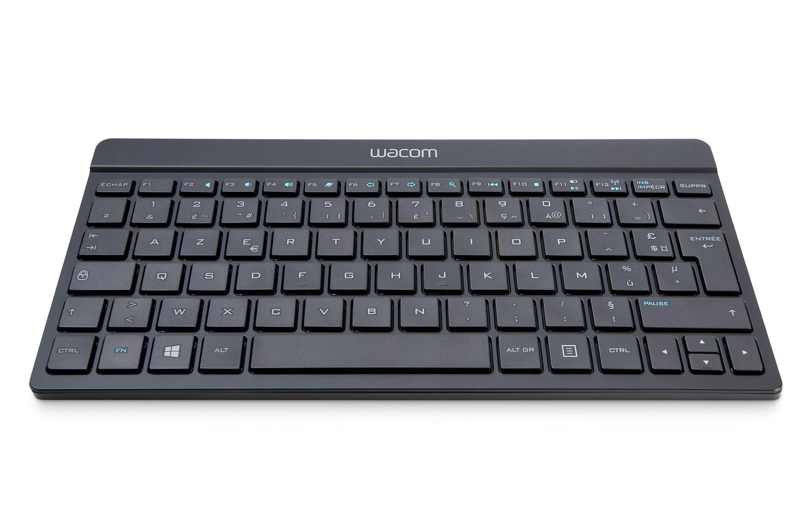
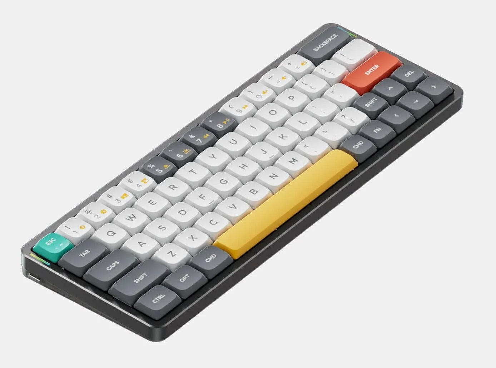
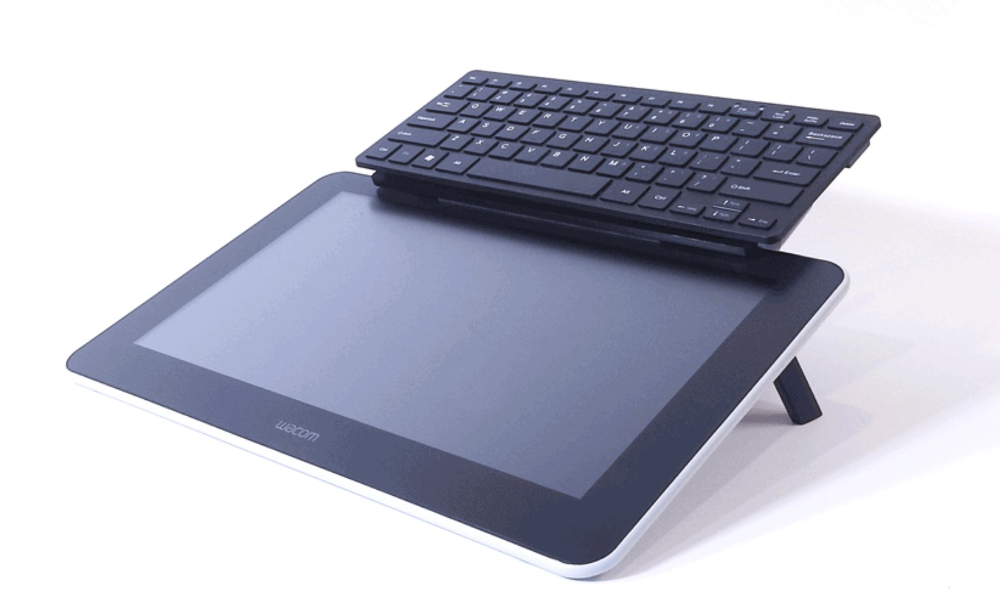

# Keyboards

## Overview

For their drawing setups, sometimes people use smaller keyboards. The smaller size makes it easier to keep one near the tablet without taking up too much space.

## Examples of small keyboards

There are many smaller keyboards available. Here are just a few examples.

### Wacom keyboard

This small keyboard hasn't been in stock for a while. [https://estore.wacom.com/en-US/wireless-keyboard-us-english-wkt400.html](https://estore.wacom.com/en-US/wireless-keyboard-us-english-wkt400.html)

## Nuphy Air 60

([https://nuphy.com/collections/keyboards/products/air60](https://nuphy.com/collections/keyboards/products/air60))

## CinTweak keyboard holder

[https://cintweak.com/](https://cintweak.com/)

This device is intended to keep your keyboard easily accessible when using a large drawing tablet.

**Videos**

* [CreateNowSleepLater - CinTweak Universal Keyboard Tray for Wacom Cintiq, Huion, and XPPen Review](https://youtu.be/iuDreUS767M)
