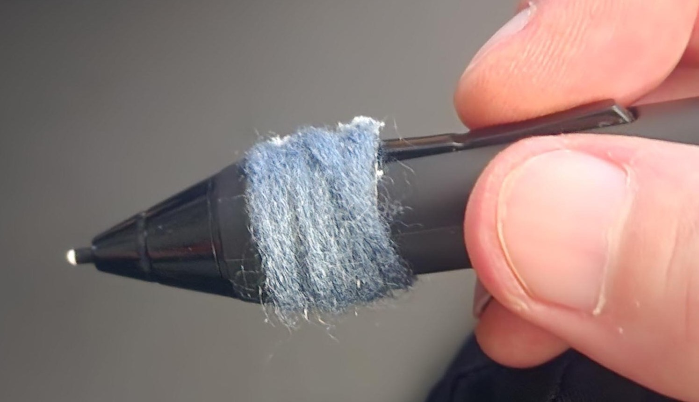

# Pen grips

## Overview

Some pens let you swap out the grip area of the pen to customize the feeling of the pen.

## Wacom Pro Pen 3

This pen comes with several different grips or can be used without a grip.

## 3rd party options

* **Korelax grips**
  * Link: [https://korelax.io/](https://korelax.io/)&#x20;
  * I haven't tried these out myself. But, they have some interesting options.
* [**Hagurumado grips**](hagurumado-grips.md)
  * Super premium grips from Japan. I have used one of these with a Pro Pen 2.

## Do-it-Yourself grips

Some people make their own grips using

* Raquetball tape
* Hockey tape
* Suguru (See this [reddit thread](https://www.reddit.com/r/huion/comments/mcefso/comment/gs3ew7e/?utm_source=share\&utm_medium=web2x\&context=3))
* Yarn

Here's an example of someone using **yarn** to make a grip. ([**from this reddit thread**](https://www.reddit.com/r/wacom/comments/1bnvtqu/setup_is_super_old_and_the_grip_is_smooth_my/))

<figure><figcaption></figcaption></figure>
