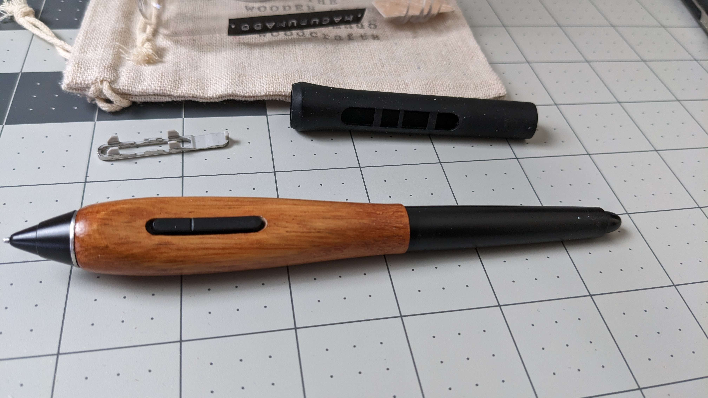

# Hagurumado grips

## Overview

Hagurumado Woodcrafts ([https://hagurumado.com/](https://hagurumado.com/)) offers wooden grips for select models of Wacom pens.

## What I use

I have this model ([https://pinion.thebase.in/items/26608192](https://pinion.thebase.in/items/26608192)), shown below, which I use with a KP-504E pen. It was easy to swap out the original grip. The wood adds some "warmth" to the touch and looks very elegant.

Model: "Wooden Grip for Wacom Pro Pen 2 (KP-504E) \[Thick Bodied with Button hole]"

<figure><figcaption></figcaption></figure>
