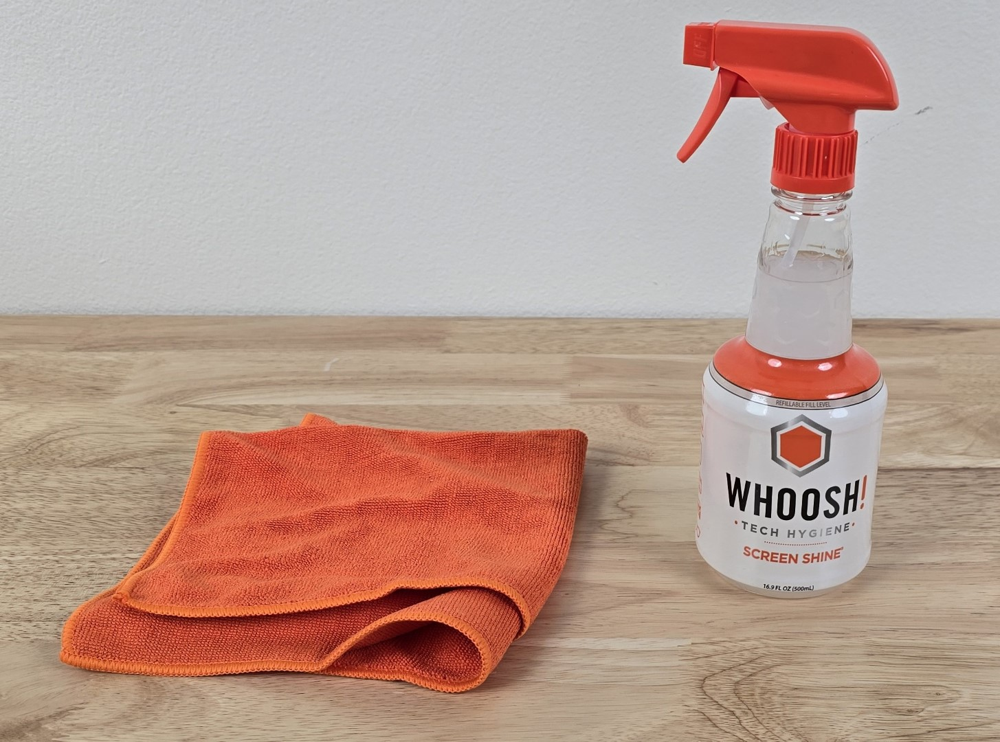
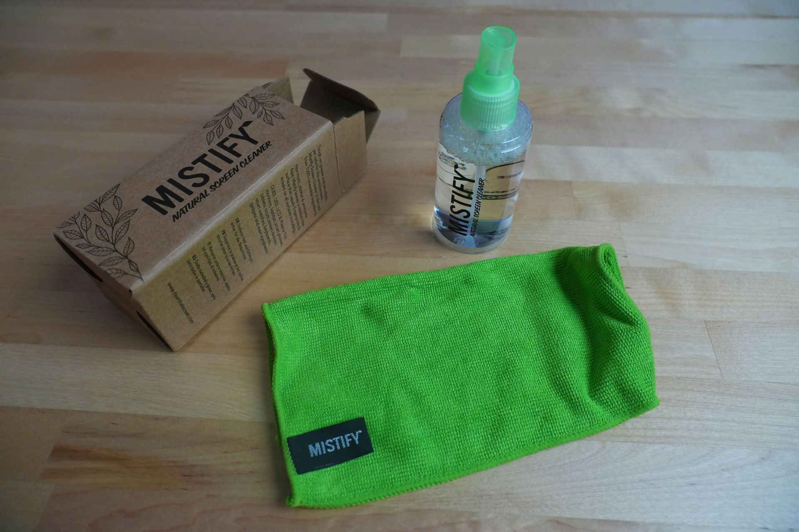

# Screen cleaning sprays

## Overview

There are specialized cleaning sprays for screens which work very well on pen displays.

More here: [Cleaning drawing tablets](../../guides/maintaining-your-drawing-tablet/cleaning-a-drawing-tablet.md)

## What I use

I've used two screen cleaning sprays: WOOSH and MISTIFY. Both work well.

I spray the into a microfiber towel that comes with the bottle. I want the cloth damp (not wet). Then I wipe down the tablet screen.

## Demonstration

Here's a good video showing WOOSH in use: [https://www.youtube.com/watch?v=6zNUKkehnpc](https://www.youtube.com/watch?v=6zNUKkehnpc) &#x20;

*

    <figure><figcaption>
WOOSH! bottle with its microfiber towel
</figcaption></figure>

    <figure><figcaption>
MISTIFY bottle with its microfiber towel
</figcaption></figure>

## Pen tablets

These sprays also works on pen tablets, but the effects aren't especially dramatic.&#x20;
