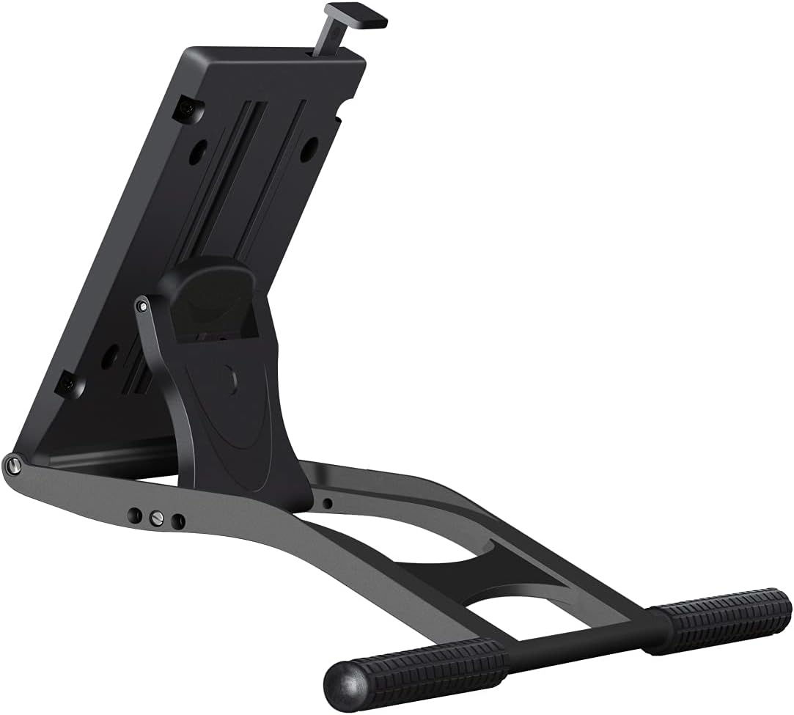
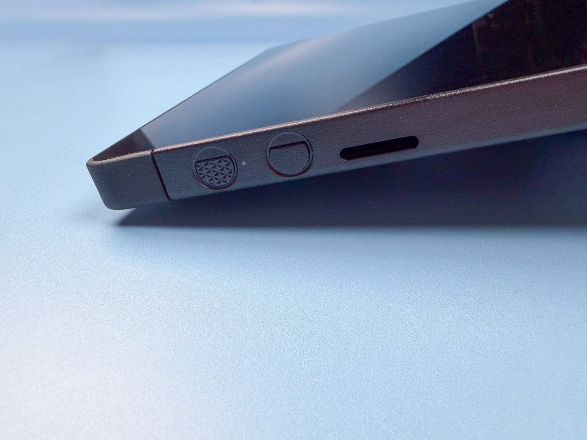

# Huion ST100 stand

Product link: [https://store.huion.com/products/adjustable-stand-st100](https://store.huion.com/products/adjustable-stand-st100)

Angle range: 20° to 80°

VESA mounting: YES

Pen display size compatibility: Huion lists this stand as being compatible with 19" to 24" pen displays.

<figure><figcaption>
HUION ST100A Adjustable Drawing Tablet Stand
</figcaption></figure>

## In the box

* the stand
* 4 screws
* screwdriver

## Stability

Very stable. No wobble.

## Using it with a 16" pen display

I tried this stand with a 16" pen display - a Wacom Cintiq 16 2025 (DTK-168). It attached fine, which was expected. Everything worked, but there is one thing to be aware of: at the very lowest angles, the bottom edge of the tablet does not rest on the desk. This means that if you press down on the tablet at those angles, there is a bit of wobble. At higher angles, there is no wobble and everything is stable.

You could probably mitigate this issue at low angles by adding some kind of padding under the bottom edge.

<figure><figcaption></figcaption></figure>
