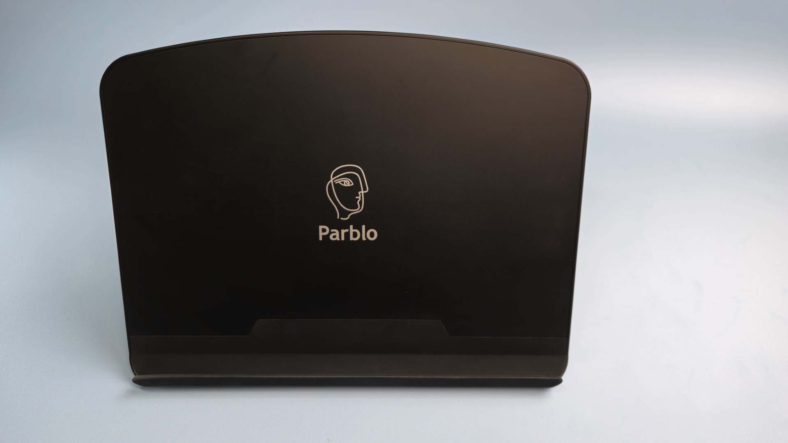
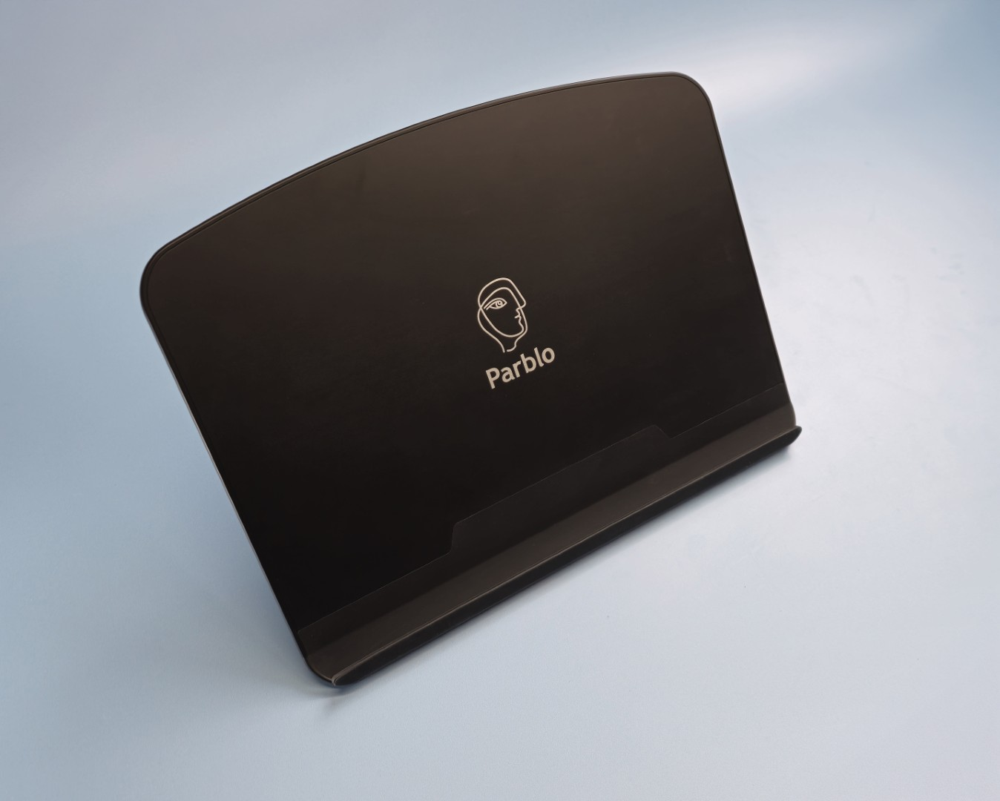
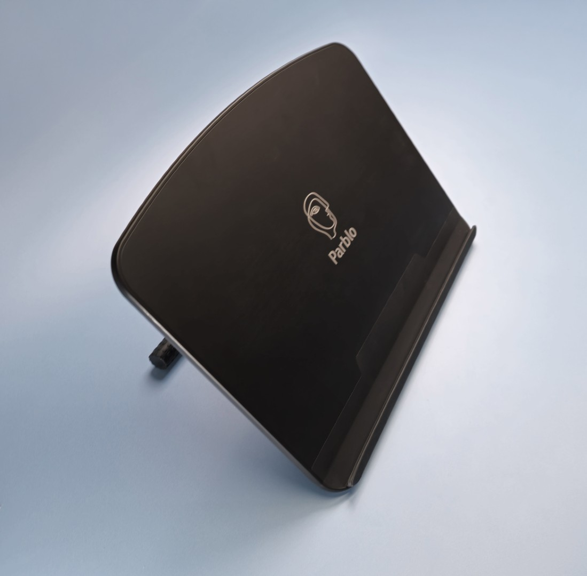
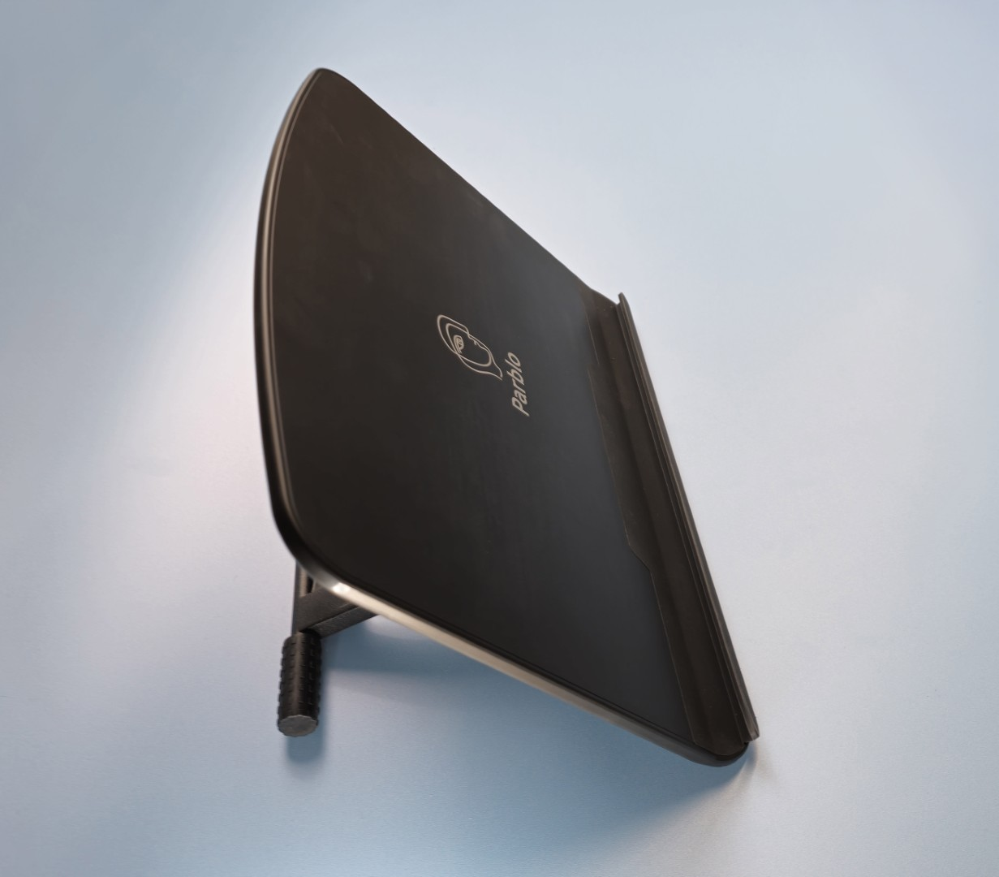
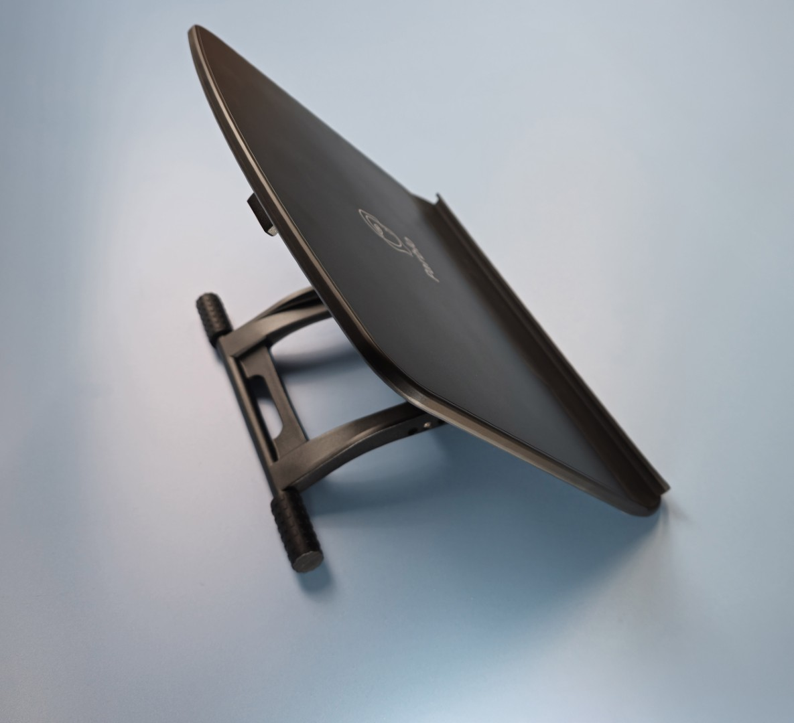
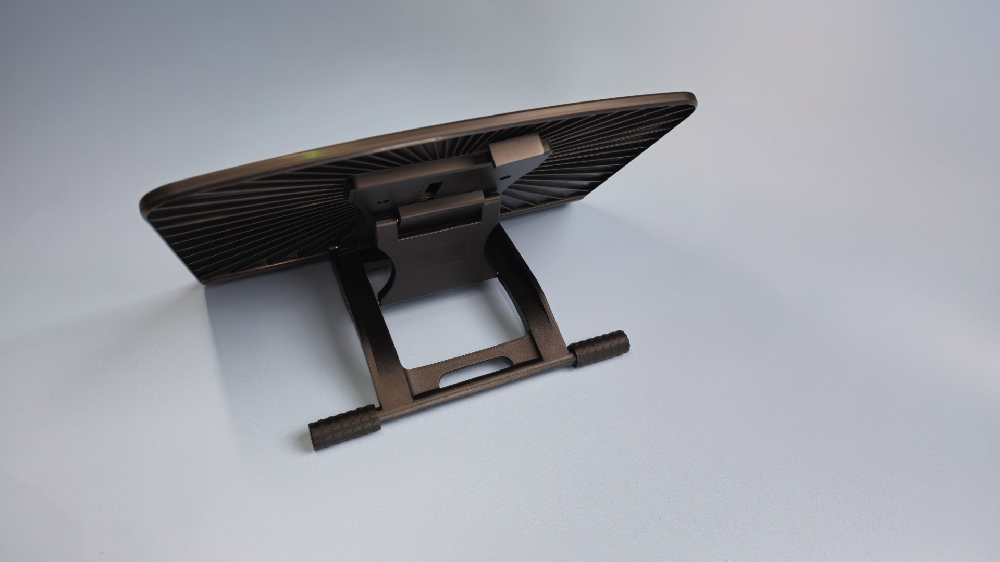
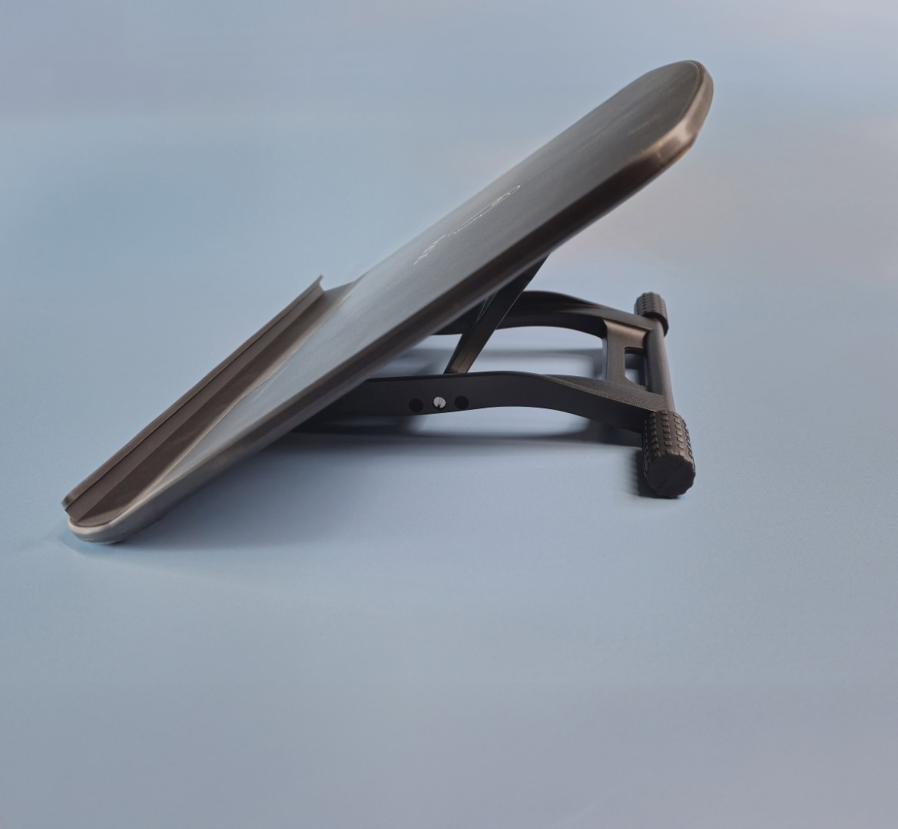
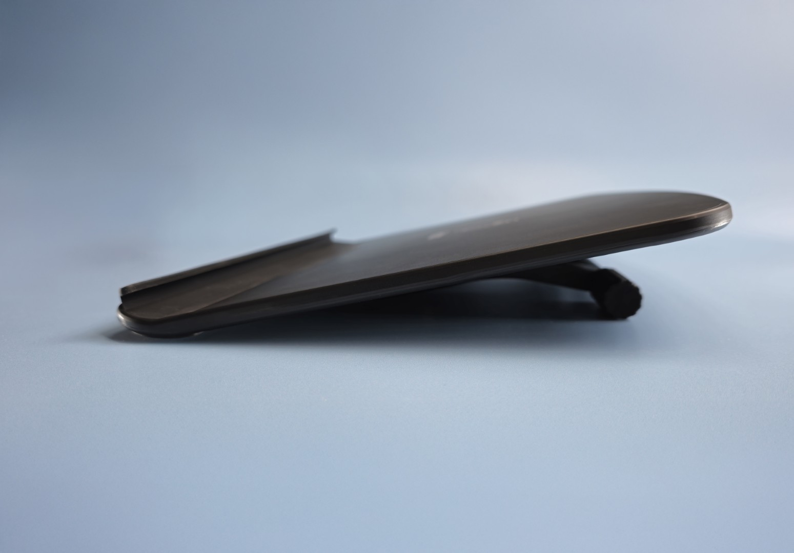
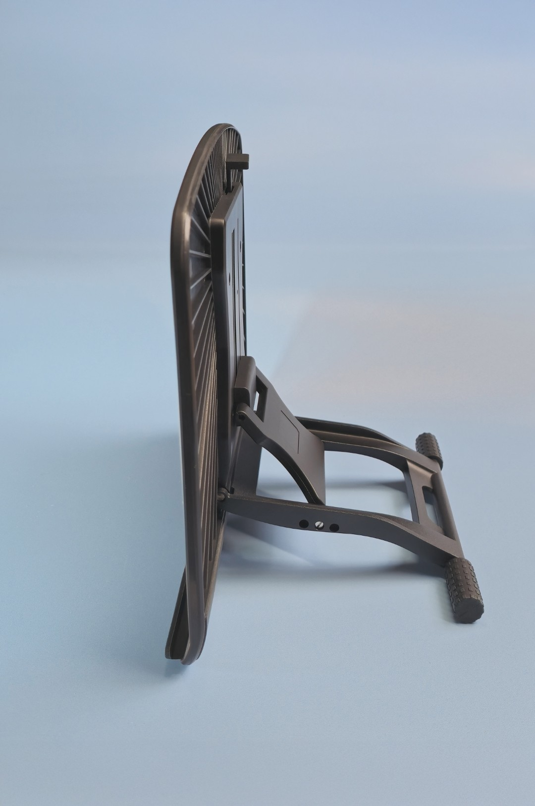
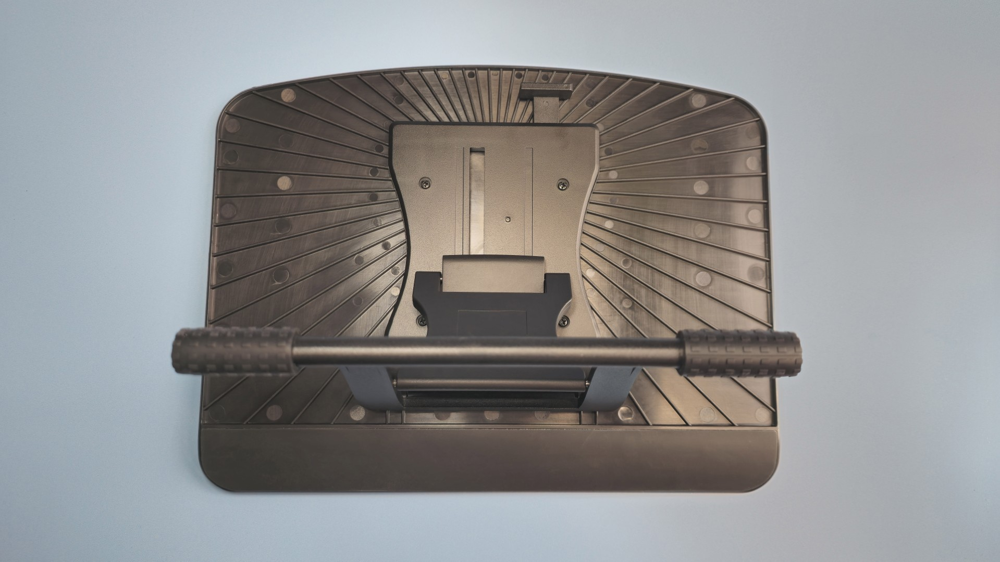

# Parblo PR-100 stand

## Overview

Even though I do not have any Parblo tablets, I use the Parblo PR-100 stand. I have two of them, and I am very happy with them.

Product page: [https://www.parblo.com/products/pr100](https://www.parblo.com/products/pr100)

What I notice:

* Sturdy
* Tablets do not wobble when drawing on them
* It does not slip and slide on my desk
* Tablets do not easily slide off the stand
* It works great for tablets 16" and under, though I have also used it occasionally for 19" tablets, such as the Huion Kamvas Pro 19. I would not recommend it for anything larger than 19".

## How I learned about this stand

I found out about this stand from Teoh on Tech's channel: [https://www.youtube.com/@teohontech7141/](https://www.youtube.com/@teohontech7141/)



## Photos

<figure><figcaption></figcaption></figure>

<figure><figcaption></figcaption></figure>

<figure><figcaption></figcaption></figure>

<figure><figcaption></figcaption></figure>

<figure><figcaption></figcaption></figure>

<figure><figcaption></figcaption></figure>

<figure><figcaption></figcaption></figure>

<figure><figcaption></figcaption></figure>

<figure><figcaption></figcaption></figure>

<figure><figcaption></figcaption></figure>
