# VIVO Pneumatic Arm Monitor Desk Stand (STAND-V100R)

## Overall

I am very happy with this stand. It makes it easy to use my pen displays as monitors and then move them into a position that is convenient for drawing. See the photos at the bottom of this document for examples of what it looked like with a 22" pen display attached.

## Basics

Product page: [https://vivo-us.com/collections/monitor-mounts/products/stand-v001r](https://vivo-us.com/collections/monitor-mounts/products/stand-v001r)

<figure>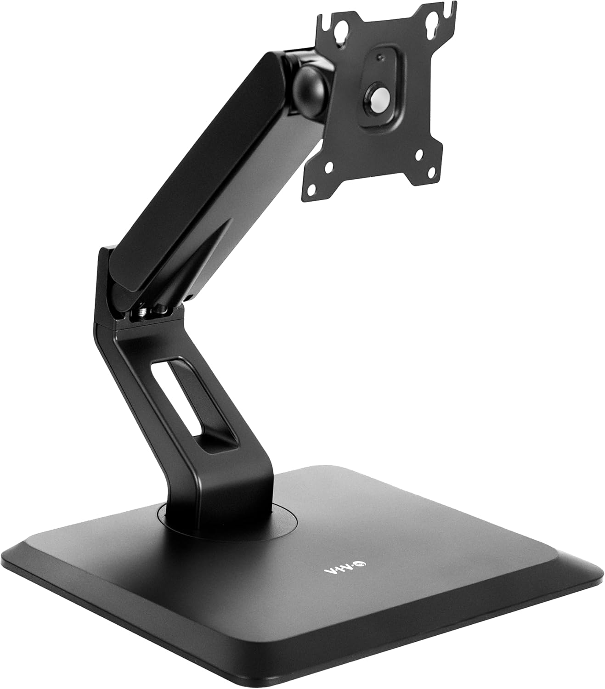<figcaption></figcaption></figure>

## VESA

It does support VESA mounting.

## Assembly

The stand comes in several pieces. The package comes with the screws and two hex wrenches.

Putting it together is not difficult. And the user manual is clear on what to do.

You will need a Phillips-head screwdriver to attach it to a pen display with the provided screws.

## Wobble

Like all stands and arms, there is some wobble if you press on it. This is normal and was not a disappointment.

However, there is a good range of motion and adjusting so that the bottom edge of my 22" pen display touches the desk helps tremendously in stabilizing it.

### Tension adjustment

The tension on the arm is adjustable with one of the provided hex wrenches. I turned down the tension to work with my 22" pen display.

## Other notes

The base was surprisingly heavy.

## Photos and notes

<figure>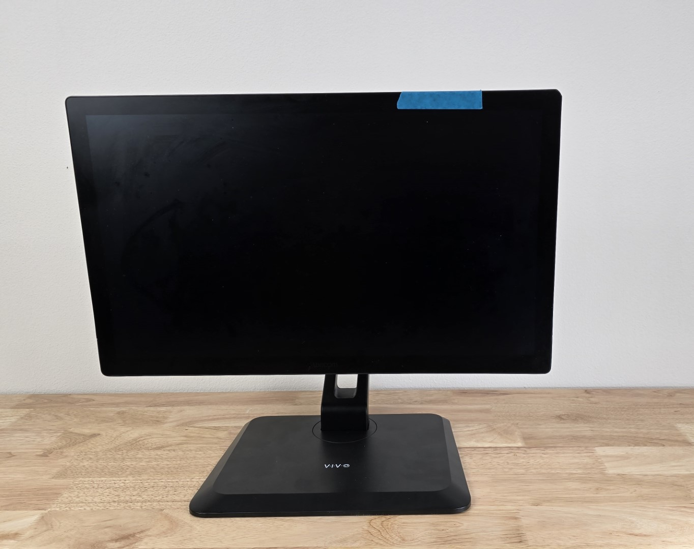<figcaption></figcaption></figure>

I attached the tablet with the screws and used the washers this way because I thought it would be more secure.

<figure>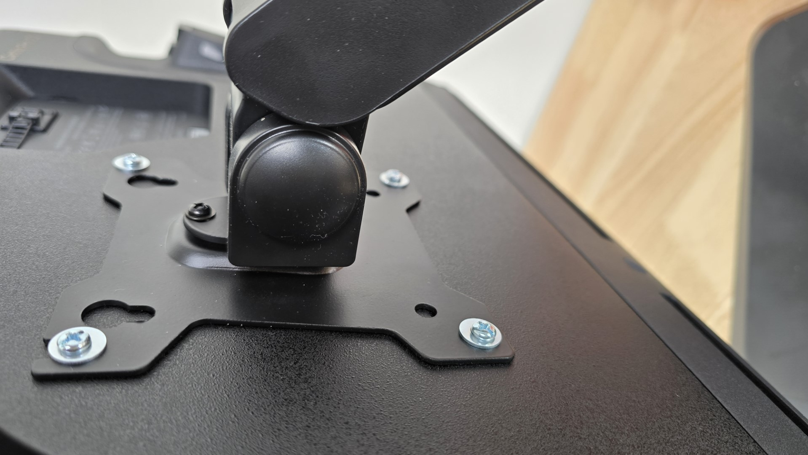<figcaption></figcaption></figure>

This is where the tension is adjusted.

<figure>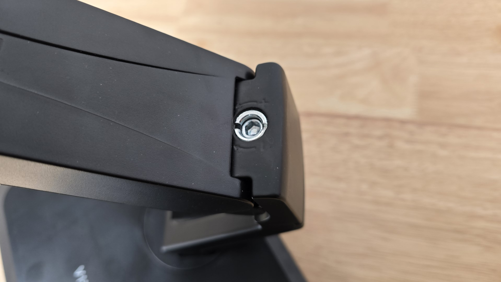<figcaption></figcaption></figure>

The stand rotates about +/- 45 degrees.

<figure>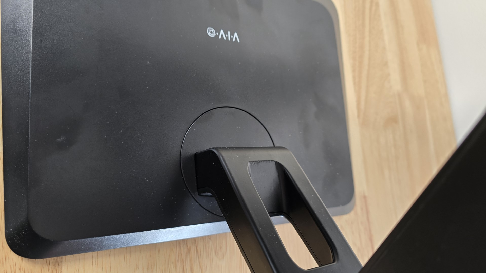<figcaption></figcaption></figure>

<figure>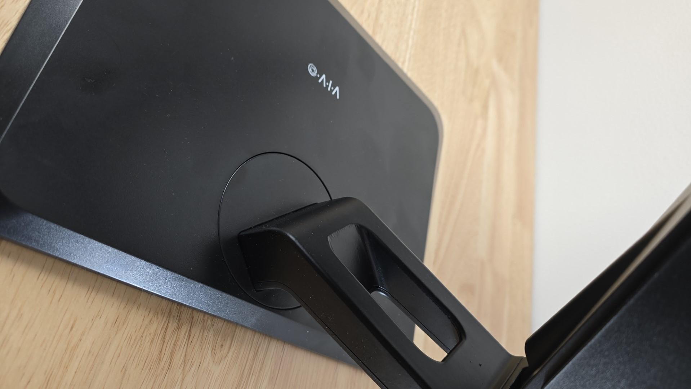<figcaption></figcaption></figure>

This is about as high as the display can go.

<figure>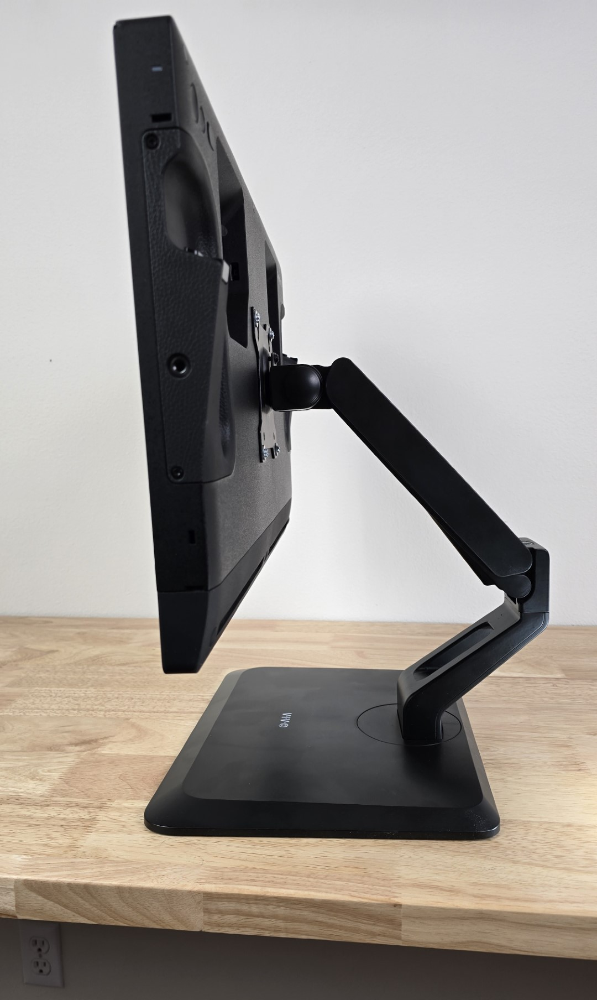<figcaption></figcaption></figure>

With my 22" display I could lower it such that the display could securely rest on the desk.

<figure>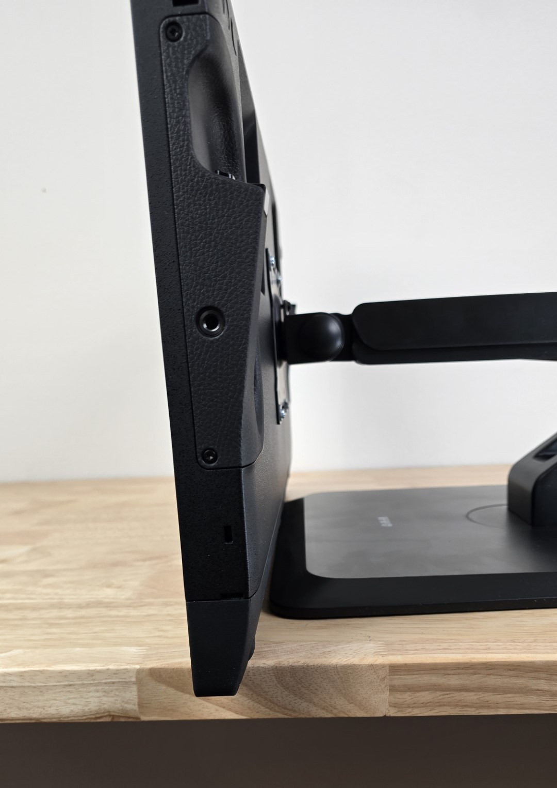<figcaption></figcaption></figure>

<figure>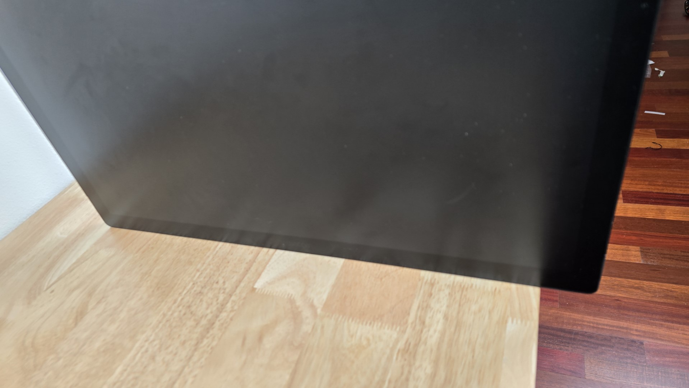<figcaption></figcaption></figure>

It can be tilted back. I was able to keep the bottom edge of the display securely on the desk up to 35 degrees.

<figure>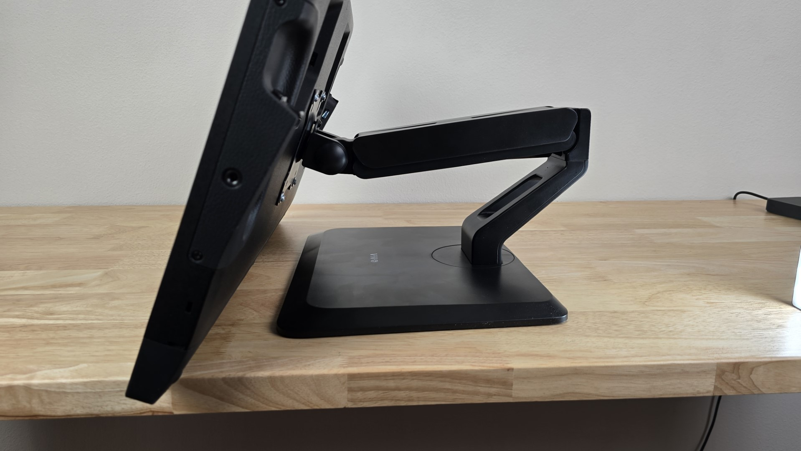<figcaption></figcaption></figure>

<figure>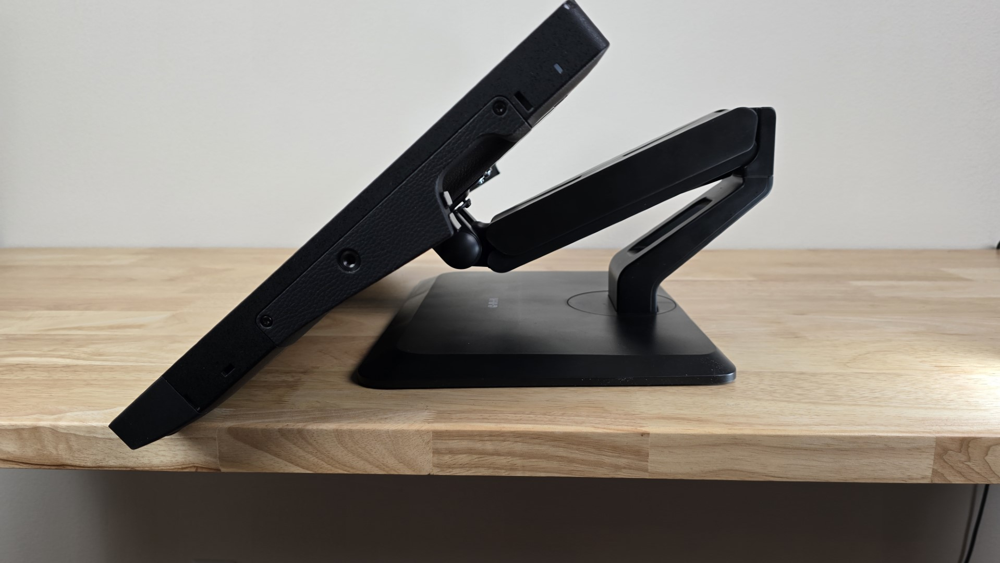<figcaption></figcaption></figure>

But at angles greater than 45 degrees, the edge of the display could not touch the desk.

<figure>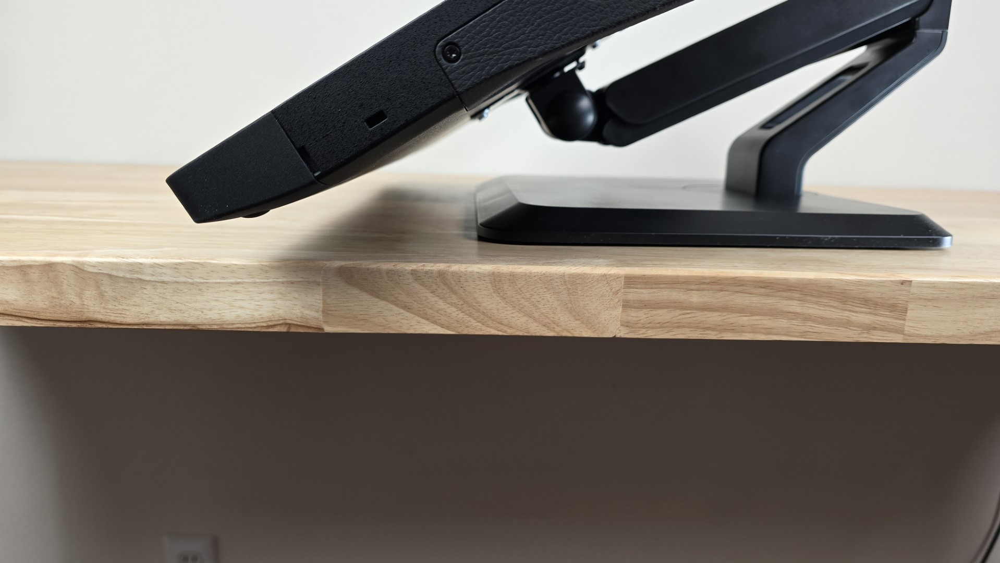<figcaption></figcaption></figure>

<figure>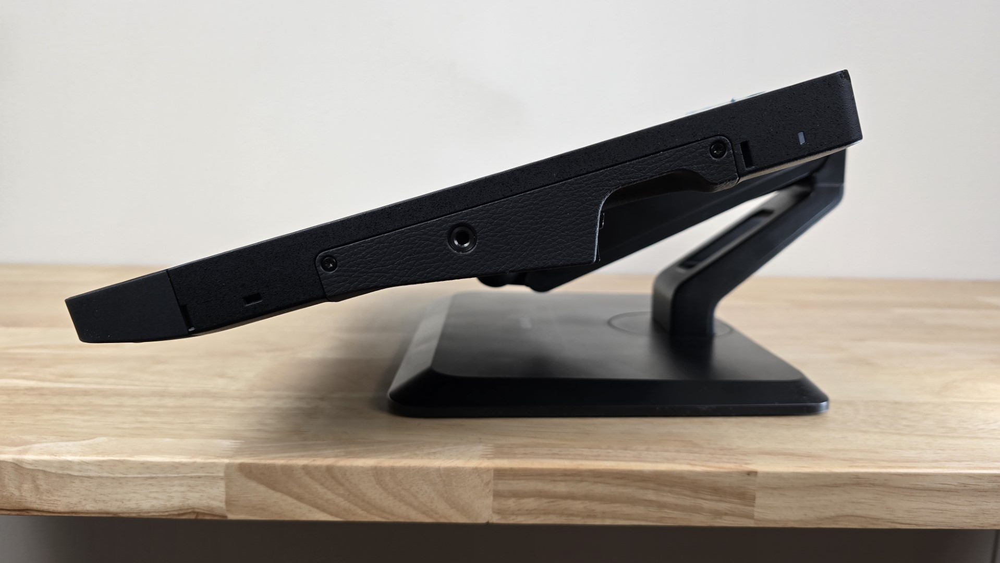<figcaption></figcaption></figure>

Here are some more extreme angles.

<figure>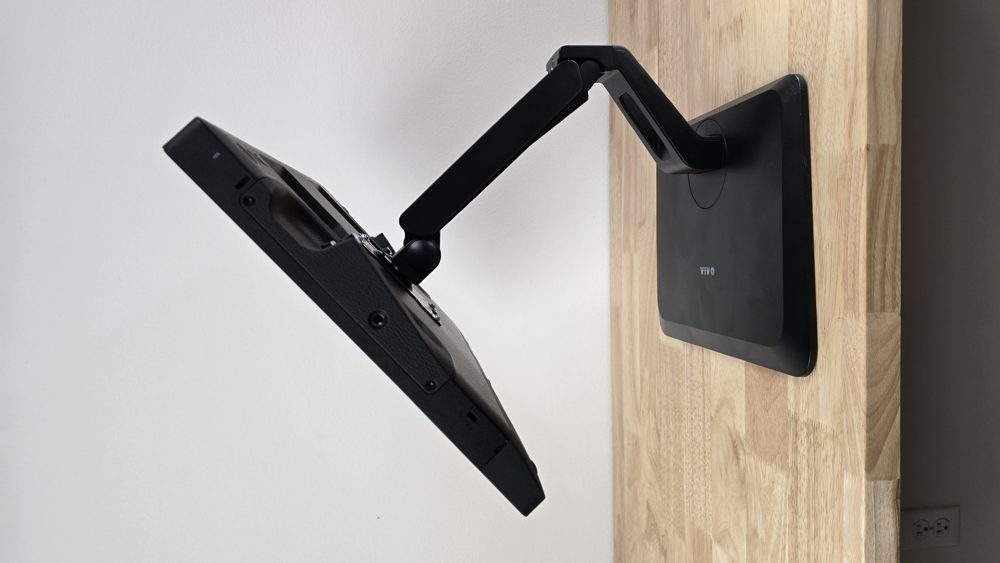<figcaption></figcaption></figure>

<figure>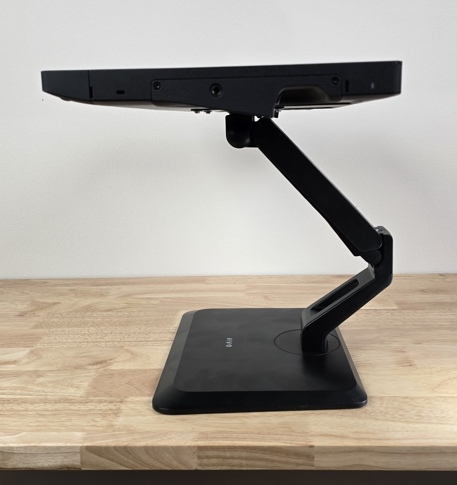<figcaption></figcaption></figure>
