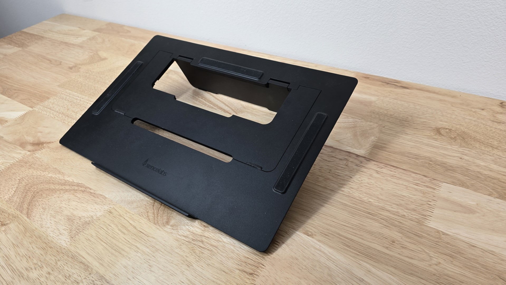
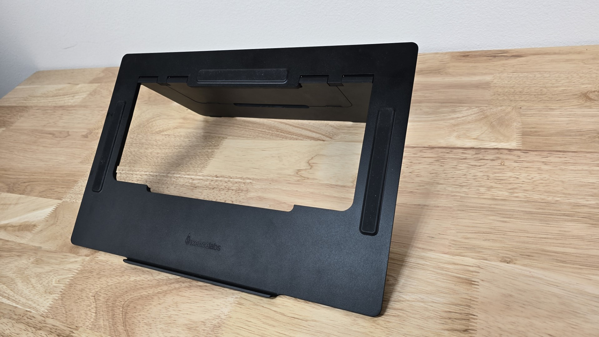

# Xencelabs Mobile Easel

## Overview

This is a quite nice stand.

**Size** - It is designed for a 16" pen display. It also works well for 19" pen displays.

Angles - It folds to provide two angles: 18° and 32°.

The rubber grips do a good job holding the tablet and preventing the stand from sliding on the desk.

## Photos

<figure><figcaption></figcaption></figure>

<figure><figcaption></figcaption></figure>

