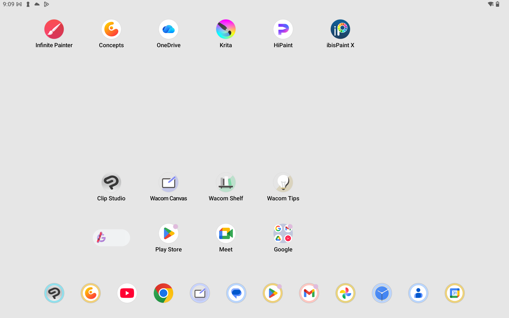
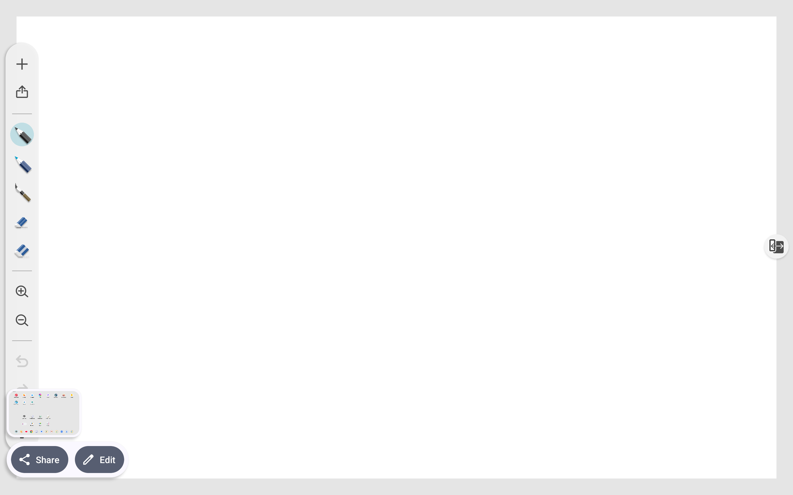
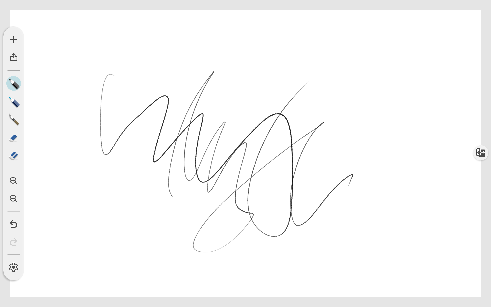
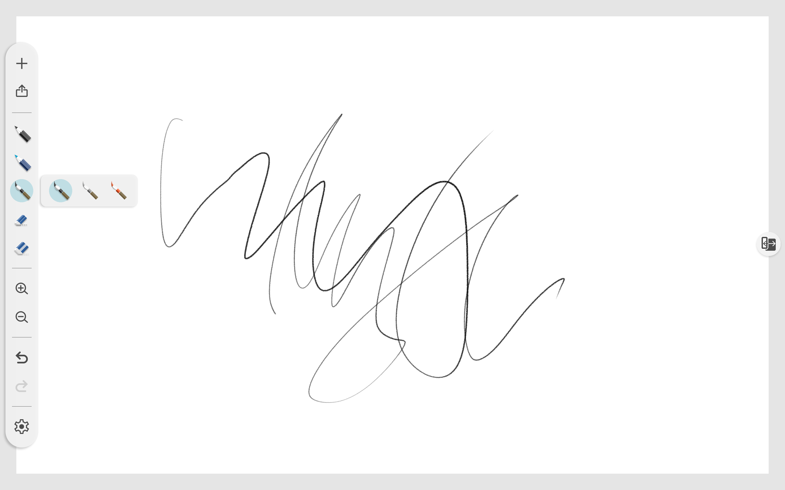
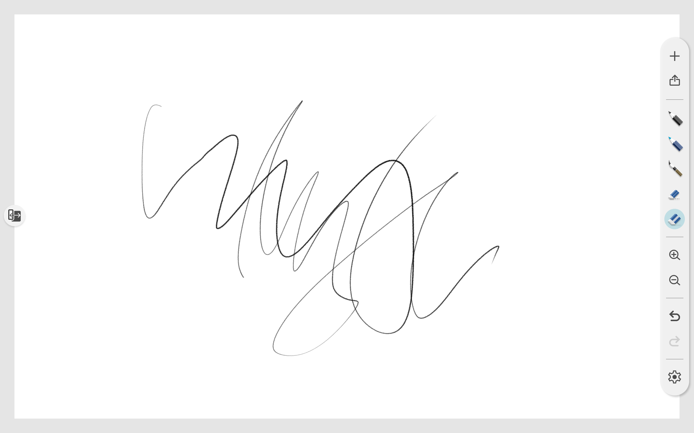
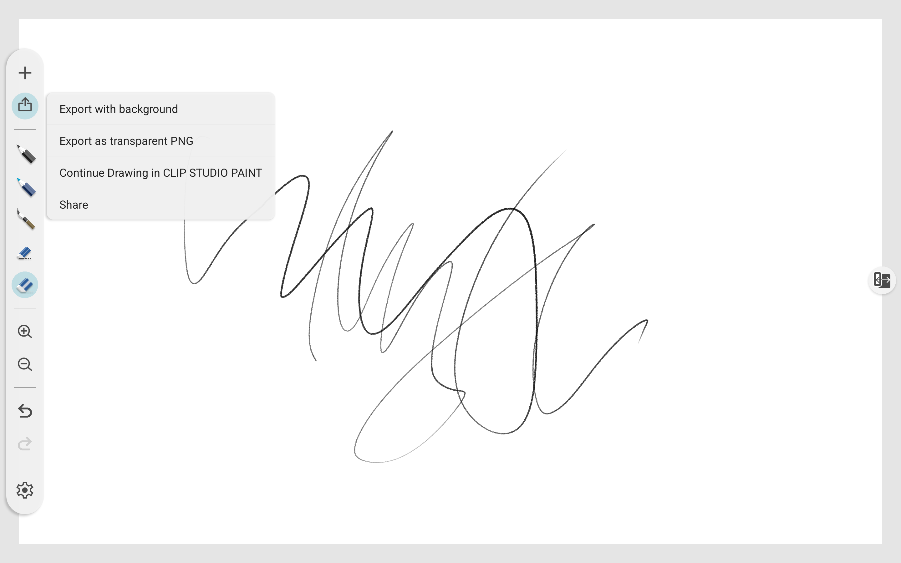

# Wacom Canvas

## Overview

Wacom Canvas is an app that comes with Wacom MovinkPad tablets.

It is a simple app with limited features. Despite this, it is incredibly useful as a way to draw the moment inspiration hits.

If you want to refine your sketch, you can transfer the drawing to Clip Studio Paint.

## Platforms

Wacom Canvas is for Android only.

It does not run on and is not available on other platforms such as Windows, MacOS, iPad, Linux, etc.

## Screenshots (ver 1.9.2)

<figure><figcaption></figcaption></figure>

<figure><figcaption></figcaption></figure>

<figure><figcaption></figcaption></figure>

<figure><figcaption></figcaption></figure>

<figure><figcaption></figcaption></figure>

<figure><figcaption></figcaption></figure>

<figure><figcaption></figcaption></figure>

<figure><figcaption></figcaption></figure>
