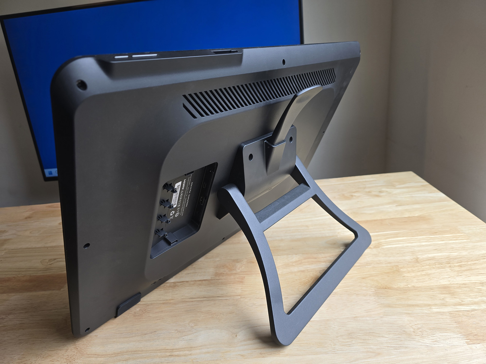
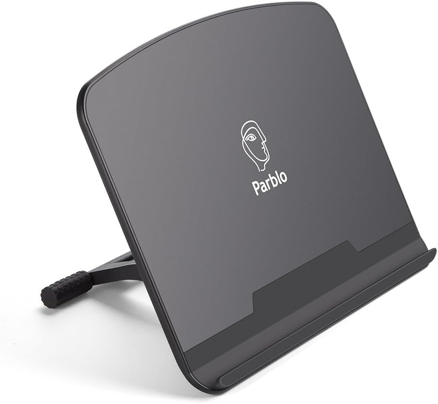
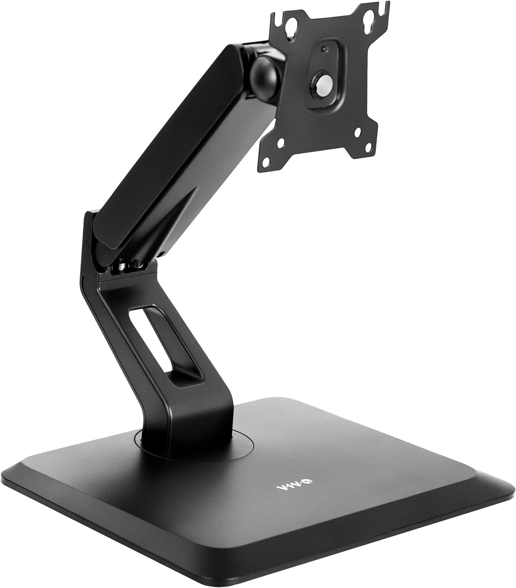

# Stands

## Overview

There are several options for stands below:

* Attached stands
* Unattached stands
* Complex stands

If you are looking for iPad-specific stands stands go here: [**iPad stands**](https://www.amazon.com/HUION-Adjustable-Drawing-Displays-Suitable/dp/B09C5YJFGS)

## Attached stands

Here's a typical VESA-attached stand. This one came pre-attached to the XP-Pen Artist 22 Plus. It is my favorite VESA-attached stand because the wide lever is easy to reach and operate.

VESA is a standard to mount displays to various things using screws. More here: [**VESA**](../../../technology/vesa.md)

<figure><figcaption>
XP-Pen Artist 22 Plus with stand
</figcaption></figure>

These stands attach to the back of tablet via screws. Because they are VESA compatible, they work with any drawing tablet that is VESA mountable.

## Pen display size

Stands me be intended for use with a specific size range of pen displays. Pay attention to the specs.

It's important to match the stand with the height of the pen display.

Some issues you might run into:

* A stand designed for a smaller pen display will have its angle adjustment lever in a position so that it is convenient to reach by putting your hand over the top of the display. However when used with a large display that lever may be much more difficult to reach.
* A stand designed for larger pen displays may not be as stable when at its lowest angles because the bottom edge of the pen display may not rest on the desk. This may introduce some wobble.

## Options

Some people have had success with the **Ergotron Neo-Flex Stand**. See this reddit thread: [https://www.reddit.com/r/wacom/comments/1b527hs/finally\_found\_a\_stand\_for\_my\_cintiq\_pro\_27/](https://www.reddit.com/r/wacom/comments/1b527hs/finally_found_a_stand_for_my_cintiq_pro_27/)

In 2025 XP-Pen released the [X&#x50;**-Pen ACS15 Ergo Stand**](xppen-acs15.md). This reminds me a bit of the STAND-V100R which I like so the ACS15 is one I plan to get soon.

## Unattached stands

here are the key features:

* They are height/angle adjustable
  * Some can vary the angle continually and you can lock them into a specific preferred angle
  * Some only support 1 or two angles
* They have a "lip" at the bottom to help secure the tablet
* The tablet is not attached to the stand
* They have rubberized surfaces on top to prevent the tablet from sliding off too easy
* They have rubberized surfaces on the bottom to prevent the stand from moving around on the desk

These stands are simple and inexpensive, but beware that since the tablet is not secured to the stand, it can be easy to knock the tablet of the stand.

<figure><figcaption>
Parblo PR 100 Drawing Tablet Stand
</figcaption></figure>

### Options

* [Parblo PR-100 stand](/broken/pages/8xm1PVGe0sIqyVwAtbXQ)
* [XP-Pen AC41 and AC42 stands](xppen-ac41-ac420-stands.md)

## Complex stands

* [XOOT stand](xoot-stand.md)

## VIVO VESA monitor and touch screen desk stand

I've used this for a while with a 22" pen display and I really like it. [<mark style="background-color:green;">**notes on this stand**</mark>](vivo-v100r.md)

<figure><figcaption></figcaption></figure>

## XP-Pen ACS15 Ergo Stand

See this video



## Stands I use

* I use the Huion ST100A stand with my Huion Kamvas Pro 19. [**notes on Huion ST100 stand**](huion-st100-stand.md).
* I use the VIVO Pneumatic Arm Monitor Desk Stand (STAND-V100R) with y Cintiq Pro 22. [<mark style="background-color:green;">**notes on this stand**</mark>](vivo-v100r.md)

## Links

* [Teoh on Tech - Comparison of Huion stands for tablets and pen displays](https://www.youtube.com/watch?v=axJV4C-Lp_o) 2025-01-17
* [Teoh on Tech - XP-Pen tablet and pen display stands: AC41 and AC42](https://www.youtube.com/watch?v=mkgdbuLUtOU) 2020-12-12
* [Teoh on Tech - Review: Parblo PR112 & PR110 stand for tablet & laptops](https://www.youtube.com/watch?v=vzu49ulI7PE) 2021-08-02
