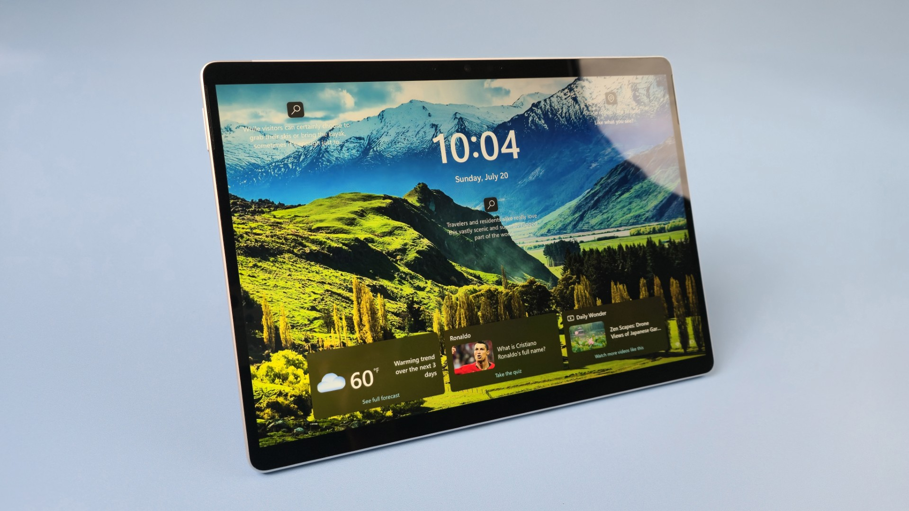
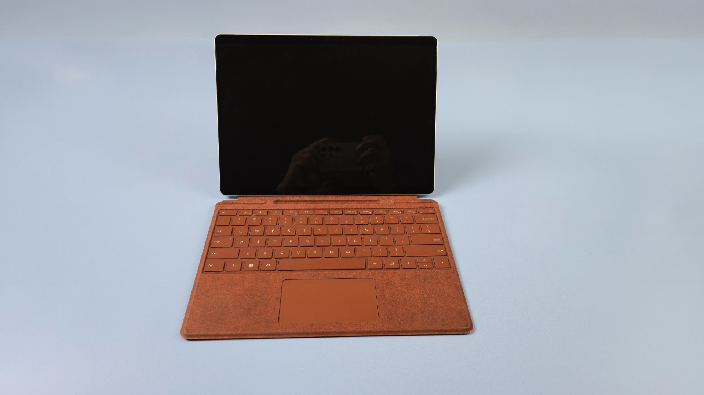

# Microsoft Surface Pro 8 notes

## Overview

If you are looking for running Windows desktop apps on a standalone tablet for notetaking rather than art, then the **Surface Pro 8** (and above) is a good choice when combined with Surface Pro Signature Keyboard and Slim Pen 2.&#x20;

<figure><figcaption></figcaption></figure>

<figure><figcaption></figcaption></figure>

## Basics

* [https://en.wikipedia.org/wiki/Surface\_Pro\_8](https://en.wikipedia.org/wiki/Surface_Pro_8)
* Release date: 2021-09-22
* Processor: 3 options&#x20;
  * Intel Core i7-1185G7
  * Intel Core i5-1135G7
  * Intel Core i3-1115G4
* Memory: available with:
  * 8GB
  * 16GB
  * 32GB
* Storage: available with
  * 512GB
  * 1TB

## Display

* Size: 13"
* Native resolution: 2880 x 1920
* Pixel density: 267 ppi
* Aspect ratio: 3:2
*

## Included pen

The tablet does NOT come with a pen.

You have to buy that separately

## Compatible pens

Surface Slim Pen 2 - [<mark style="background-color:green;">**my notes on this pen**</mark>](../../../catalog-pens/microsoft-pens/surface-slim-pen-2-notes.md)

## Drawing experience&#x20;

Context: Surface Pro 7 ands below do not have good pens for drawing. They exhibit too much line wobble.

If you use the Surface Slim Pen 2 with the Surface Pro 8, the drawing experience has definitely improved. The wobble is much less, but still present.

Overall it is OK, but not in the same league as an iPad or Samsung Galaxy Tab S series device.

While I think one could create art with this device, I think it is better suited for note taking, marking up documents, whiteboarding etc.&#x20;

## Heat and noise

* 80% of the time it is quiet and ony slightly warm.
* The remaining 20% of the time the fans are running aggressively and it can get quite warm.

## Ports

* 2 USB-C Thunderbolt 4 ports

## Compatibility with docks

### Surface Dock 2

I connect it the Microsoft Surface Dock 2 for power and network connectivity.

I use two  Thunderbolt 3 cables from the Surface Pro 8 to connect two 4K 60Hz displays (one of those will be the a 4K pen display)&#x20;

The Surface Pro can be used for drawing with its own pen. However I don't like drawing with the Surface pen. Instead,  I prefer to use attached drawing tablets.&#x20;

### CalDigit TS4 dock

Since about June of 2024, I've been using it with the CalDigit TS4 dock since that dock provides more ports than the Surface Dock.

## **Limitations on number of simultaneous displays**

Including the built in laptop display, I've only every been able to use 3 displays connected to the Surface Pro 8. Even if I connect 4 (using a dock) only a maximum of 3 displays will be used by the Surface Pro 8.&#x20;

## Using drawing tablets with the Surface Pro 8

Because the Surface Pro uses its own pen technology (N-TRIG) and its own pen (Surface Slim Pen 1) some people ask if there is any problem when using a traditional drawing tablet with the Surface Pro.

My experience is that The Surface Pro has worked seamlessly with drawing tablets once you install the tablet driver. The fact that the surface pro has its own pen features does not interfere with the drawing tablet. Nor does the drawing tablet interfere with the Surface pen.

I've used every brand of tablet successfully: Huion, XP-Pen, Xencelabs, etc. &#x20;

I have extensively used these drawing tablets with my Surface Pro 8:

* Wacom Cintiq 24 (2025)
* Wacom Intuos Pro (PTH-860)
* Wacom Cintiq Pro 27 (DTH-271)
* Wacom Cintiq Pro 16 (DTH-167)
* Huion Kamvas Pro 19 (GT-1902)

