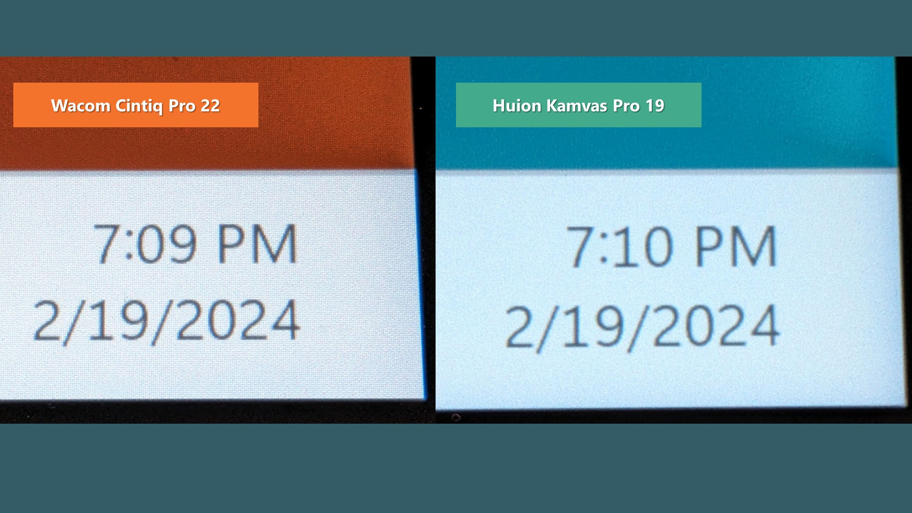

# Huion Kamvas Pro 19 (GT1902) notes

## Summary

I do recommend this tablet. The drawing experience is the best Huion's ever had.&#x20;

Is it as good as a Wacom Cintiq Pro? No. But it is VERY GOOD overall with only a few limitations and minor issues you should be aware of.

## Companion video

This companion video covers many but not all of the topics described in these notes:&#x20;



## Links

* [EyeKooDraws - Review of Huion Kamvas Pro 19](https://www.youtube.com/watch?v=Hf01mwaGtdI) 2025-09-13
* [Trent Kaniuga - Review of Huion Kamvas Pro 19](https://www.youtube.com/watch?v=znKvWJON_k8) 2024-12-16
* [David Revoy - Huion Kamvas Pro 19](https://www.youtube.com/watch?v=M9VbiVJX-J4) 2024-11-21&#x20;
* [Create Now Sleep Later - Review of the Huion Kamvas Pro 19](https://www.youtube.com/watch?v=5AWpKgv8jdY) 2024-09-15&#x20;
* [Teoh on Tech - Huion Kamvas Pro 19 review: 4K touchscreen pen display](https://www.youtube.com/watch?v=oSdZYmkOGKE) 2024-06-21&#x20;
* [claybrush review of Huion Kamvas Pro 19](https://www.youtube.com/watch?v=hvrPw6mlrlQ) 2024-01-09
* [Brad Colbow - Wacom Cintiq Pro 17 vs Huion Kamvas Pro 19](https://www.youtube.com/watch?v=6kh07G_L_qU) 2024-03-04
* [Brad Colbow review of the Huion Kamvas Pro 19](https://www.youtube.com/watch?v=WxdFXfuPvN4) 2024-02-14
* [Yanick Paquette review of Huion Kamvas Pro 19](https://www.youtube.com/watch?v=t-Qo1jTVibY) 2024-02-21
* [TheSevenPens Notes on the Huion Kamvas Pro 19](https://www.youtube.com/watch?v=CnTBrhUhciM) 2024-03-05

## Basics

### Product information

* Name: Huion Kamvas Pro 19
* Model number: GT1902
* Launch year: Released: Jan 2024
* Product page: [https://www.huion.com/products/pen\_display/KamvasPro/Kamvas-Pro-19.html](https://www.huion.com/products/pen_display/KamvasPro/Kamvas-Pro-19.html)

### What's in the box

* Kamvas Pro 19 Pen Display
* PD Power Adapter
* 3-in-2 Cable (1.8m)
* Full-featured USB-C Cable (1.8m)
* USB-C to USB-C Cable (1.8m)
* PW600 Digital Pen
* PW600S Digital Pen
* PN06 Standard Pen Nib x 5 (inside the pen case)
* PN06F Felt Pen Nib x 5 (inside the pen case)
*
  Pen Case
* (Built-in nib clip, pen nibs)

## Specs

### Digitizer specs

* Note: huion describes the tech version as PenTech 4.0
* Active area dimensions: 409 x 230 mm
* Active area Diagonal: 469.23 mm (18.473622")
* Active area Aspect ratio: 16x9
* Digitizer tech: EMR
* resolution: 200 LPmm (5080 LPI)
* Number of pressure levels: 16,384&#x20;
* Tilt support: YES
* Tilt range: +/- 60 deg
* Hover height: 10mm
* Report rate: 260PPS
* Accuracy: Accuracy:±0.5mm (Center), ±3mm (Corner)

### Display specs

* Resolution: 4K (3840x2160)
* Diagonal size: Actually 18.47"
* Surface: (New) AG glass
* Laminated: YES
* Brightness: 220nits
* Response time: 15ms
* Refresh rate: 60hz
* Contrast ratio: 1000:1
* Color gamuts supported
  * sRGB – 99%
  * AdobeRGB – 96%
  * DCI-P3 – 98%

### Other

* Multi-touch&#x20;
  * Support for Windows&#x20;
  * Support for MacOS (after a firmware update)

## Pens

### Included pens

Comes with 2 pens: PW600 and PW600S. More manufacturers should do this!

* Pens behave exactly the same in terms of drawing, pressure, etc.
* Both pens are PenTech 4.0 pens
* Both pens have erasers

See [**my notes on the PW600 pens**](../../../../catalog-pens/huion-pens/7p-huion-pw600.md)

### Pen compatibility

**Compatibility across different PenTech versions**

* Older Huion PenTech 3.0 pens DO NOT work with this tablet
* The newer PenTech 4.0 pens DO NOT work with older tablets

**Notes on backwards compatibility with the older PW517 pen** - not compatible. Or at least not completely compatible. The PW517 pen will move the pointer, but not there is no pressure detected so drawing is useless.

### Nibs

The pre-installed nibs are both felt. The felt nibs feel good draw with and add an additional amount of texture. In the month I used the felt nibs I saw no appreciable wear - but I don't draw very heavily so your experience may differ. The tablet comes with replacement felt and plastic nibs.

**NOTE: I damaged one of the felt nibs** - On the third day of using the tablet the PW600 pen would click or draw even when it was hovering. I did drop the pen at some point during the third day and that may have triggered something. I removed the nib, saw the nib was bent and replaced it with a fresh nib and the problem went away.&#x20;

## Drawing Experience

### **Corner/Edge accuracy**&#x20;

* NORMAL. This is only visible in the last 2mm and did not affect my normal usage of the tablet. It was so minor, I didn't even bother performing any calibration to address it.

### **Pointer lag**&#x20;

NORMAL - standard for modern pen displays.

### **Parallax**&#x20;

NORMAL - standard for modern pen displays.

### **Pressure range**&#x20;

**Pen IAF and Max pressure - See** [**Huion PW600 and PW600S**](../../../../catalog-pens/huion-pens/7p-huion-pw600.md)

* **Pressure Transition Instability** - VERY GOOD. You may remember the issues I pointed out with the Huion Inspiroy 2 L and the Wacom One M. That the problem is not visible with this tablet and pen. Remember: All tablets have some amount of it. Desirable tablets just have a very small amount of it and you have to construct situations to reveal it. This tablet so far seems comparable to what I see with the Wacom Intuos Pro & Cintiq Pro tablets. more here: [**pressure transition stability**](../../../../../core-features/pen-pressure/drawing-at-low-physical-pressure.md)&#x20;
* **Pen button stroke interruptions** - While drawing with older Huion pens the buttons would might interrupt the drawing - even if you disabled the buttons in the driver. With the new pens, the buttons do not interfere with the stroke.

### Tilt compensation&#x20;

VERY GOOD. The pointer stays where the nib is during normal ranges of tilt with some deviation only at extreme angles. more here: [**pen tilt compensation**](../../../../../core-features/pen-tilt/pen-tilt-compensation.md).

### **Surface texture**&#x20;

it feels slightly more textured than the Huion Kamvas Pro 24 4K

### **Parallax**&#x20;

VERY GOOD. It has very little parallax. As good as - maybe even a little better than the Wacom Cintiq Pro 22 in my observation. As is typical even for Cintiq Pro tablets, the parallax is not as good as an Apple iPad. More here: [**Parallax**](../../../../../guides/pen-displays/parallax.md)&#x20;

## Drawing experience

### Pens and Pressure

**Pens** - comes with the PW600 and PW600S pens.&#x20;

**Driver & Pens** - the driver knows that there are two different pen models and has separate button settings for each. However settings like the driver pressure curve are the shared across both pens.&#x20;

These pens are very good in terms of pressure. Much more here: [**Huion PW600 and PW600S**](../../../../catalog-pens/huion-pens/7p-huion-pw600.md)

### Diagonal wobble

GOOD. LOW amounts of wobble in stroke.

<figure><figcaption></figcaption></figure>

## **Display experience**

### Anti-glare treatment&#x20;

the display uses an etched glass surface which does a good job dispersing light that hits the surface of the tablet. It reduces more glare even than the Cintiq Pro 22.

### **Anti-Glare sparkle**

&#x20;OK. This is a BIG IMPROVEMENT over some older Huion models. Slightly noticeable at 6 inches. At normal drawing distance for me not noticeable. I am very happy with the outcome. In comparison the Wacom Cintiq Pro 16 (DTK-167) has a little less AG sparkle. More here: [**Anti-glare sparkle**](../../../../../guides/pen-displays/anti-glare-sparkle.md)

How the AG sparkle of this tablet compares to other tablets

* Very close to Wacom Cintiq Pro 22&#x20;
* Very close to Wacom Cintiq Pro 16&#x20;
* Noticeably more than the Wacom Cintiq Pro 27&#x20;
* Noticeably less than Huion Kamvas Pro 24 4K&#x20;
* Noticeably less than Huion Kamvas 13&#x20;
* Noticeably less than Huion Kamvas 13 2.5K&#x20;
* MUCH LESS than Kamvas Pro 16 4K Plus&#x20;
* It SHOULD have less than the Kamvas Pro 27 which has a lower density display panel (lower PPI)

### **Sharpness**&#x20;

&#x20;OK. the anti-glare treatment diffuses the light coming from the display. The result is that the pixels on the display are "soft" and not as crisp as on comparable 16" or 22" displays. Several other people with this tablet have commented on the same thing. For me this is not a problem. In comparison, even the Wacom Cintiq Pro 16 (DTK-167) and Cintiq Pro 22 have a slightly soft experience, this Huion has a little more softness than that.

<figure><figcaption></figcaption></figure>

### **Brightness**&#x20;

seems as advertised. I thought it was fine. It's not especially bright - but I thought it was bright enough at 100%. In comparison I use the Cintiq Pro 22 at 50% (I would use it at 70% but don't like the additional fan noise it creates).

## **Connections and cabling**

### **Single USB-C cable connection?**

Official Answer: NO. Huion's documentation is explicit on thjis point ([**see this doc**](https://support.huion.com/en/support/solutions/articles/44002011098-list-of-compatible-devices-support-usb-c-to-usb-c-connection-with-huion-displays)).

I tried testing it with an appropriate cable and could not get a single cable configuration to work with a Microsoft Surface Pro 8 or a M3 MacBook Pro.

However ... this user got it to work with by plugging the single cable into a ASUS ThunderboltEX 4 expansion card: [https://www.reddit.com/r/huion/comments/1b22sia/huion\_kamvas\_pro\_19\_usbc\_cables/](https://www.reddit.com/r/huion/comments/1b22sia/huion_kamvas_pro_19_usbc_cables/)

### **Using third party USB-C cables for display signal & data**

I tried a Cable Matters USB-C Thunderbolt cable. It did work, however sometimes slight movements of the cable cause the tablet to lose the display signal and data.

Upon closer examination, the Huion USB-C cable plug is slightly longer than the CableMatters cable. So there is a slight difference on how some third party cables can connect.

For this reason I recommend using the supplied Huion USB-C cable.

## Non-pen inputs

### Touch

* **Touch on MacOS** -&#x20;
  * At time of launch. This tablet did not support touch on MacOS.
  * On 2024/08/01 Huion released a firmware update firmware to enable touch on MacOS.
    * Video: See this video: [https://www.youtube.com/watch?v=4D0\_OpPIgC8](https://www.youtube.com/watch?v=4D0_OpPIgC8)&#x20;
    * Update on 2025/04/10 - I did successfully install the firmware update and the updated driver. Unfortunately, I could never make touch work on MacOS. I will try later in 2025.
* **Touch on Windows**
  * Overall touch on windows works great thanks to Windows great support for touch.
  * If touch goes to your monitor instead of the tablet, here's how to fix it: [TSG: Touch input goes to a different display on Windows](tsg-touch-input-goes-to-the-wrong-display-on-windows.md)
* **Palm rejection**: OK. Very TYPICAL for Touch on pen displays.&#x20;
  * Touch support is not comparable to an iPad's touch support which is EXCELLENT. Too often I accidentally pressed something on the screen because of my palm.&#x20;
  * I would say it's very on par with the Cintiq Pro 22 and Cintiq Pro 27.  I didn't try to use a drawing glove yet.&#x20;
  * Brad Colbow in his review of the Kamvas Pro 27 noticed that the palm rejection didn't seem to result in accidental drawing, but rather accidental clicks. I had the same experience.
  * Note: I used the tablet without using any drawing glove. In theory a drawing glove would help with the palm-rejection.&#x20;

## **Ergonomics**

### **Weight**&#x20;

lighter than I expected. I noticed it immediately when I picked up the box.&#x20;

### **VESA mounting**&#x20;

YES. There are 75 mm × 75 mm VESA holes for mounting on the back.&#x20;

### **Legs**&#x20;

&#x20;YES. Two legs. Seemed sturdy. No complaints.

### **Noise**

&#x20;EXCELLENT. No noise because no fans

### **Heat**&#x20;

EXCELLENT. After running at 100% brightness for one month days without turning off the tablet, the tablet stays cool. Roughly the same temperature as the Wacom Cintiq Pro 22 - maybe very very slightly warmer. Just very slightly warmer on the right than the left side.&#x20;

### **Stand**&#x20;

&#x20;It does not come with a stand. Instead, I used separately-purchased Huion ST100A stand which attaches to this pen display using the VESA mounting holes.&#x20;

## Comparisons

### Compared to the Huion Kamvas Pro 24 4K (GT2401)

The Huion Kamvas Pro 24 4K (GT2401) was Huion's flagship pen display for a few years. And now the the Kamvas Pro 19 and Kamvas Pro 27 tablets represent the new flagship tablets.  &#x20;

The new tablets have clear improvements in these areas.

* Pressure handling through the new PenTech 4.0  is clearly better.
* The new pens have an eraser and that night be important for you
* The new tablets have less AG sparkle&#x20;
* The new tablets have touch&#x20;

There are a few areas that might not compare as well though

* The new anti-glare treatment gives a slightly soft look to the pixels in the Kamvas Pro 19 at least. I didn't test the Kamvas Pro 27 so not sure how much the softness is present in that model.
* Currently there is no exact match in terms of size to the 24". Drawing on 19" feels very different than 24".&#x20;
* The new tablets are a bit more expensive for their size.

But for other areas, the Kamvas Pro 24 4K was already a good pen display. So for this reason, if you already have a Huion Kamvas Pro 24 4K (GT2401) then these new tablets are NOT an immediate "MUST BUY". If you are happy with how your Kamvas Pro 24 4K is working, then keep it. I would suggest at least waiting to see if Huion releases something closer to a 24" size.&#x20;

### Compared to the Huion 16 GEN3

Not long after Huion rolled out the Kamvas Pro 19, it followed up with the Kamvas 13 GEN3 Kamvas 16 GEN3.

Huion puts the Kamvas Pro 19 and Pro 27 in the "GEN3" category even though they don't literally have "GEN3" in name. This makes sense because these Pro 19, Pro 27 and the GEN3 tablets all use "PenTech 4.0" with the PW600 series pens.

Because of their similar sizes, many people want to understand the differences between these two models.

* The **drawing peformance** is roughly the same because they share the same "PenTech" and are compatible with the  PW600 series pens
* **Pens included in the box** - The KP19 comes with TWO PW600 series pens. The K16GEN3 comes with only one pen.
* **Touch** - The KP19 supports touch (works great on windows, is still only in preview on MacOS), the K16GEN3 does not.&#x20;
* **AG sparkle** - comparable
* **Diagonal wobble** - very minimal on the KP19. The K16GEN3 has a little diagonal wobble at slow speeds.
* **Display Size** - Obviously one ia 19" andf the other 16" - their actual sizes are closer to 18.5" and 15.5" - but despite this difference they feel similar to each other. In other words the KP19 does not feel massively larger - just somewhat larger.
* **Physical size** - very similar. Both fit on my desktop well and are easy to move.
* **Using a single UBS-C cable** - with the K16GEN3 some computers will be able to use a single USB-C cable to deliver power, video, and data. With the KP19 this is not the case - it is **extremely** unlikely. You will always have to use the additional power adapter to supply the KP19 with enough power. &#x20;

## Other features

### **OSD**&#x20;

to get to the OSD Hold the power button for a few seconds and the OSD can appear

### **Sound**&#x20;

There's a headphone jack for audio. Some of you may find this convenient.

In Windows if you connect the tablet, it may **appear** that windows has lost sound output. What is happening here is Windows can automatically switch its default audio to a new audio device - which is what this tablet is. Of course, it doesn't have speakers, so you won't hear anything unless you have a headphone connected.&#x20;

### Usage notes

**Driver > Active Area mapping on resume from sleep on Windows** - On Windows, when resuming from sleep the Huion driver can occasionally become be confused about how to map the active area of the tablet to the screen. It may choose the wrong screen. It map span across both screens. When it does this it may not track the pen position correctly. This is resolved just by restarting Windows. This is a well-known issue with Huion drivers. Not a serious problem but a minor irritation.&#x20;

### **Using it as a pen tablet**

Yes. In Windows, you can tell windows to "disconnect" the display in the tablet and you will no longer see anything on the tablet. It will say "no signal" for few seconds then go dark. However, you can still use the pen on the tablet - just like a normal pen tablet (screenless tablet).

NOTE: If you press the button to power down the tablet, it will turn off the display AND it will stop the pen from working.

