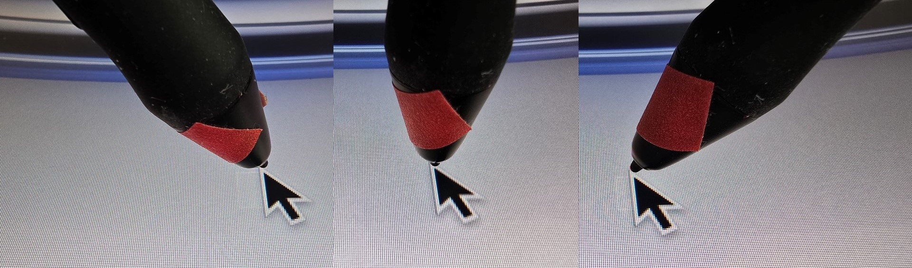
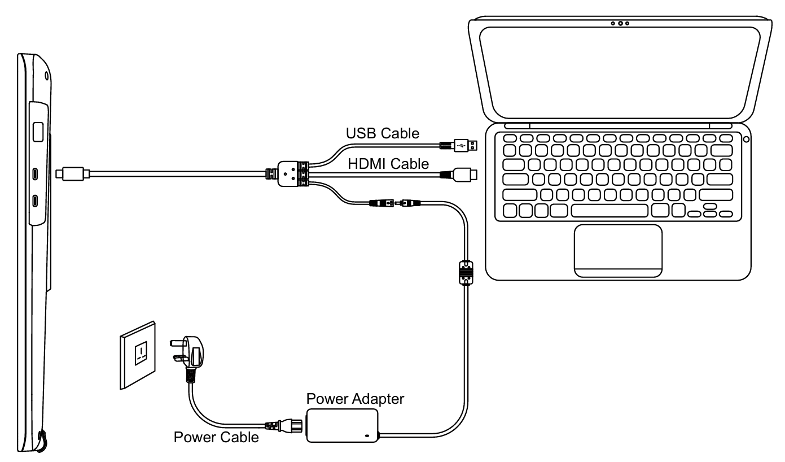
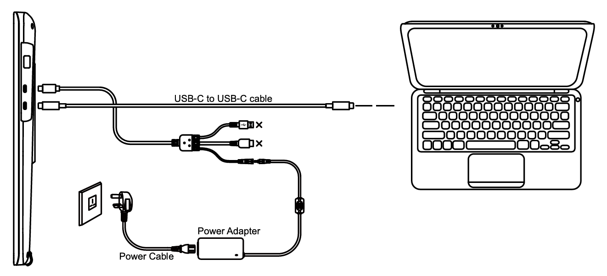

# Huion Kamvas 22 Plus (GS2202) notes

## **Summary**

The Huion Kamvas 22 Plus is one of the best price-to-performance pen displays in the market.

NOTE: In 2023, with the arrival of the XP-Pen Artist 22 Plus (MD220FH), I think the XP-Pen is an even better choice because of the improved pressure handling of the XP-Pen X3 Pro pen.

## Basics

* Model number: GS2202
* Release year: 2020
* Active area: 22" diagonal
* **Price** - It normally costs about $450 but I see it discounted often to $400

### Links

* [Brad Colbow review of Huion Kamvas 22 Plus](https://youtu.be/GJxGzJgfYGA) 2020/09/08
* [Nemanja Sekulic review of Huion Kamvas 22 Plus](https://youtu.be/mlYTRD2KmeY) 2022/03/04

### Display specs

* Size: 22" diagonal
* Aspect ratio: 16x9
* Display panel tech: IPS
* Bit depth: 8 bits per pixel
* Anti-glare treatment: Etched glass
* Laminated: YES
* Color gamut: 140% sRGB

## Pen

### Included pen

* PW517 - [**notes on the PW517 pen**](../../../catalog-pens/huion-pens/huion-pw517-notes.md)

### Compatible pens

* PW517 - [**notes on the PW517 pen**](../../../catalog-pens/huion-pens/huion-pw517-notes.md)
* PW550 - [**notes on the PW550 pen**](../../../catalog-pens/huion-pens/huion-pw550-notes.md)
* PW550S

## Display experience

### **Anti-glare sparkle**

VERY GOOD. very minimal. Not noticeable.

### **Pixelation**

With a 1920x1080 display, it looks slightly pixelated. But I don't find that a problem while drawing. My ideal pen display would have the same 22" size but with 2560x1440 resolution

### Dead pixels

None detected when I got it. And none present two years later.

### Sharpness

VERY GOOD. pixels clear and well delineated.

### Color

Color accuracy: did not measure.

### Color gamut

This is a wide color gamut display with a range of 140% sRGB.

Compared to many other displays, you may find that greens and reds are more intense than you might expect. Some people will love this - for example when watching a movie - but I found it some colors distractingly intense.

For digital art I prefer to work in a smaller color gamut of 100% sRGB.

Unfortunately, unlike other pen displays this tablet does not have way to force it into a smaller color gamut. No options were present in the OSD or the driver.

For reducing the gamut, you could use other techniques: [**Clamping wide-gamut displays to sRGB**](../../../../guides/customizing/clamping-wide-gamut-displays-to-srgb.md).

In my case, I just left it the way it was and did not try anything to clamp the range.

Note that I used Windows with this tablet. With MacOS there may be other options for dealing with the color.

## Drawing experience

### Pointer lag

TYPICAL. Normal for a pen display.

### Pen tracking accuracy

* **Center accuracy -** GOOD. I did not measure
* **Corner Accuracy** - Seems to me about +/- 3mm on the lower left corner. Other corners had less. A little on the high side, but it will not interfere with drawing.

### **Tilt compensation**

GOOD. Pointer has only very minor displacement when pen tilted at 45 degrees.

<figure><figcaption></figcaption></figure>

### **Parallax**

GOOD - low.

## Auxiliary inputs

**NONE**. So, I use keyboard shorts with this device: [tourbox](../../../catalog-accessories/auxiliary-input-devices/tourbox/)

## **Diagonal wobble**

very good. has extremely low wobble.

.png>)

## Ergonomics

### VESA

Supports VESA mounting

I have my Kamvas 22 plus mounted to an Ergotron LX. It works great. I especially like that it can lower the tablet enough that the bottom edge can rest on the desk. This adds for some extra stability.

### **Stand**

Comes with a basic stand that attaches via VESA mounting. Nothing fancy. but works great.

### **Legs**

Tablet has no legs.

### **Heat**

display stays cool. I leave it on 24/7 and it has no hot spots.

### **Fan noise**

NONE. It has no fans

### **Touch**

it does NOT have touch support

## **Usage notes**

I originally bought this tablet for digital art, and it works fine for that.

Over time I have it setup on my work desk on an arm. I use it as an external display but I pull it in closer when I want to draw on a whiteboard during an online meeting. I still occasionally sketch and paint on it, but since it is on my work desk I don't do as much of it as I used to.

## **Connections and Cabling**

### **Connecting with HDMI for video signal**

For this case you use the included proprietary 3-in-1 cable.

<figure><figcaption></figcaption></figure>

### **Connecting with USB-C for video signal**

For this case you must use the 3-in-1 cable to provide power AND and a USB-C cable for video signal and data.

<figure><figcaption></figcaption></figure>
