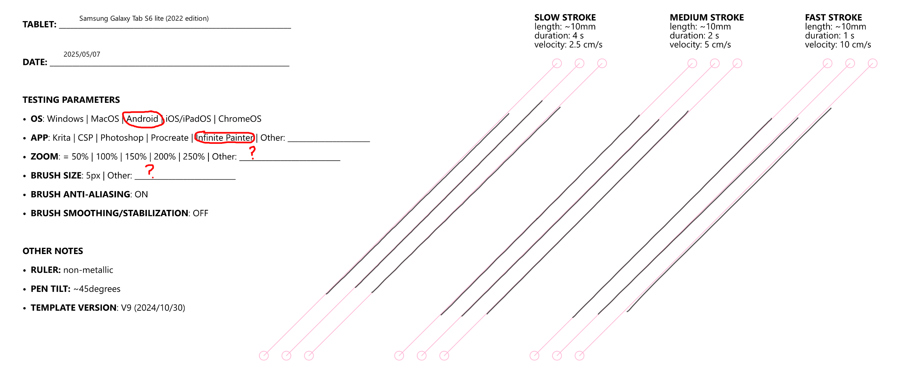

# Samsung Galaxy Tab S6 lite notes

## Editions

### S6 Lite (2024 edition)

* Samsung announced this early in 2024 but it isn't widely available for purchase.&#x20;
* [Brad Colbow review of the Samsung Galaxy S6 lite 2024](https://www.youtube.com/watch?v=ZhEq2pMUq28) 2024-05-03

### S6 Lite (2022 edition)

* [Teoh on Tech review of Samsung Tab S6 Lite 2022](https://youtu.be/mbdu6ID93xA) 2022-11-26
* [Brad Colbow: Review of Samsung Galaxy Tab S6 Lite (2022 Edition)](https://youtu.be/YTzQRP5G1aw) 2022-06-28
* [EyekooDrawsStuff: Affordable iPad alternative for drawing beginners - Galaxy Tab S6 Lite](https://www.youtube.com/watch?v=l6WwSRp63Zs) 2022-11-02

### S6 Lite (2020 edition)

* Get a more recent version edition (2022 or above) instead

## My notes on the S6 Lite 2022 edition

If you are a beginner budget is constrained you might find that this slightly older tablet might meet your needs and is still not too expensive ($230)

**THESE NOTES ARE CURRENTLY IN PROGRESS**


These are my notes for this specific tablet. You may also be interested in [my notes on the overall Samsung Galaxy Tab S series](samsung-tab-s-notes.md).


## Compatible Pens

In particular you should think about using the Wacom CP-913 instead of the Samsung S Pen: [Upgrading from the Samsung S pen to the Wacom CP-913 pen](../../../catalog-pens/samsung-s-pen/upgrading-to-wacom-one-pen-cp-913.md)

## **Diagonal Wobble**

<figure><figcaption></figcaption></figure>
