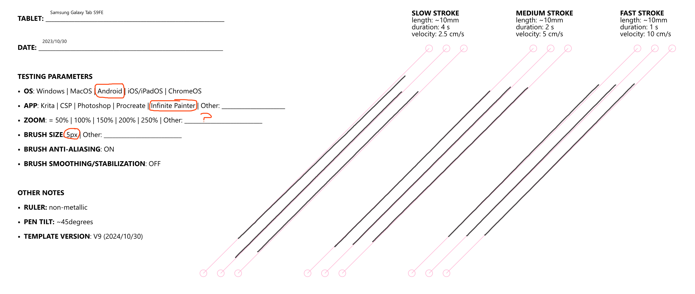

# Samsung Galaxy Tab S9 FE notes


These are my notes for this specific tablet. You may also be interested in [my notes on the overall Samsung Galaxy Tab S series](samsung-tab-s-notes.md).


## Overview

This is one of my standard recommendation for anyone who wants to get an entry level standalone drawing tablet.

It's just an all around good device.

* The drawing performance is very good
* The screen looks good.
* There are many apps you can use with it.
* It's at a very convenient price.
* And it's highly competitive with an Apple iPad.

## Links

* [Teoh on Tech review of Samsung Tab S9 FE and FE Plus](https://www.youtube.com/watch?v=lZI9gB3siNs) 2023-10-30&#x20;
* [Brad Colbow Review of Samsung Galaxy Tab S9 FE ](https://www.youtube.com/watch?v=8Pb7OAERdZg)2023-10-23
* [Brad Colbow - Samsung Galaxy Tab S9 FE 6 months later](https://www.youtube.com/watch?v=H5gTmrUzS1A) 2024-03-11&#x20;
* [reddit - first 48 hours with samsung Galaxy s9 FE](https://www.reddit.com/r/Android/comments/1732g1v/my_first_48_hours_with_the_samsung_galaxy_tab_s9) 2023-10-08
* [Teoh on Tech - Samsung Galaxy Tab S9 FE handwriting & note taking review](https://www.youtube.com/watch?v=11i6ZK8Tpu8) 2023-11-14
* [Draw Your Weapon review of Samsung Galaxy Tab S9 FE](https://drawyourweapon.com/galaxy-tab-s9-fe-artisreview/) 2023-12-29

## Included pen

* Samsung S Pen ([<mark style="background-color:$success;">**notes on the S Pen**</mark>](../../../catalog-pens/samsung-s-pen/samsung-s-pen-notes.md))
* This is an OK pen. Not great as EMR pens go in terms of pressure range, but it is enough for basic drawing drawing tasks.

## Compatible pens

* Samsung S pen
* [UD EMR Pens 2nd gen](../../../../technology/wacom-ud-emr/pens-that-support-ud-emr-2nd-gen.md) &#x20;
* In particular you should think about using the Wacom CP-913 instead of the Samsung S Pen: [Upgrading from the Samsung S pen to the Wacom CP-913 pen](../../../catalog-pens/samsung-s-pen/upgrading-to-wacom-one-pen-cp-913.md)

## Diagonal wobble

<figure><figcaption></figcaption></figure>
