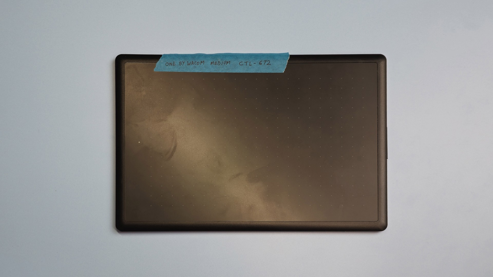
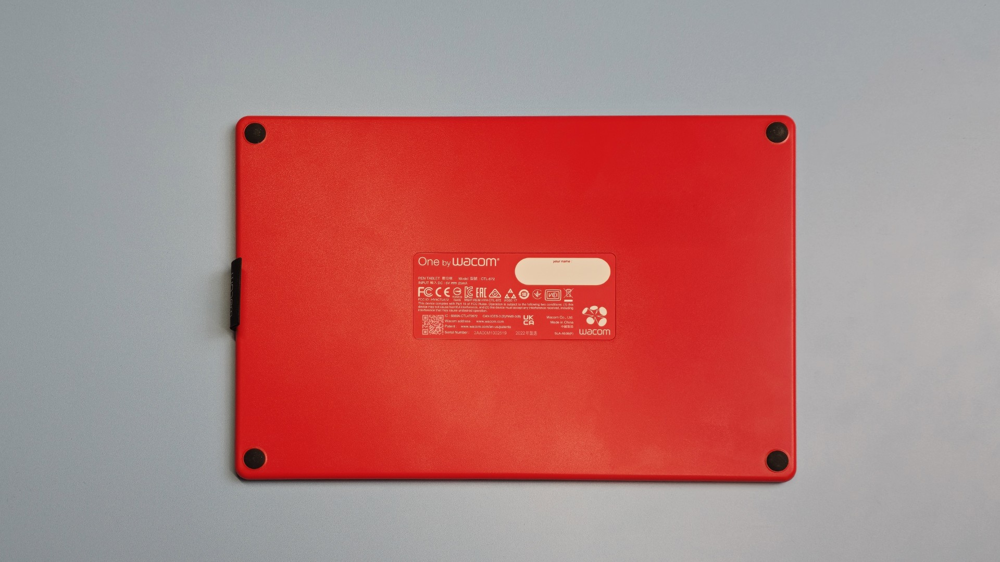
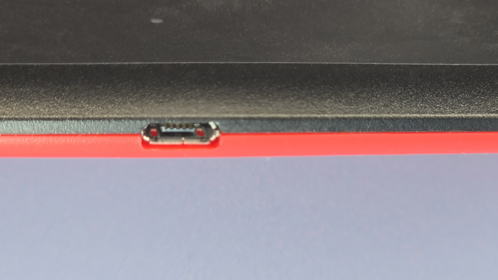
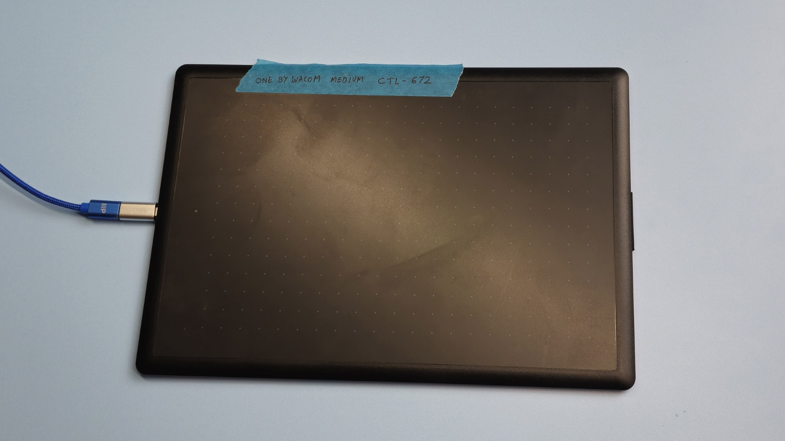
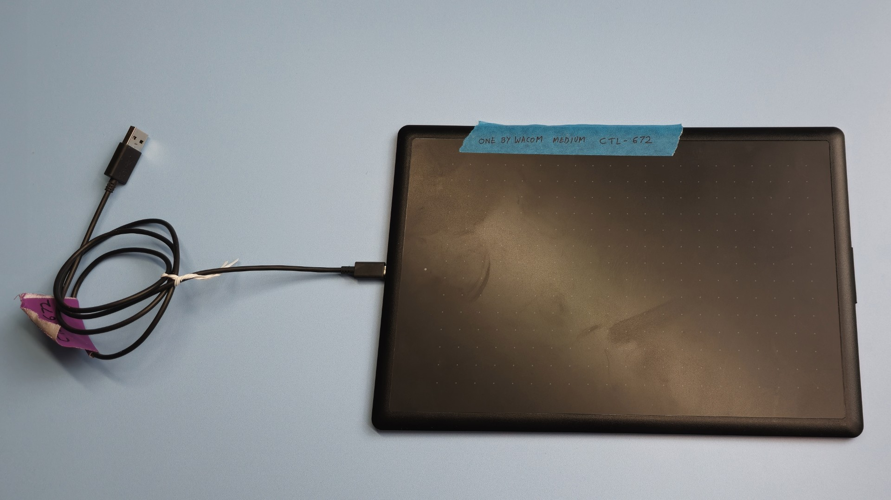
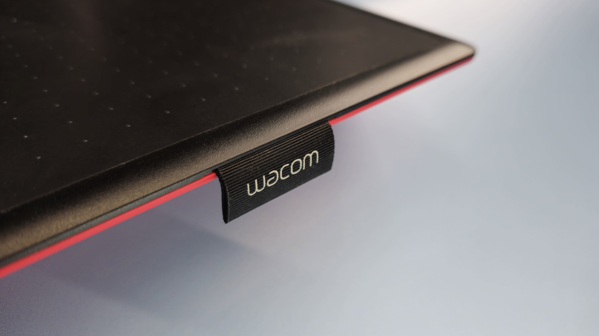
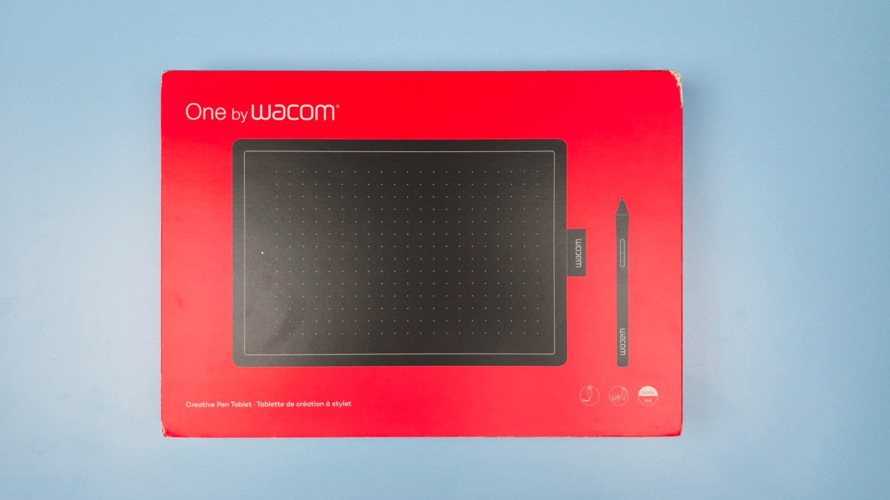
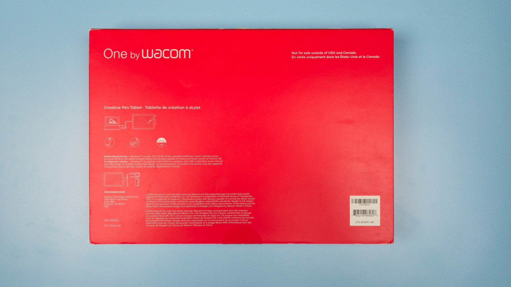

# One by Wacom (CTL-x72) notes

## Overview

The One By Wacom series of pen tablet (CTL-672, and CTL-472) are very good tablets. I highly recommend them for beginners. They are very reliable, have a good drawing experience, and allow you to explore drawing tablets without spending too much.

## Availability

* Availability - As of December 2025, we see that retail inventories of these tablets has greatly diminished. It's getting very hard to find one. And those new one you can find are often marked up to a much higher price.
* Some models are still available eBay. More here: [Buying used drawing tablets](../../../../buying-drawtabs/buying-used.md)

## Future

There is NOT a modern Wacom tablet that is a direct successor to this tablet. Officially, Wacom seems to want people to use the Wacom One 2023 (CTC-x6110WL0) pen tablets. But these tablets are not good and I don't even recommend them. more here: [My notes on Wacom One 2023 pen tablets](../wacom-one/wacom-ctcx110wl-notes.md)

### &#x20;

## Basics

### Product information

* One by Wacom Medium
  * Model number: CTL-672
  * Released 2019
  * Product page: [https://www.wacom.com/en-us/products/one-by-wacom](https://www.wacom.com/en-us/products/one-by-wacom) ([archive](https://archive.is/wip/PFbRz))
  * User manual: [https://101.wacom.com/UserHelp/en/TOC/CTL-672.htm](https://101.wacom.com/UserHelp/en/TOC/CTL-672.html)
* One by Wacom Small
  * Model number: CTL-472
  * Released: 2019
  * Product page: [https://www.wacom.com/en-us/products/one-by-wacom](https://www.wacom.com/en-us/products/one-by-wacom) ([archive](https://archive.is/wip/PFbRz))
  * User manual: [http://101.wacom.com/UserHelp/en/TOC/CTL-472.html](http://101.wacom.com/UserHelp/en/TOC/CTL-472.html)

### Active area

Dimensions

* Small CTL-472: 152.0 x 95.0 mm (6.0 x 3.7 in)
* Medium CTL-672: 216.0 x 135.0 mm (8.5 x 5.31 in)

Diagonal

* Small CTL-472: 179.25 mm (7.06 in)
* Medium CTL-672: 254.72 mm (10.03 in)

Aspect ratio:

* Small: 1.78:1 (16:9)
* Medium: 1.60:1 (16:10)

## **Photos**

<figure><figcaption>
CTL-672 front
</figcaption></figure>

<figure><figcaption>
CTL-672 back
</figcaption></figure>

## **Specs**

### **Digitizer specs**

* **Pressure Levels** - 2048.
  * This may seem low when you see other tablets rated at 8K or 16K pressure levels. Do not worry. 2048 is enough pressure levels for creative tasks. This is absolutely not going to affect the quality of the art you can make with this tablet. I maintain all you need are about 2000 levels of pressure.
* **Tilt** - this tablet does NOT support tilt
  * For a beginner this may not be an issue. Many people do not need tilt.

### Device specs

* Ports:
  * 1x Micro-USB port
* Size:
  * CTL-472: 210 x 146 x 8.7 mm / 8.3 x 5.7 x 0.3 in
  * CTL-672 : 277 x 189 x 8.7 mm / 10.9 x 7.4 x 0.3 in

## **Pens**

### **Included pen**

The tablet comes with a Wacom 2K Pen (LP-190K). This is a standard 2-button pen. And actually quite a good one. More here: [<mark style="background-color:green;">**my notes on Wacom 2K Pen (LP-190K)**</mark>](../../../catalog-pens/wacom-pens/wacom-lp190k-notes.md)

### Pen compatibility

* This tablet ONLY works with the Wacom 2K Pen (LP-190K).

## **Cabling and connectivity**

* **Cable** - the tablet comes with a Micro USB to USB-A cable. You can use this cable or any cable that supports data.
  * Instead of this cable, I used my own USB-C to USB-A cable and used a Male Micro USB to Female USB-C adapter. This specific one: [https://www.amazon.com/gp/product/B0BDLB86RT/](https://www.amazon.com/gp/product/B0BDLB86RT/)
* **Ports** - the port on the tablet is Micro USB. Micro USB is not reversible unlike USB-C, so make sure you are connecting a cable in the right orientation.
* **Wireless** - These tablets **DO NOT SUPPORT WIRELESS CONNECTIVITY**. You must always use it with a cable.

<figure><figcaption>
Micro USB port on the left side of the tablet
</figcaption></figure>

<figure><figcaption>
Tablet connected with a 3rd party cable and a Micro USB adapter
</figcaption></figure>

<figure><figcaption>
Tablet connected with the cable that came with the tablet
</figcaption></figure>

## ExpressKeys

These tablets do NOT have any buttons or dials on the tablet.

## Touch

These tablets DO NOT support touch.

## **Pen holder**

A small cloth loop on the right side of the tablet can be used to hold the pen.

<figure><figcaption></figcaption></figure>

## Surface texture

There is a slight amount of texture on the surface to keep the pen from feeling "slippery" on the surface. The amount of texture is pretty average for a modern pen tablet.

## Usage scenario

### Osu!

The CTL-x72 series tablets are **highly recommended for playing osu!** More here: [**Buying a drawing tablet for osu!**](../../../../buying-drawtabs/drawtabs-for-osu.md)

## **Box photos**

<figure><figcaption></figcaption></figure>

<figure><figcaption></figcaption></figure>
