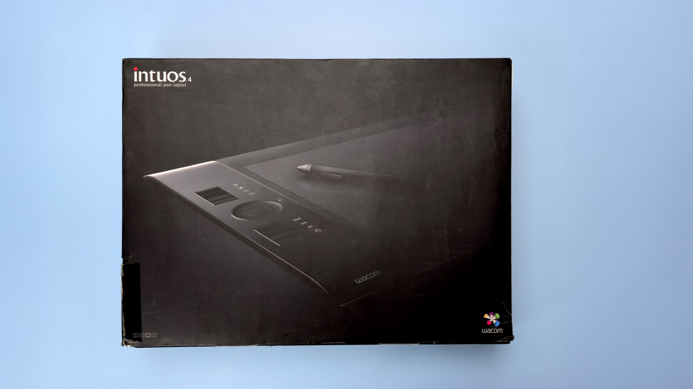
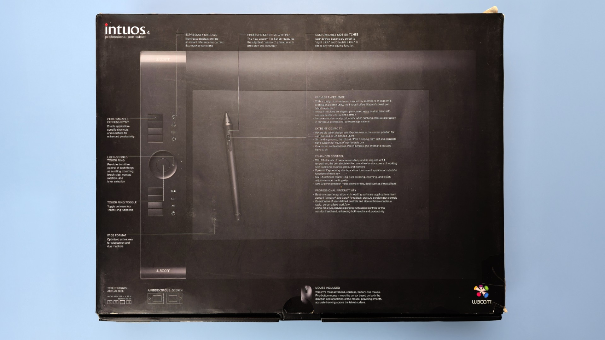

# Wacom Intuos4

## Overview

Wacom launched the Intuos4 in 2009. These are professional pen tablets.

* Release year: 2009
* Intuos pro generation: 4th gen
* Preceded by: [Intuos3](../wacom-intuos3.md)
* Succeeded by: [Intuos5](../wacom-intuos5.md)
* User manuals
  * [User manual for PTK-540WL](https://support.wacom.asia/sites/default/files/manuals_brochures/intuos4-wireless-en.pdf) ([archive.org](https://archive.org/details/manualzilla-id-5993373))
* Last supported driver
  * PTK-440, PTK-640, PTK-840
    * Windows: 6.3.41-1 released on 2020-10-06
    * MacOS: 6.3.41-2 released on 2020-10-06
  * PTK-1240
    * Windows: 6.4.3-1 released on 2023-08-09
    * MacOS: 6.4.3-2 released on 2023-08-09

## Models

<table><thead><tr><th width="131">Model ID</th><th width="190.11797175172904">Name</th><th>Notes</th></tr></thead><tbody><tr><td>PTK-440</td><td>Intuos4 Small</td><td></td></tr><tr><td>PTK-540WL</td><td>Intuos4 Wireless</td><td></td></tr><tr><td>PTK-640</td><td>Intuos4 Medium</td><td></td></tr><tr><td>PTK-840</td><td>Intuos4 Large</td><td></td></tr><tr><td>PTK-1240</td><td>Intuos4 XL</td><td><a href="wacom-ptk1240-notes.md"><mark style="background-color:green;"><strong>My notes on the Intuos4 XL</strong></mark></a></td></tr></tbody></table>

## Links

* [EyekooDrawsStuff - Wacom Intuos 4 Large (PTK-840)](https://www.youtube.com/watch?v=GAb-mte-j5w) 2021/10/12

## Photos

<figure><figcaption></figcaption></figure>

<figure><figcaption></figcaption></figure>

## Design

The Intuos4 introduced a tablet design with expresskeys and the ring on the left. This design would last in the subsequent Intuos professional series all the way till the introduction of the Intuos Pro 2025.

## Using a Wacom Intuos 4 in 2023 or later

These are still excellent tablets. However, Wacom has dropped support for them in their latest drivers.

For example none of them are listed in the compatibility list for Wacom windows driver version 6.4.4-4:

More here: [https://cdn.wacom.com/u/productsupport/drivers/win/professional/releasenotes/Windows\_6.4.4-3.html](https://cdn.wacom.com/u/productsupport/drivers/win/professional/releasenotes/Windows_6.4.4-3.html)

You can still use these tablets with caveats that come with using older tablets. More here:[ **using older drawing tablets**](../../../../guides/general/using-older-drawing-tablets.md)

## Wacom Intuos 4 Large

* [EyeKooDrawsStuff review of Intuos 4 large](https://www.youtube.com/watch?v=GAb-mte-j5w) Oct 12, 2021
* [Terry Lee White review of Wacom Intuos 4](https://www.youtube.com/watch?v=yKQlAiATVzI) May 11, 2009
