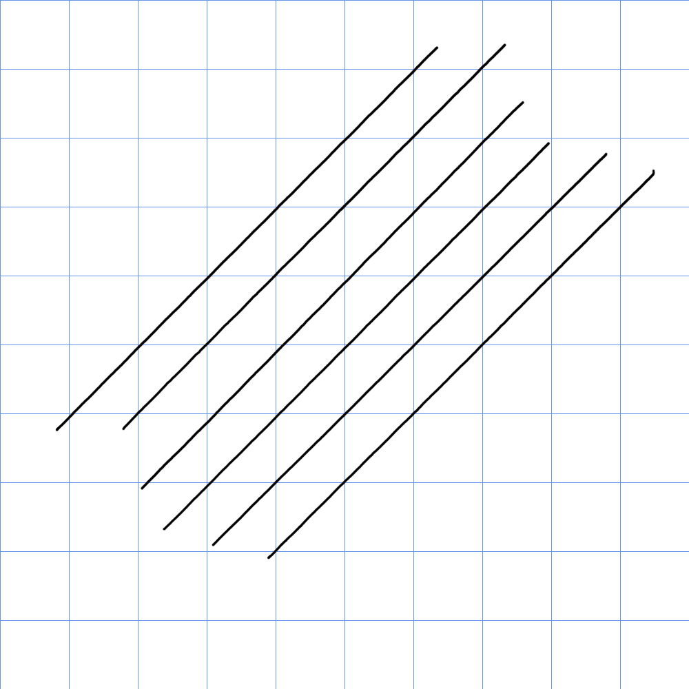

# XP-Pen Artist 12 Gen2 (CD120FH) notes

## Summary

I have this tablet but haven't used it extensively. Overall seemed like a decent tablet.

* The X3 Elite pen it came with had a good physical pressure range.
* The display has low amounts of anti-glare sparkle.
* The tablet exhibited a little more diagonal wobble than I normally like but smoothing/stabilization should help. The Artist 13 GEN2 unit has less diagonal wobble.

## Basics

* Model year: 2022

## Pen

Comes with the XP-Pen X3 Elite pen - with an OK IAF and a GOOD pressure range. More here: [<mark style="background-color:green;">**My notes on the X3 elite pen**</mark>](../../../catalog-pens/xp-pen-pens/xppen-x3elite-notes.md)

## Pen tracking 

* XP-pen lists accuracy as:
  * center ±0.5mm
  * corner ± 2mm
* I agree with XP-Pens accuracy numbers

## Diagonal wobble

<figure><figcaption>
Diag Wobble XP-Pen Artist 12 GEN2 (CD120FH)
</figcaption></figure>

Compare to the Artist 13 GEN2

<figure><figcaption></figcaption></figure>

## Pen pressure range 

See: [<mark style="background-color:green;">**My notes on the X3 elite pen**</mark>](../../../catalog-pens/xp-pen-pens/xppen-x3elite-notes.md)

## Pointer lag 

TYPICAL for a pen display - very slightly more than typical. But not by much.

## Parallax

VERY GOOD. The tip of the pointer aligns very closely with the tip of the pen.
