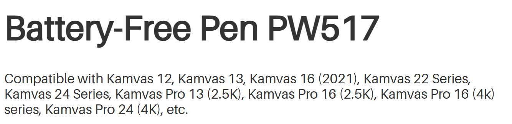

# Huion PW517 pen notes

## Overview

The Huion PW517 pen is one that comes many Huion tablets that use PenTech 3.0.

Huion store link: [https://store.huion.com/products/battery-free-pen-pw517](https://store.huion.com/products/battery-free-pen-pw517)

## Compatible tablets

Huion lists these as compatible tablets

* Kamvas 12
* Kamvas 13
* Kamvas 16 2021
* Kamvas 22 Series
* Kamvas 24 Series
* Kamvas Pro 13 (2.5K)
* Kamvas Pro 16 (2.5K)
* Kamvas Pro 16 (4k) series
* Kamvas Pro 24 (4K), etc.

<figure><figcaption></figcaption></figure>

## Use the PW550 pen instead

If you have a tablet what is compatible with the PW517 pen, I strongly urge you to consider getting a PW550 pen which is also compatible but has generally a much better pressure range. [<mark style="background-color:green;">**my notes on the PW550 pen**</mark>](huion-pw550-notes.md).

## Pressure range&#x20;

I have 7 units of this pen.&#x20;

* IAF ranges from 5gf to 9gf
* Max Pressure ranges from 150gf to 500gf

Like other PenTech 3.0 pens, there is a lot of variation in IAF and max pressure.

<figure><figcaption></figcaption></figure>

## Consider the PW550 series pens as a potential upgrade

The PW550 series of pens are backwards compatible with tablets that work with the PW517. And the PW550 has improved pressure handling. So consider the PW550 as an upgrade option.

See: [**Upgrading from Huion PW517 to Huion PW550 pens**](upgrading-from-pw517-to-pw550.md)
