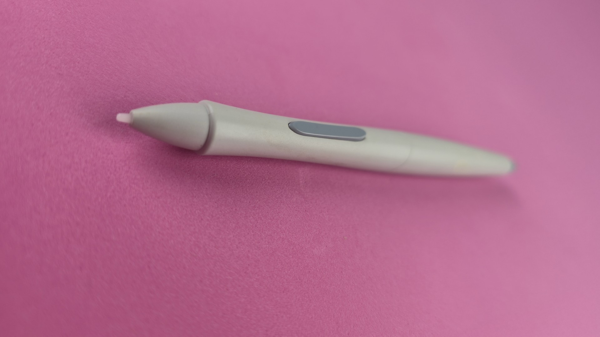

# Wacom Intuos1 Pen (GP-300E) notes

## Overview

This was the default pen for the [Intuos1 series](../../catalog-drawtabs/wacom/wacom-intuos1.md).

Key features

* Duo switch - Rocker switch that acts as two buttons
* Eraser

## Pictures

<figure><figcaption></figcaption></figure>

<figure><figcaption></figcaption></figure>

<figure><figcaption></figcaption></figure>
