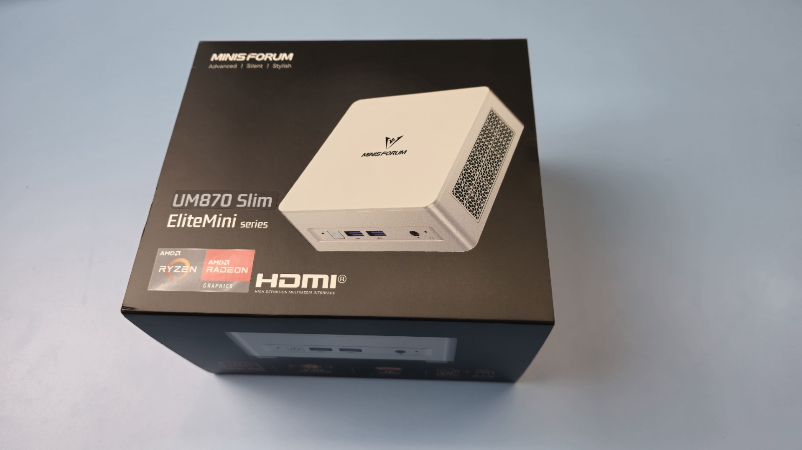
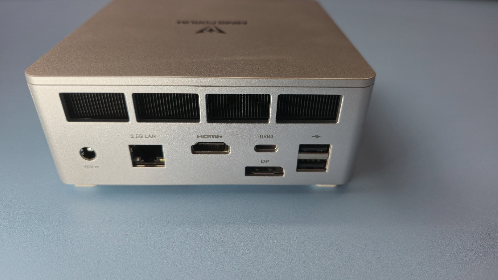
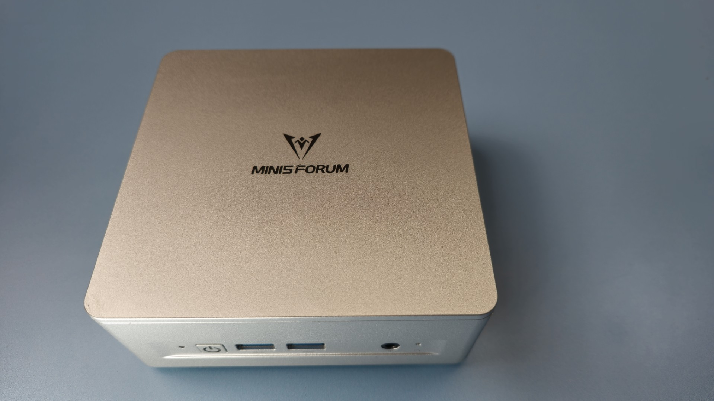
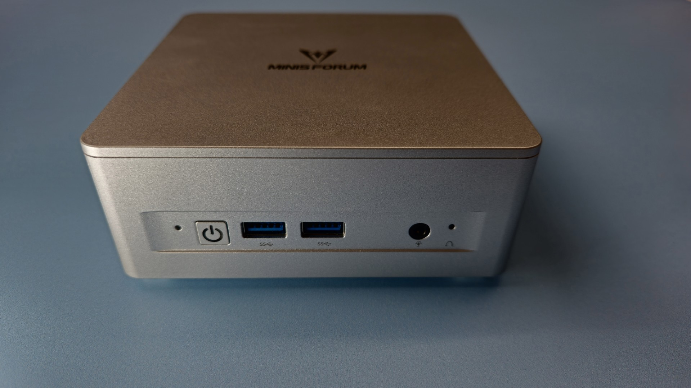
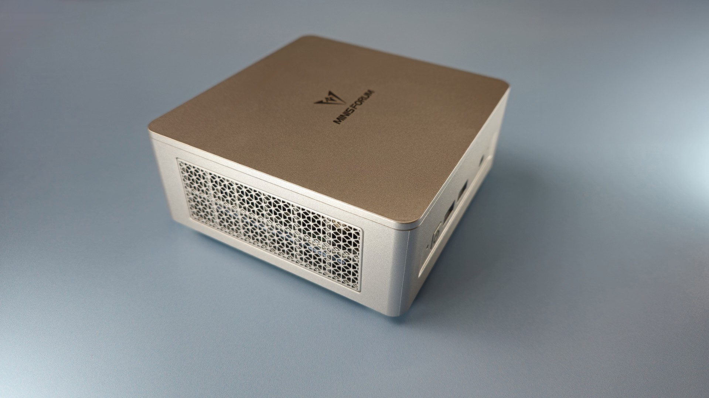

# Minisforum UM870 slim notes

## Summary

I've had a very good experience with this mini-PC. It's been reliable and quiet.

As of November 2025 it serves as my primary art computer.

## Links

* [RobTech - Review of Minisforum UM870 Slim](https://www.youtube.com/watch?v=xKD2mU6shdo) Dec 8, 2024
* [ETA Prime - Review of Minisforum UM870 Slim](https://www.youtube.com/watch?v=aBRo-44rDu8) Nov 27, 2024

## Price

The 32GB 1 TB model is often discounted to around $500.

NOTE: You may see the "kit" version with no RAM and no SSD being sold. Please verify you are buying the full version with RAM and SSD instead.

## Performance

For my needs, doing 2D art and heavily using Clip Studio Paint and Photoshop, this works exceptionally well.

I do think this is not the right choice if you want to do any kind of serious gaming.

## Stability

Excellent

For most of 2025, I have used a UM870 Slim as my primary Windows art workstation.

I have been using Clip Studio Paint, Krita, and Photoshop extensively on this device.

I have been writing code using Visual Studio 2022.

I've created scripts and PowerPoint slides for my videos using Microsoft Word and Microsoft PowerPoint.

And in all that time this mini PC has not had any problems. I haven't experienced any weird stuttering or blue screens.

## Noise

This mini PC is very quiet.

Even when my room is very quiet at night I cannot hear this mini PC. If I put my ear right next to the mini PC then yes I can hear the fans but it's a very light sound.

When doing very heavy workloads, for example exporting a video, I hear the fans turn on, but they have never been super loud.

I did not do anything like gaming with this mini PC, so I did not strain it in any other way.

In comparison- The M4 Mac mini in my usage for similar tasks has been completely silent.

## How I connect it

I have this mini PC connected to a CalDigit TS4 Thunderbolt dock. This makes it simple for me to switch between this mini PC and several laptops I own.

I have two cables going to this mini PC.

One is the cable from the power adapter.

The second is the Thunderbolt 4 cable from the CalDigit TS4 Thunderbolt dock.

All other cables go through the CalDigit TS4 Thunderbolt dock.

## Portability

Because this mini PC is so small I find it to be very portable.

It's very easy to move between my desks.

It's small enough to fit into a large jacket pocket.

While a laptop does have its own advantages, if you're traveling and sitting at a desk, it can make sense to bring a mini PC like this along with a pen display that can act as both a drawing tablet and a monitor.

## What could be better

This mini PC comes with one USB4 port - however I really wish it came with two USB4 ports because sometimes it seems like certain pen displays really need to be directly connected to a computer instead of going through a Thunderbolt dock like I normally use.

Although I am very satisfied with this mini PC, I am looking forward to future mini PCs that:

* maintain this same size
* maintain the same quiet operation
* have more RAM and SSD storage
* have two USB4 ports

## Photos

<figure><figcaption></figcaption></figure>

<figure><figcaption></figcaption></figure>

<figure><figcaption></figcaption></figure>

<figure><figcaption></figcaption></figure>

<figure><figcaption></figcaption></figure>
