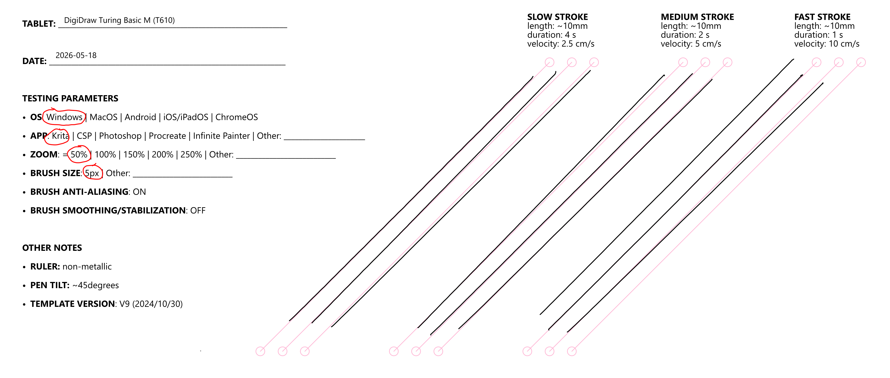

# DigiDraw Turing Basic M (T610)

## Summary

Overall, it makes for a very good basic tablet. That's not surprising. The tablet's technical lineage (digitizer) seems to be the Huion Frego M, which is one of my common recommendations for a pen tablet.

## Basics

* Product page: [https://www.turingdraw.com/page156](https://www.turingdraw.com/page156)
* Year released: 2025

## Specs

### Digitizer

* Digitizer Type: PASSIVE\_EMR
* Pressure Levels: 16384
* Density: 5080.00 LPI (200 LPmm)
* Tilt: 60 degrees
* Max Hover: 0.39 in (10 mm)
* Touch: NO
* Dimensions: 10.00 x 6.25 in (254 x 158.8 mm)
* Aspect Ratio: 1.599
* Aspect Ratio (fraction): 16:10
* Size Category: Medium
* Diagonal: 11.80 in (299.6 mm)
* Similar ISO Paper: 17% larger than A5

### Pens

Included pens: DigiDraw M3 Pen

Compatible pens:

* Officially only the DigiDraw M3 pen is compatible. In my testing I was able to fully use a Huion PW500 pen with this tablet.

## Design

* Looks attractive.
* The surface pattern is much more subtle than the photos show. Not a problem. It just may be surprising for some people.

## Size

This is a medium-sized tablet, and it is slightly larger than the Wacom Intuos Pro 2017 Medium (PTH-660).

<figure><figcaption></figcaption></figure>

<figure><figcaption></figcaption></figure>

<figure><figcaption></figcaption></figure>

## Drawing experience

### Nib feeling

* Slightly springier than Wacom Pro Pen 3.
* Retracts a little more than Wacom Pro Pen 3
* Feels a little "softer" than PP3. The PP3 nib feels firmer.
* Still feels nice to use.

## Pen pressure

IAF: The M3 pen seems to have a typical IAF. I would estimate it at around 3 gf.&#x20;

MAX Pressure: I was also pleased with its maximum pressure - which \~350gf when I measured with a scale.&#x20;

Notes

* Please remember, the max pressure and IAF comments involved measuring only a single pen. To form a more complete picture of a pen, it requires multiple pen units (>=3)to be measured.

### Drawing at low pressure

All EMR pens have their reported pressure change a bit abruptly when drawing at low pressure near the IAF. So does this pen, but not as strongly as some pens like the Wacom Pro Pen 2. As a result, you probably won't need as much of a pressure curve or pressure smoothing to deal with it. Overall, the pressure is well controlled in that domain and relatively stable.

### Surface texture

* Feels fine to draw with. The texture has enough grip to keep the pen from feeling slippery.
* Comparisons to Wacom Pro Pen 2 on PTH-660
  * The PTH-660 has a little more texture, but about the same amount of nib noise. The pitch is slightly lower.

### Button stroke interruption

Like many non-Wacom pens, the buttons interrupt strokes slightly. Even if the buttons are disabled in the driver, I noticed that strokes were interrupted when the button was released. Again, this is common, and most likely you will never encounter it or have it affect you while drawing.

### Pointer lag

* LOW. Subjectively, it is very slightly more than a Wacom tablet, but I doubt anyone would notice.

## Diagonal wobble

* GOOD to OK
* Very slight wobble at slow speeds, and even less at medium and fast strokes.
* To compensate for the wobble, I only needed to add a little smoothing. In Krita, I used weighted smoothing with distance set to 100. For many tablets, I have to increase the smoothing to 200.

<figure><figcaption></figcaption></figure>

## Connection and cabling

### Ports

* Single USB-C port on the upper left of the tablet

### Wireless

NO. The tablet is not wireless and requires a USB cable to connect to a computer.

## Non-pen inputs

* Touch - the tablet DOES NOT support touch
* Buttons/Dials/etc. - the tablet has no such features

## Other features

* Replaceable surface? No.

## Driver

Driver version:

* I downloaded the Windows driver: DIGIDRAW Win\_V1.0 which was released on 2026-04-14

Driver experience

* The driver has an attractive skin than matches the digidraw branding. In terms of capabilities this version is very similar to the Huion V15 drivers.

Driver issues I discovered:

* MINOR ANNOYANCE
  * The driver UI got confused which monitor whas which. I have two monitors - let's call them A and B. If I wanted to map the tablet to monitor A, I had to pick monitor B.&#x20;
  * I tested on my standard testing machine and have never experienced this before. It is unclear what is causing it, but since I have never seen this with any other driver I lean towards this being a driver issure.&#x20;

## Usage with Android

SUMMARY: Does NOT work well with Android

I tested this tablet with multiple apps (Concepts, HiPaint, and Infinite Painter) on two different Android tablets (Samsung S11 Ultra & Wacom MovinkPad Pro 14).

In all cases:

* Only a vertical column on the tablet, about a third of the tablet, is usable.
* Strokes were severely distorted on Android.

