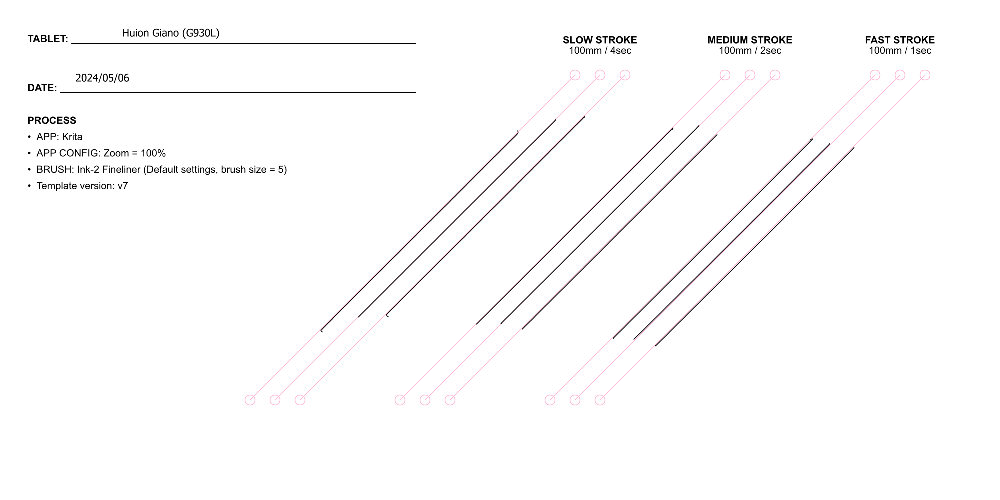

# Huion Inspiroy Giano (G930L) notes

## **Summary**

Introduced in 2022, the Giano G930L is a fantastic value. It's quite nice for drawing and I enjoy the extra size.

## Links

These links come from the [DrawTabData Explorer](https://thesevenpens.github.io/DrawTabDataExplorer/). To add or fix a link, change it in DrawTabData.

| Source | Link | Date |
| --- | --- | --- |
| Huion | [Product page](https://www.huion.com/products/inspiroy-giano) |  |
| Huion | [Store page](https://store.huion.com/products/inspiroy-giano) |  |
| Huion | [User manual](https://www.huion.com/manual/inspiroy-giano) |  |
| SweetMonia | [Huion Inspiroy Giano graphics tablet Review:- a large drawing area for your heart content](https://sweetmonia.com/Sweet-Drawing-Blog/huion-inspiroy-giano-graphics-tablet-review-a-large-drawing-area-for-your-heart-content/) | 2024-03-14 |
| EyekooDrawsStuff | [Reviewing Huion's HUGE Inspiroy Giano for digital drawing and painting](https://www.youtube.com/watch?v=43dZC0j0T1k) | 2023-05-26 |
| Anna Sok | [IT'S HUGE! Huion Inspiroy Giano Review and Painting on Mac, PC, Android //graphic tablet for PROS](https://www.youtube.com/watch?v=03auOS8lgAE) | 2022-10-04 |
| Create Now Sleep Later | [Huion Inspiroy Giano Review \| LARGE Graphics Pen Tablet](https://www.youtube.com/watch?v=CcrTe2J5Ho8) | 2022-08-08 |
| Gartzia Artz | [¿WACOM INTUOS PRO L KILLER? HUION INSPIROY GIANO REVIEW En Español \| Tableta gráfica inalámbrica XL](https://www.youtube.com/watch?v=RAHxGExeAgU) | 2022-07-15 |
| Brad Colbow | [Huion Inspiroy Giano Review](https://www.youtube.com/watch?v=DiRwtSonevY) | 2022-07-06 |
| Teoh on Tech | [Huion Inspiroy Giano G930L (review): Largest Bluetooth Drawing Tablet](https://www.youtube.com/watch?v=2XcP_Db9e_w) | 2022-05-25 |
| Parka Blogs | [Huion Inspiroy Giano G930L](https://www.parkablogs.com/content/review-huion-inspiroy-giano-g930l-biggest-wireless-pen-tablet) |  |

## Specs

These specs come from the [DrawTabData Explorer](https://thesevenpens.github.io/DrawTabDataExplorer/). Click a model ID to see its full record there.



| | [G930L](https://thesevenpens.github.io/DrawTabDataExplorer/entity/huion.tablet.g930l) |
| --- | --- |
| Name | Inspiroy Giano G930L |
| Released | 2022-05-25 |
| Status | — |



| | [G930L](https://thesevenpens.github.io/DrawTabDataExplorer/entity/huion.tablet.g930l) |
| --- | --- |
| Active area | 345 × 216 mm (13.6 × 8.5 in) |
| Diagonal | 407 mm (16 in) |
| Aspect ratio | 16:10 |
| Pen technology | Passive EMR |
| Pressure levels | 8192 |
| Tilt | ±60° |
| Accuracy (center) | ±0.3 mm |
| Accuracy (corner) | — |
| Report rate | 300 Hz |
| Density | 200 LPmm (5080 LPI) |
| Max hover | 10 mm |



| | [G930L](https://thesevenpens.github.io/DrawTabDataExplorer/entity/huion.tablet.g930l) |
| --- | --- |
| Included pen | [PW517 (PW517)](https://thesevenpens.github.io/DrawTabDataExplorer/entity/huion.pen.pw517) |
| Compatible pens | [PW517 (PW517)](https://thesevenpens.github.io/DrawTabDataExplorer/entity/huion.pen.pw517) [PW550S (PW550S)](https://thesevenpens.github.io/DrawTabDataExplorer/entity/huion.pen.pw550s) [PW550 (PW550)](https://thesevenpens.github.io/DrawTabDataExplorer/entity/huion.pen.pw550) |



| | [G930L](https://thesevenpens.github.io/DrawTabDataExplorer/entity/huion.tablet.g930l) |
| --- | --- |
| Buttons | — |
| Dials | — |
| Touch rings | — |
| Touch strips | — |
| Touch | No |



| | [G930L](https://thesevenpens.github.io/DrawTabDataExplorer/entity/huion.tablet.g930l) |
| --- | --- |
| Size | 429 × 260 × 9 mm (16.9 × 10.2 × 0.4 in) |
| Weight | 1145 g |



| | [G930L](https://thesevenpens.github.io/DrawTabDataExplorer/entity/huion.tablet.g930l) |
| --- | --- |
| Ports | — |
| Attached cable | — |
| Bluetooth | Yes (5.0) |



| | [G930L](https://thesevenpens.github.io/DrawTabDataExplorer/entity/huion.tablet.g930l) |
| --- | --- |
| Power input | — |
| Consumption | 0.3 W |
| Standby | — |
| Power adapter | — |
| Power output | — |



| | [G930L](https://thesevenpens.github.io/DrawTabDataExplorer/entity/huion.tablet.g930l) |
| --- | --- |
| Contents | — |



## Notes on specs

### Pens

Consider upgrading the pen

For an improved drawing experience, consider buying the PW550 pen which is compatible with it. See: [Upgrading from PW517 to PW550](../../pens/huion-pens/upgrading-pw517-to-pw550.md).

## **Compared to Wacom**

Its competitor is the Wacom Intuos Pro Large (PTH-860), and the Giano has some interesting differences:

* The Giano G930L costs about $200 where the Wacom Intuos Pro Large (PTH-860) costs about $500
* The Giano's active area is slightly larger than the Wacom Intuos Pro

## **Surface texture**

The tablet has a textured surface. The amount of texture is comparable to the Wacom Intuos Pro.

## **Wireless**

One minor nit: by default, the tablet will still go to sleep when connected, apparently to conserve its battery. This is not a problem because you can go into the driver settings and turn off this sleep behavior.

## **OLED auxiliary display**

There's a monochromatic OLED auxiliary display on the upper left of the tablet. This is a nice feature that lets you see the battery level easily.

## **Working with a large tablet**

Large tablets require some adjustment to work with. More here: Using large pen tablets

## Pressure instability

Some pressure pulsing is visible at lower pressure. It will mostly be visible with strokes using large brushes.

## Diagonal wobble

Rating: VERY GOOD. Low amounts of wobble.

<figure><figcaption></figcaption></figure>
