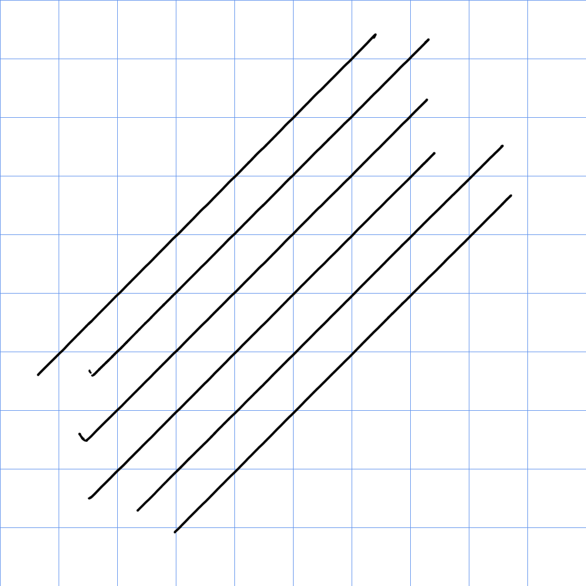

# Huion Kamvas 13 (GS1331) notes

## **Overview**

A decent, slightly older pen display. I highly recommend getting the Kamvas 13 GEN3 (GS1333) instead - it is a better tablet in every way. More here: [Huion Kamvas 13 GEN3 (GS1333) notes](huion-gs1333-notes.md)

Another budget alternative is the XP-Pen Artist 13 GEN2.

## Links

These links come from the [DrawTabData Explorer](https://thesevenpens.github.io/DrawTabDataExplorer/entity/huion.tabletfamily.huion_kamvas_2020). To add or fix a link, change it in DrawTabData.

| Source | Link | Date |
| --- | --- | --- |
| Huion | [Product page](https://www.huion.com/products/kamvas-13) |  |
| Huion | [Store page](https://store.huion.com/products/kamvas-13) |  |
| Huion | [User manual](https://www.huion.com/manual/kamvas-13) |  |
| Teoh on Tech | [Huion Kamvas 13 Drawing Performance](https://www.youtube.com/watch?v=LZqJ6snjWTc) | 2020-07-07 |
| Teoh on Tech | [Review: Huion Kamvas 13 Pen Display (Just $239)](https://www.youtube.com/watch?v=yn1eJFsrFnY) | 2020-05-01 |
| Create Now Sleep Later | [Huion Kamvas 13 Review: Huion beats Wacom?](https://youtu.be/rgaqRLhct0A) | 2020-04-17 |
| Brad Colbow | [Wacom One - VS -  Huion Kamvas 13 - Smackdown!](https://www.youtube.com/watch?v=vP_-kE0b8WE) | 2020-04-06 |
| Brad Colbow | [Huion Kamvas 13 Review (2020 version)](https://www.youtube.com/watch?v=ku8x1q_nhFQ) | 2020-03-26 |
| Parka Blogs | [Huion KAMVAS 13](https://www.parkablogs.com/content/review-huion-kamvas-13-pen-display-just-us-239) |  |

## Specs

These specs come from the [DrawTabData Explorer](https://thesevenpens.github.io/DrawTabDataExplorer/entity/huion.tabletfamily.huion_kamvas_2020). Click a model ID to see its full record there.



| | [GS1331](https://thesevenpens.github.io/DrawTabDataExplorer/entity/huion.tablet.gs1331) |
| --- | --- |
| Name | Kamvas 13 |
| Released | 2020-01-07 |
| Status | — |



| | [GS1331](https://thesevenpens.github.io/DrawTabDataExplorer/entity/huion.tablet.gs1331) |
| --- | --- |
| Resolution | 1920 × 1080 |
| Aspect ratio | 16:9 |
| Pixel density | 166 PPI |
| Panel | IPS |
| Lamination | Yes |
| Anti-glare | AG film |
| Coatings | — |
| Color gamut | sRGB 120% area |
| Color depth | 8 bits per channel |
| Brightness | 220 cd/m² |
| Peak brightness | — |
| Viewing angle | 178° horizontal 178° vertical |
| Refresh rate | — |
| Response time | 25 ms |



| | [GS1331](https://thesevenpens.github.io/DrawTabDataExplorer/entity/huion.tablet.gs1331) |
| --- | --- |
| Active area | 293.8 × 165.2 mm (11.6 × 6.5 in) |
| Diagonal | 337 mm (13.3 in) |
| Aspect ratio | 16:9 |
| Pen technology | Passive EMR |
| Pressure levels | 8192 |
| Tilt | ±60° |
| Accuracy (center) | ±0.5 mm |
| Accuracy (corner) | ±3 mm |
| Report rate | 266 Hz |
| Density | 200 LPmm (5080 LPI) |
| Max hover | 10 mm |



| | [GS1331](https://thesevenpens.github.io/DrawTabDataExplorer/entity/huion.tablet.gs1331) |
| --- | --- |
| Included pen | [PW517 (PW517)](https://thesevenpens.github.io/DrawTabDataExplorer/entity/huion.pen.pw517) |
| Compatible pens | [PW517 (PW517)](https://thesevenpens.github.io/DrawTabDataExplorer/entity/huion.pen.pw517) [PW550S (PW550S)](https://thesevenpens.github.io/DrawTabDataExplorer/entity/huion.pen.pw550s) [PW550 (PW550)](https://thesevenpens.github.io/DrawTabDataExplorer/entity/huion.pen.pw550) |



| | [GS1331](https://thesevenpens.github.io/DrawTabDataExplorer/entity/huion.tablet.gs1331) |
| --- | --- |
| Buttons | 8 |
| Dials | — |
| Touch rings | — |
| Touch strips | — |
| Touch | No |



| | [GS1331](https://thesevenpens.github.io/DrawTabDataExplorer/entity/huion.tablet.gs1331) |
| --- | --- |
| Size | 366.5 × 217.4 × 11.8 mm (14.4 × 8.6 × 0.5 in) |
| Weight | 980 g |
| VESA mount | — |
| Legs | — |
| Included stand | — |



| | [GS1331](https://thesevenpens.github.io/DrawTabDataExplorer/entity/huion.tablet.gs1331) |
| --- | --- |
| Ports | USB-C USB-C (Full-featured) |
| Attached cable | — |
| Bluetooth | — |



| | [GS1331](https://thesevenpens.github.io/DrawTabDataExplorer/entity/huion.tablet.gs1331) |
| --- | --- |
| Power input | 5 V, 2 A |
| Consumption | 7 W |
| Standby | 0.3 W |
| Power adapter | — |
| Power output | — |



| | [GS1331](https://thesevenpens.github.io/DrawTabDataExplorer/entity/huion.tablet.gs1331) |
| --- | --- |
| Contents | — |



## Notes on specs

### Pens

* I recommend buying and using a PW550 instead of the included PW517. [Huion PW550 series pens notes](../../pens/huion-pens/huion-pw550-notes.md)

## Other links

* [2023 13" pen displays compared](../../../recs/comparisons/2023-13inch-pen-displays-compared.md)

## **Removing anti-glare film**

The AG film is removable and Huion sells replacement films for this model.

I have removed the film and have used it by drawing on directly on its glass surface. Without the glass, the colors are more vivid, pixels are sharper, AG sparkle is completely gone - however you will be able to see light reflections in the glass easily.

## **Anti-glare sparkle**

Exhibits moderate [Anti-glare sparkle](../../../guides/pen-displays/ag-sparkle.md)

## Connections and cabling

* I connect it to my PC with a separately purchased Huion full-featured USB-C cable.

## Diagonal wobble

Very low

